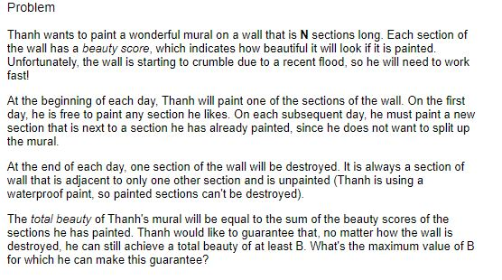

[TOC]

## 2017-07-24

awk命令：

```sh
awk -F "\t" '{print $1}' wenda_1_1.gbk | head
```

iconv命令：

```sh
iconv -f utf-8 -t gb18030 wenda_1_1.utf8 > wenda_1_1.gbk
```

sort命令：

```sh
sort -k1,1n sim.txt.seg 
```


## 2017-07-24

### 1.hydoop学习：mapper/reducer

  streaming架构

### 2.url编码

query = urllib.unquote(query) 
query = query.decode("gbk", "ignore")

## 2017-07-27

dos2unix test_20170728_1.txt  // 将windows系统下的txt文本中的换行符转换成unix系统中的换行符
nohup ./chatbot_test.py test_20170728_1.txt output_20170728.txt wechat > log & // nohup 后台运行进程
ps aux  // 进程控制和显示
kill 。。。 // 杀死相关进程
grep 命令  // 可依据正则表达式显示相关文件

##2017-07-31
debug: baike_percent.py脚本，import chatdet时，本地运行可行，上传hadoop出错，原因是集群里没有chatdet包

reducer的原理：

print xx,xx输出时，是用空格分开的

## 2017-08-02

awk函数进阶，过滤
grep函数进阶
比较命令vimdiff, svn log
最终整理的排序结果中前一段有很多数字，需要进行过滤

## 2017-08-03

paste 粘贴两个文件（同行）
wc 查看文件字节数、行数

##2017-08-04
### 1. python中多断式的用法

```python
dict([itm.split('="') if len(itm.split('="    ')) == 2 else (itm, '') for itm in rank_str.replace('<rank ',     '').replace('"></rank>', '').split('" ')])
```

shell脚本中定义字符串
STR1 = "abc"(错误写法)

STR1="abc"(正确写法)
不能有空格

if \[\$STR1=\$STR2](错误写法)

if \[ \$STR1 = $STR2 ](正确写法)

awk命令 length($1)可直接获取字符串的长度

## 2017-08-07

1.grep命令 grep 'xx\|xx\|xx' 不能少了转义符，不然不能多个义项进行选择
2.python 中的in, 单个项在词典和列表是否存在可以直接用in，单个字母在字符串中的判断也可以使用，一串字符是否在另一串
  字符中使用findt

3. 中文字符用in判断时出现bug：Non-ASCII character '\xe5' in file
    解决方法在行首添加#coding=utf-8后，可以使用中文字符编码用in

## 2017-08-10

Ctrl+w 切换窗口(vim）

## 2017-08-16

pdb.set_trace()  // 单步调试
awk -F '\t' '{print $2}' bank_result.txt  | sort | uniq > bank-urls& 
uniq -c testfile // 删除出现重复的行数

## 2017-08-21

cd - // 返回上一个（非上一级）目录
AttributeError: 'Worksheet' object has no attribute 'nrows' // xlrd有该属性，xlwt没有，需要自己计算行数
搜狗放炮哥是谁 在本地测试和集群测试的结果不一致 // get_yaoting的参数query需要作为
import os // os包，用于管理本地文件及路径
os.path.abspath(__file) // 当前文件的绝对路径
os.path.dirname(abspath) // 指定绝对路径的目录地址
os.path.join(dir, '../../lib') // 根据dir和str连接得到新的地址
import sys // sys包，管理系统文件
sys.path.append(dir) // 在程序链接库中增加dir指定的库
sys.argv	// 传入参数
import xlrd
import xlwt	// 分别用于管理xls文件的读和写的工具包
wb = xlrd.open_workbook(infilename) // 打开xls文件
for sheet in wb.sheets():	// wb.sheets()为表格文件的每一个工作单
xls = xlwt.Workbook() // 打开一个用于写入的表格
table = xls.add_sheet(sheet.name) // sheet.name为sheet的名字，add_sheet在表格中加入一个工作单
table.write(index, 0, query.decode('utf-8')) // 在一个sheet中[index, 0]位置写入str
****** 代码路径：http://svn.sogou-inc.com/svn/websearch4/web/dialogue/chatbot
svn checkout|co svn全路径 本地全路径（默认当前目录） 
svn add *.php ＜－ 添加当前目录下所有的php文件
svn commit -m “添加我的测试用全部php文件“ *.php

## 2017-08-17
??? Ques: 搜狗汪仔客户端和本地测试不一致，如下列问题：

1. 鲁豫那么瘦是为什么
2. 冯小刚的第一部影片是哪部
3. 刘德华是四大天王之一么
4. 为何说莫高窟是丝绸之路上的艺术殿堂
5. 金庸写过哪些长篇武侠小说
6. 搜狗放炮哥是谁
。。。
经过多次尝试发现，当web search返回的结果为空时，即使yaoting的结果是对的，也不会返回yaoting结果。
应该是汪仔在结果判断中出现的问题。

命令学习：
svn update 更新当前目录下所有文件到最新版本
svn up 文件名  //只更新当前文件到最新版本
svn update -r 版本号 文件名 //将文件更新到指定版本

svn　delete　svn://路径(目录或文件的全路径) -m “删除备注信息文本”
推荐如下操作：
svn　delete　文件名 
svn　ci　-m　“删除备注信息文本”//进行备注说明

svn　lock　-m　“加锁备注信息文本“　[--force]　文件名 // 对文件进行上锁
svn　unlock　文件名 // 解锁

## 2017-08-17
svn命令学习
svn　diff　文件名 
svn　diff　-r　修正版本号m:修正版本号n　文件名 // 比较两个文件的差异
svn diff -r 200:201 test.php //示例

svn st // 显示目录下的文件和子目录状态

svn log 文件名 // 显示这个文件的所有修改记录，及其版本号变化

## 2017-08-18
svn命令学习
svn list svn://localhost/test  // 查看版本目录下的全部文件和子目录列表

svn mkdir -m "Making a new dir." svn://localhost/test/newdir
该命令用完后需要用 svn update 不然在该目录下提交文件会提示“提交失败”

svn　revert　[--recursive]　文件名 // 丢弃对一个文件的修改，加上参数后为对目录的操作

## 2017-09-04

lsof -i:9200 // 查看端口号

## 2017-09-07

tar -zcvf 压缩后文件名 要压缩的文件或者目录
tar -zxvf 待解压文件 -C 要解压到的目录
xlwt的超链接读写操作:
sheet.write(
​    0, 0,
​    Formula('HYPERLINK("http://www.python.org";"Python")'),
​    style)

## 2017-09-08

lambda关键字：sorted(list, key = lambda student: (-x[1], x[0]))
map(f, list) // map函数
zip() //zip函数 
注意深度学习的交叉验证训练

## 2017-09-09

每天一个linux命令：
chattr +a|i 文件名称
lsattr 文件目录 

## 2017-09-15

libboost安装问题：
在运行skill-platform中的platform_server.py时，一直提示：
找不到libboost_python3.so.1.64.0，因此，从源代码编译boost_python。
1.下载boost_1_64_0.tar.gz
2.解压文件
3.进入boost_1_64_0
4.终端输入:./configure --with-python=python3 // 之前这一步没加，要用python3编译
5.修改./tools/build/src/tools/python.jam,547行，includes ?= $(prefix)/include/python$(version)m ;
（注意加上m）
6.运行./b2 --with-python 
7.运行./b2 install //这一步是将库加入/usr/local目录，很关键
以上，完成libboost_python3.so.1.64.0的编译

##2017-09-15

vim命令：
f命令用于行内快速查找，fx定位于本行本字符后的x字符上，
t命令同上
*命令，全文搜索当前词

shell脚本:
for f in $(ls | grep tupu) 
do 
  ...
done
// shell 脚本与shell命令结合，for循环

--------？-------
web search问题：海贼王的作者是谁
回答出现了符号：》《尾田荣一郎...

##2017-09-15

linux去重：
sort -u 文件名 > 新文件名 // 注意导向符不可缺，否则不对原文件进行操作

##2017-09-26

awk命令学习：
NR:当前行数
NF:当前列数
for循环，if与c++类似，不需要指定变量类型，如: awk -F '·' '{ print $0; for (i = 1; i <= NF; i++) 
​    print $i}' OFS="\n" $before_file > $after_name
$0指整行；
OFS指定输出的分隔符

##2017-09-28

### 一、 linux c++下编码的转换：

从utf-8转换到gbk：

1. locale -a 查看所有机器支持的编码，这里需要用到zh_CN.utf8和zh_CN.gbk，
    保证这两个编码在输出列表中；

2. include <locale>包；

3. 具体代码的关键步骤：

   ```c
   // 从utf8转换为gbk
   setlocale(LC_ALL, "zh_CN.utf8"); // 将机器编码转换为zh_CN.utf8、
   int medlen = mbstowcs(NULL, src, 0); // 测试unicode长度
   wchar_t* medStr = (wchar_t)calloc(sizeof(wchar_t), medlen）; // 分配wchar_t字符
   mbstowcs(medStr, src, strlen(src));  // 将src转换为unicode
   // 再重复一次，从unicode转换为gbk
   setlocale(LC_ALL, "zh_CN.gbk"); // 将机器编码转换为zh_CN.gbk
   int deslen = wcstombs(NULL, medStr, 0); // 测试gbk长度
   char gbkstr = new char[gbklen + 1];
   wcstombs(medStr, src, strlen(src));  // 将src转换为unicode
   ```

## 2017-09-29

c++编译错误：
collect2: error: ld returned 1 exit status // 由于存在命名冲突造成的，
​                                           //我这边是因为冲突的libboost_regex定义（53和60的冲突）
git fsck --lost-found // very good 

## 2017-11-03

### 一、除法的模余计算

在计算机中计算$n*(n+1)*(n-1)*(2*m-n)/12  mod （10e9 + 7)$的值。其中n,m取值在int的正整数范围内。
这看起来简单，但在c中最长整数表示为8个字节的限制下，需要考虑很多问题。利用同余的性质是关键。
由于一开始不太熟悉，走了不少弯路。正确的做法是：先计算前边的所有乘积的模，根据最后结果，累
加10e9+7得到可以被12整除的最小整数，之后除以12就可以了。

(2018-12-28) 补充：现在知道了这道题的通用做法，即求12的逆余数，因为$10e9+7$是一个素数，即求$12^{10e9+5} mod (10e9+7)$的值，利用二分法可快速计算。 

## 2017-11-24

cat /etc/redhat-release 查看cent OS版本号
curl -XPOST 'localhost:9200/twitter/tweet?routing=kimchy&pretty' -H 'Content-Type: application/json' -d'
{
​    "user" : "kimchy",
​    "postDate" : "2009-11-15T14:12:12",
​    "message" : "trying out Elasticsearch"
}
'

## 2017-12-11

python中的枚举类型：
1.先定义枚举函数：
def enum(**enums):
  return type('Enum', (), enums)

2.使用枚举函数定义枚举：
  A = enum(B=1, C=2)

3.调用枚举
  print A.B

## 2017-12-15

lsb_release -a (适用于所有的linux，包括Redhat、SuSE、Debian等发行版，但是在debian下要安装lsb)

## 2017-12-27

A,Shell支持作用控制，有以下命令：
1. command& 让进程在后台运行
2. jobs 查看后台运行的进程
3. fg %n 让后台运行的进程n到前台来
4. bg %n 让进程n到后台去；   
   PS:"n"为jobs查看到的进程编号.
   
## 2018-02-11

python reduce
在python中，有很多为了处理列表和字典的便捷接口，比如说zip、map、lambda，
今天学到了一个reduce函数，它对列表的每个元素进行判断，进行函数操作后生成
新的列表，我用它来对元素是字典的列表进行去重。set方法没办法对字典元素列表
进行去重，这是因为字典属于不可哈希类。因此通过reduce方法解决。

```python
reduce(lambda x, y: x + y, [1,2,3,4,5], 0)
# 第一个参数是函数入口，对列表中的两个元素进行参数
# 第二个参数是需要处理的集合类型，列表、字典、元组皆可
# 第三个参数是默认值，他相当于被放在秩为-1的位置上，当列表为空时返回该值
# 在python3中，需要reduce时需要引入functools包
```

## 2018-02-24

tensorflow中图Graph和会话Session的概念
按照我的理解，Graph保存一个变量和结构，可以说是一个静止概念，就像神经网络
的图形一样，由点和流程线构成；
Session是一个运行概念，它将Graph中的变量输出成对应的形式。
Graph中可以有多个Session，而Session中也可以有多个Graph。

## 2018-02-28

linux grep命令不匹配：
1. grep -v "xxx"  用-v命令表示不匹配某个字段
2. grep "\[^xxx]"  用正则表达式表示不匹配某个字段

## 2018-03-05

Tensorflow容易犯的错误：
全连接层最后一层容易加了某个非线性函数后，再用softmax；实际上最后直接
wx+b然后softmax就可以了，多加了会影响结果，在此谨记，以免再犯同样的错误。

##2018-03-05

locust测试网站抗压能力的工具，locust网站地址：https://locust.io/

## 2018-03-20

tensorflow中的数组操作：
1. tf.scatter_nd_update()

  ```python
  #example
  ref = tf.Variable([1, 2, 3, 4, 5, 6, 7, 8])
  indices = tf.constant([[4], [3], [1] ,[7]])
  updates = tf.constant([9, 10, 11, 12])
  update = tf.scatter_nd_update(ref, indices, updates)
  with tf.Session() as sess:
    print sess.run(update)
  ```
2. tf.gather_nd()

  ```python
  # example
  indices = [[1], [0]]
  params = [['a', 'b'], ['c', 'd']]
  output = [['c', 'd'], ['a', 'b']]
  
  indices = [[1]]
  params = [[['a0', 'b0'], ['c0', 'd0']],
            [['a1', 'b1'], ['c1', 'd1']]]
  output = [[['a1', 'b1'], ['c1', 'd1']]]
  
  indices = [[0, 1], [1, 0]]
  params = [[['a0', 'b0'], ['c0', 'd0']],
            [['a1', 'b1'], ['c1', 'd1']]]
  output = [['c0', 'd0'], ['a1', 'b1']]
  
  indices = [[0, 0, 1], [1, 0, 1]]
  params = [[['a0', 'b0'], ['c0', 'd0']],
            [['a1', 'b1'], ['c1', 'd1']]]
  output = ['b0', 'b1']
  ```
3. tf.squeeze()
    function: Removes dimensions of size 1 from the shape of a tensor.

  ```python
  # example: 
  # 't' is a tensor of shape [1, 2, 1, 3, 1, 1]
  tf.shape(tf.squeeze(t))  # [2, 3]
  
  # 't' is a tensor of shape [1, 2, 1, 3, 1, 1]
  tf.shape(tf.squeeze(t, [2, 4]))  # [1, 2, 3, 1]
  ```
## 2018-03-21

今天在用git push到远程服务器时遇到代理无法访问的问题，在105.106这台机器
上，当时以为git访问远程服务必须使用正确的代理（毕竟我是用公司的服务器跑的
）。今天找到了解决方法，一条命令：
git config --global --unset http.proxy
取消git的代理设置即可，看来想太多有时并不是好事啊。

##2018-03-23

解决同一台机器上提交多个git服务器的方法：（以自已的例子为例）
在~/.ssh目录下已经有公用的id_rsa，连接到公司的git服务器上。以下建立自己
的id_rsa

1. 生成新的id_rsa，取名xxx_id_rsa（名称随意，有区别就行）：
    cd ~/.ssh
    ssh-keygen -t rsa -C "gejx2010@gmail.com"

2. 添加私钥
    ssh-agent -s
    ssh-add ~/.ssh/gejx_id_rsa(若执行出错则执行"ssh-agent bash"后再执行本句，我的情况就是这样通过的）。

3. 将私钥添加到自己的git账户上，即添加ssh key粘贴gejx_id_rsa.pub的内容。

4. 配置config
    cd ~/.ssh
    touch config
    config的内容如下：

  ```
  # self(gejx2010@gmail.com)
  Host github.com
  HostName github.com
  PreferredAuthentications publickey
  IdentityFile ~/.ssh/gejx_id_rsa
  User gejx
  ```

5. 测试：
ssh -T git@github.com 
如果显示：
Hi gejx2010! You've successfully authenticated, but GitHub does not provide shell access.
则为成功。此时可以使用git push|pull 等命令连接自己的git账户。

## 2018-03-28

tensorflow 拆分tensor的方法：
1. tf.split()

  ```python
  # 'value' is a tensor with shape [5, 30], 
  # Split 'value' into 3 tensors with sizes 
  # [4, 15, 11] along dimension 1
  split0, split1, split2 = tf.split(value, [4, 15, 11], 1)
  tf.shape(split0)  # [5, 4]
  tf.shape(split1)  # [5, 15]
  tf.shape(split2)  # [5, 11]
  
  # Split 'value' into 3 tensors along dimension 1
  split0, split1, split2 = tf.split(value, num_or_size_splits=3, axis=1)
  tf.shape(split0)  # [5, 10]
  ```

2. tf.dynamic_partition()

    ```python
    # Scalar partitions.
    partitions = 1
    num_partitions = 2
    data = [10, 20]
    outputs[0] = []  # Empty with shape [0, 2]
    outputs[1] = [[10, 20]]
    
    # Vector partitions.
    partitions = [0, 0, 1, 1, 0]
    num_partitions = 2
    data = [10, 20, 30, 40, 50]
    outputs[0] = [10, 20, 50]
    outputs[1] = [30, 40]
    ```
## 2018-04-23

在skill_platform代码中，import acmotion时遇到以下问题：
Eroor: ImportError: libboost_python27.so.1.67.0: cannot open shared object
 file: No such file or directory
解决步骤：

1. 使用命令：
locate libboost_python27.so
显示如下：
/search/odin/spgoal/lib_sp/boost_1_67_0/bin.v2/libs/python/build/gcc-4.8.5/release/threading-multi/libboost_python27.so.1.67.0
/search/odin/spgoal/lib_sp/boost_1_67_0/stage/lib/libboost_python27.so
/search/odin/spgoal/lib_sp/boost_1_67_0/stage/lib/libboost_python27.so.1.67.0
/usr/lib/libboost_python27.so
/usr/lib/libboost_python27.so.1.67.0
该结果显示文件存在，说明相关路径没有添加到系统路径中。（若没有显示结果，则说明boost未编译安装成功，需要重新编译生成该文件）
2. 使用如下命令编辑系统路径:
vim ~/.bashrc
添加以下行：
export LD_LIBRARY_PATH="$LD_LIBRARY_PATH:/usr/lib"
3. 重新编译c++代码生成acmotion及acmotion.so，问题解决。

##2018-04-23

scp文件传输时，遇到乱码问题，原文件使用utf-8编译，copy后变成乱码.
该问题和linux系统语言设置有关。原机器上，locale的设置为en_US.UTF-8,
而新机器上为en_US。使用以下命令后解决问题：
export LC_ALL=en_US.UTF-8

##2018-04-24

很厉害的一个命令：
os.system("rm -rf " + dir_name)
利用os.system()接口直接调用命令行命令。

##2018-04-26

linux查看nvidia显卡：
lspci | grep -i nvidia  
查看显卡信息：
lspci -v -s 00:0f.0  

## 2018-04-26

boost.python安装：
1）下载boost(网址https://www.boost.org/，我的是boost_1_67_0.tar.gz)
wget https://dl.bintray.com/boostorg/release/1.67.0/source/boost_1_67_0.tar.gz
2） 安装：
tar -zxvf boost_1_67_0.tar.gz
cd boost_1_67_0
./bootstrap.sh --with-python=PYTHON --prefix=/search/odin/spgoal/lib/boost \
  --with-libraries=system,thread,python
./b2 install
./b2 cxxflags=-fPIC cflags=-fPIC --c++11
echo "LD_LIBRARY_PATH=$LD_LIBRARY_PATH:/search/odin/spgoal/lib/boost/lib" >> ~/.bashrc
source ~/.bashrc

## 2018-05-02

### 配置nvidia驱动：

#### Part I

##### 确保nouveau被禁用

```
 lsmod | grep nouveau
```

若以上命令输出信息，则表示nouveau没有被禁用。
在centos系统中在**/etc/modprobe.d/blacklist-nouveau.conf**（没有则创建）文件中输入:

```shell
blacklist nouveau
options nouveau modeset=0
```

重新生成kernel initramtf:

```
$ sudo dracut --force
```

#### Part II.

##### python-pip 安装并更新到最新目录

```
yum install python-pip
pip install --upgrade pip
```

##### boost.python安装（参见daily)

#### Part III. (安装GPU驱动)

#####1. 安装gcc工具

```
yum install gcc*
```

#####2. 安装dkms

```
wget http://dl.fedoraproject.org/pub/epel/epel-release-latest-7.noarch.rpm
rpm -ivh epel-release-latest-7.noarch.rpm
yum install --enablerepo=epel dkms
```

#####3. 安装kernel 开发包等

```
yum install kernel*
```

#####4. 安装cuda

```
wget https://developer.nvidia.com/compute/cuda/9.0/Prod/local_installers/cuda_9.0.176_384.81_linux-run
```

(此处根据对应机型以及tensorflow对应版本寻找合适版本安装，例如，我想安装tensorflow1.8.0，在https://www.tensorflow.org/install/install_sources#common_installation_problems

网站上发现需要cuda9.0以及cudnn7，因此需要cuda9.0，9.1或者其他版本不适用)

```
sh cuda_9.0.176_384.81_linux-run --silent --driver --toolkit --toolkitpath=/tmp/ --samples --samplespath=/tmp/ --verbose
```

(路径可修改，此处安装可能会有丢失包，看打印信息，比如我安装时有libX11.so,libXi.so等未安装，则使用yum install libX11命令安装上，余者类推)

#####5. 编辑环境变量

在~/.bashrc中添加以下几行。

```
CUDA_HOME=/usr
PATH=PATH:CUDA_HOME/bin
LD_LIBRARY_PATH=LD_LIBRARY_PATH:CUDA_HOME/lib64:CUDA_HOME/extras/CUPTI/lib64
```

使环境变量生效：

```
 source ~/.bashrc
```

#####6. 挂载驱动

```
modprobe nvidia
```

(到此CUDA安装成功)

#### Part IV. 安装cuDNN

官网地址：https://developer.nvidia.com/cudnn
按照指示下载软件，我下载的是：cudnn-9.0-linux-x64-v7
安装：

```
tar -xzvf cudnn-9.0-linux-x64-v7
sudo cp cuda/include/cudnn.h /tmp/include
sudo cp cuda/lib64/libcudnn* /tmp/lib64
sudo chmod a+r /tmp/include/cudnn.h /tmp/lib64/libcudnn*

```

#### Part V. 安装Tensorflow

```
pip install tensorflow-gpu==1.8.0
```

(为了使服务器上的tensorflow版本同步，不加版本号默认为最新)

#### Part VI. 测试

```
 python
 >>> import tensorflow as tf 
 >>> hello = tf.constant('Hello, TensorFlow!')
 >>> sess = tf.Session()
 >>> print(sess.run(hello))
 Hello, TensorFlow!
```

如果此处不成功，提示：ImportError: libcublas.so.9.0: cannot open shared object file: No such file or directory,则添加以下指令：则添加以下指令：

```
echo "/tmp/lib64" >> /etc/ld.so.conf.d/cuda.conf
ldconfig
```

其中"/tmp/lib64"为安装路径，若安装路径不同则更换之；

若通过以上测试，说明安装tensorflow成功。

## 2018-05-03

文件去重等相关操作：
1. 取出两个文件的并集(重复的行只保留一份)
$ cat file1 file2 | sort | uniq > file3
2. 取出两个文件的交集(只留下同时存在于两个文件中的文件)
$ cat file1 file2 | sort | uniq -d > file3
3. 删除交集，留下其他的行
$ cat file1 file2 | sort | uniq -u > file3
4. 合并两个文件
4.1 一个文件在上，一个文件在下
$ cat file1 file2 > file3
4.2 一个文件在左，一个文件在右
$ paste file1 file2 > file3
5. 一个文件去掉重复的行
$ sort file | uniq
注意：重复的多行记为一行，也就是说这些重复的行还在，只是全部省略为一行！
$ sort file | uniq –u
上面的命令可以把重复的行全部去掉，也就是文件中的非重复行！

## 2018-05-26

java.net.UnknownHostException: xxx: 未知的名称或服务
这是由于本地域名localhost未解析造成的。我出该问题的机器是nmyjs_105_106,
将它映射到127.0.0.1上即可，即在/etc/hosts添加一行：
127.0.0.1 nmyjs_105_106 localhost

## 2018-06-05

```
pip --default-timeout=100 （设置延迟时间） -i https://pypi.tuna.tsinghua.edu.cn/simple (设置源）--ignore-installed ipython (忽略包针）
cat /usr/local/cuda/version.txt
```

## 2018-06-13

**cuda 版本 **

```shell
cat /usr/local/cuda/version.txt
```

**cudnn 版本 **

```sh
cat /usr/local/cuda/include/cudnn.h | grep CUDNN_MAJOR -A 2
```

##2018-07-02

安装Expect:
1. 下载最新版本的Tcl和Expect
已下载位置：(root@10.141.105.106:/search/odin/gejx2010/software/soft_expect)
2. 解压安装包
unzip tcl868-src.zip
tar -zxvf expect5.45.3.tar.gz
3. 安装TCL
    3.1 进入解压目录tcl8.6.8/unix，然后依次执行以下命令：
	sed -i "s/relid'/relid/" configure
	./configure --prefix=/expect
	make
	make install
	mkdir -p /tools/lib
	cp tclConfig.sh /tools/lib/
    3.2 将/tools/bin目录export到环境变量，在~/.bashrc中编辑：
	export tclpath=/tools/bin
	source ~/.bashrc
4. 安装Expect
    4.1 进入解压目录expect5.45.3，执行：
    ./configure --prefix=/tools --with-tcl=/tools/lib --with-x=no
	如果最后一行提示：
	configure: error: Can't find Tcl private headers
	则需要添加一个头文件目录参数：即执行：
	./configure --prefix=/tools --with-tcl=/tools/lib --with-x=no --with-tclinclude=../tcl8.4.11/generic
	然后：
	make
	make install
	编译完成后会生在/tools/bin内生成expect命令(我的是在解压目录中生成的，将它拷贝到了/tools/bin中仍然能用）
    执行/tools/bin/expect出现expect1.1>提示符说明expect安装成功. 
5. 创建符号链接
    ln -s /tools/bin/expect /usr/bin/expect 
##2018-07-03

一、命令行解析工具：
import argparse
parser.add_argument('--batch_size', default=100, type=int, help='batch size')

二、pip的相关命令参数对python同样适用，或者说是从python衍生出去的
python test.py --default-timeout=100 -i https://pypi.tuna.tsinghua.edu.cn/simple
在研究tf-hub时发现的，由于经常出现超时，以及下载速度过慢，所以尝试使用了pip控制超时的参数，可以通过。

##2018-07-13

注重异步程序的编写：

```python
from tornado.httpclient import AsyncHTTPClient
import asyncio
import json
import urllib

async def check_music(query):
    client = AsyncHTTPClient()
    resp = await client.fetch("http://10.141.105.106:5858/response?query=%s" % urllib.parse.quote_plus(query))
    maybe_music = json.loads(resp.body.decode("utf-8"))[0] == 1
    if maybe_music:
        r = await search_qq_music(query)
        if r is not None:
            return True, {"music_result": r}
    return False, None
	
async def main():
    r = await check_music("周杰伦的青花瓷")
	print ("r:", r)

if name == "main":
    loop = asyncio.get_event_loop()
	loop.run_until_complete(main())

```

可以学习的地方：
1. async 定义异步函数；
2. 使用await导出异步函数的结果；
3. 使用event loop运行异步函数；
4. 使用AsyncHTTPClient()引入异步请求Client，使用fetch方法获得请求结果；
5. 使用urllib.parse.quote_plus转义query函数；

##2018-07-13

字符串拼接方法：
a = "".join("bcd")

##2018-08-08

git针对不同项目设置不同的用户名（不需要修改全局设置）:
1. 进入git项目文件夹根目录，配置文件在.git/config中，使用如下命令可以修改
    用户名和邮箱：

  ```sh
  git config user.name "gejunxiang"
  git config user.email "gejunxiang@sogou-inc.com"
  ```

  如果有必要，使用如下命令取消全局设置：

  ```sh
  git config --global --unset user.name
  git config --global --unset user.email
  ```

2. ~/.ssh/config配置，参见(2018-03-23的日志），设置针对本项目的内容，例如我的：

  ```sh
  #self(gejunxiang@sogou-inc.com)
  Host intent
  HostName git.sogou-inc.com
  PreferredAuthentications publickey
  IdentityFile /root/.ssh/gejx_sogou_id_rsa
  User gejunxiang
  ```
3. 在本地git项目的config中，将url中的hostname url改成~/.ssh/config中使用的host，我的情况是：
    原来：

  ```
  [remote "origin"]
    url = git@git.sogou-inc.com:gejunxiang/IntentJustify.git
    fetch = +refs/heads/:refs/remotes/origin/
  ```

  修改后：

  ```
  [remote "origin"]
    url = git@intent:gejunxiang/IntentJustify.git
    fetch = +refs/heads/:refs/remotes/origin/
  ```

  只有这样，git才能正确使用配置的内容。 

## 2018-08-27

1.这会为你保留本地文件，但会在其他人拉下时删除它。

git rm --cached <file-name>或git rm -r --cached <folder-name>

2.这是为了优化，就像一个包含大量文件的文件夹，例如可能永远不会改变的SDK。 它告诉git每次更改时都不再检查那个大文件夹，因为它没有任何更改。

git update-index --assume-unchanged <path-name>

3. 这是告诉git你想要你自己的独立版本的文件或文件夹。 例如，您不想覆盖（或删除）生产/登台配置文件。

git update-index --skip-worktree <path-name>

##2018-08-30

一、 今天遇到python3中的编码问题，具体是这样的：
​    从xiaowei请求时，拿到的response基本是utf-8编码的，但有个别会报UnicodeDecodeError；细查后发现
​    这些response中有不合法编码（unicode的编码），导致上述错误。在查询API后发现以下解决方法：
​	response.body().decode("utf-8", errors="replace")
​	errors对应不同的处理方法，replace是针对出现unicode编码时的替换；ignore是忽略；
​	
二、对于git的一个困扰是：一旦在某一次向仓库中提交一个大文件后，即便后来将其删除或者加入ignore，文件仍然会保留在历史记录中(.git)。如果这些文件曾被提交到服务器，会造成远程库新建时把这些记录也一并抓取，造成抓取缓慢。

搜索过程中学到了以下有意思的指令，记录一下：

链接1:（https://segmentfault.com/q/1010000002564327）
1. 新建一个可以作为根的分支：
	git checkout --orphan new_start
	然后使用：
	git branch -D master
	可以完全丢弃之前的历史记录。
	不过令人失望的是，该方法的操作记录仍然会记录在.git中，大文件记录无法抹去。
2. git rebase命令，该命令并没有使用，虽然有趣，因为估计效果和1的作用差不多；
-----------------------------------------------------------------------------------------
链接2：https://git-scm.com/book/zh/v1/Git-%E5%86%85%E9%83%A8%E5%8E%9F%E7%90%86-%E7%BB%B4%E6%8A%A4%E5%8F%8A%E6%95%B0%E6%8D%AE%E6%81%A2%E5%A4%8D
这部分内容主要学习了git gc以及相关命令，包括：
1. git count-objects -v 查询使用空间
2. git verify-pack -v .git/objects/pack/pack*.idx | sort -k3nr | tail -3 查看objects的大小及记录
3. git rev-list --objects --all | grep 7a9eb2fb 查看objects的名称（看到这我心想，要是早点知道这条命令多好，之前有过一次类似的情况，但我是把objects一条条恢复的，因为不知道文件的名字）
4. git log --pretty=oneline --branches -- git.tbz2 找出与文件相关的记录
5. git filter-branch --index-filter 'git rm -rf --cached --ignore-unmatch shorten_tupu' -- 6df7640^..
   rm -Rf .git/refs/original
   rm -Rf .git/logs
   git gc

------------------------------------------------------------------------------------------
链接3：https://stackoverflow.com/questions/1029969/why-is-my-git-repository-so-big/1036595#1036595
1. git gc --prune=now --aggressive
   git repack
-------------------------------------------------------------------------------------------
上述三个方法都有尝试，均未成功。最终解决问题的方案为（基本是在链接2的基础上）：

```
git filter-branch --index-filter 'git rm -rf --cached --ignore-unmatch "shorten_tupu tree_tupu"' --prune-empty -- --all
rm -rf .git/refs/original
rm -rf .git/logs
git gc
git prune --expire now (这行是完全删除，谨慎；上一步已经可以保证大文件不再传播）
git push origin master --force --all
```

##2018-09-03

?*? 对NLP的一些感悟：
做过了文本分类、翻译和预测等的模型后，神经网络确实在很大程度上提高了人的
效率和机器对语言、图形、图像的理解；但仍感觉无法接触到语言和图像的真谛，
且因为训练过程的纯抽象性和数字化，人无法理解机器是如何表示自己的理解的，
而机器也仍然无法按照人的思维逻辑去具体化、抽象化一个问题。
在我看来，语言，应当是一个整体，是一个作为整体的大数据库和搜索库，不能单靠
抽出来的几万条句子拿来训练就奢望机器懂得该类语言所有的规则，单纯建立在部分
文本和翻译上的神经网络模型都缺乏准确性；基于整体的语言理解才能最终让机器懂
得人的语言。

##2018-09-04

一、今天使用std map时，传入map<char*, int>类型，结果遇到以下两个问题：
1）使用char* start读取值，传入时因为没有更新指针，导致几次插入后map中始终
   只有一个元素；应当每次插入时start需要new一下；
2）使用char* 作为key，结果在find时比较的是char*也就是字符串地址而非内容，
   应当改为string输入，切记切记！

##2018-09-07

一、vim中显示实时更新的文件：
Esc + : + e

二、sed命令
sed "2,$d" file


##2018-09-12

一、python查看第三方库版本号：
   我们可以利用  pip list 和 pip freeze命令查看所有安装包的版本号

二、shuf 命令
  shuf -i 1-10 -n5 #从1-10中随机取5个数

三、seq命令
  seq 16 #生成从1-16的数
  seq 2 3 20 #以2起始，3为间隔生成[2,20]间的数
  seq -s" " -f"str%03g" 9 11 #-s指定分隔符，-f指定输出样式, -w指定同宽

##2018-09-13

python为结构或者方法增加in关键字：
一、为结构实现in关键字有两种协议A和B，在两种方法同时存在的情况下优先使用A。

  1. 协议A: __iter__ + next

    ```python
    class A:
    	def iter(self):
    		self.limit = 4 
    		self.times = 0 
    		self.init = 1 
    		return self
    		
    	def next(self):
            if self.times >= self.limit:
                raise StopIteration()
            else:
                x = self.init
                self.times += 1
                self.init += 1
                return x
                
    print 'A>>>>>>'
    for x in A():
    	print x
    ```

  2. 协议B：__getitem__ + __len__

    ```python
    class B:
        def __init__(self):
            self._list = [5, 6, 7, 8]
    
        def __getitem__(self, slice):
            return self._list[slice]
    
        def __len__(self):
            return len(self._list)
            
    print 'B>>>>>>'
    for x in B():
    
    print x
    ```


二、为方法实现in只需要加上yield关键字即可。

```python
def C():
    for x in range(9, 13):
        yield x

print 'C>>>>>>'
for x in C():
    print x
```


##2018-09-19

一、git取消每次输入密码：
  git config --global credential.helper store（只需要输入一次）
二、yes命令
  对每个选项输入yes

##2018-09-25

一、字符串编码新解(python2)
  在python2下，确实有很多字符串编码方式令人困惑，比如以下规律：
  1)任何字符串拼接，只要其中一个出现unicode，结果必为unicode；如：
​     #coding=utf-8
​     "abc" + u"def" = u"abcdef"
​	 u"def" + "abc" = u"defabc"
​	 "abc" + "def" = "abcdef"
  2)os.path.join()同理，只要参数中出现一个unicode编码，则结果为unicode；
  这个bug导致acmotion load_struct时出错。

##2018-09-26

一、lsof -i :80 (查看端口号为80的进程)
二、xargs (将输出重定向为输入参数)

##2018-09-27

一、C++ STL排序算法:
  sort：快排+内插排序，不同于普通快排，有很好的平均性能，可以保证算法为
  nlogn且系数很小；
  stable_sort: 归并排序，保持稳定性；
  partial_sort: 堆排序，对[start, end]的元素取[start, mid]的前mid-start+1个
  nth_element: 取数组中的第n个；

##2018-09-29

一、Kickstart Sums of Sums问题总结：
  （感慨：花了近三天的时间搞定这个问题，虽然算法一开始就想到了，但实现算法
  的过程却异常曲折，出了无数的bug，查阅了很多C/C++算法。有一段时间没写C代码
  了，因此需要重新总结自己入过的坑，记在这里供自己参考和提高。）
  一）先说下我对这个问题第一次分析的主要过程和key point：
  1）问题是计算连续子序列和排序后的新数列的连续子序列和，最长序列长度是200000，
  看到这个数字，首先需要反应过来的是，算法绝对不能是个平方以上的算法，否则必定
  超时，所幸这个反应我还是有的；
  2）在纸上稍微画一下或者想一下就知道，连续数列和会组成一个三角形状的金字塔，其
  每条斜线都是偏序的，这应该是一个很直观且容易想到的东西；
  3）问题是求解整个金字塔中第li个到第ri个数区间中所有数的和；所以第一次做这题时，
  会绕以下弯：
​    3.1）能不能做简单转换，让所有金字塔天然形成所有数排好序的序列；
​    3.2）第n个数映射到金字塔中的某个数是不是有规律，即存在n=f(i,j)，i,j是三角形坐标；
​    3.3）会不会存在s=f(li,ri)的简单关系，或者动态规划可以解决；
  4）由于之前看过这题，知道以上思路行不通，很快便get到这个问题需要以下两步：
​    4.1）在偏序序列中确定li和ri的位置以及对应的数值；
​	4.2）快速计算li到ri间所有数的和；
  5）想到第4步时，再稍微分析一下就会get到快速计算的key point所在：
​    5.1）金字塔中的所有数，给定位置i,j后，可以在O(1)时间计算其值。将所有的数与第一斜
​	行（从左下第一个数到右上最大的数）比较，会发现其映射关系(暂不考虑边界)：
​	        a(i, j) = a(0, i+j) - a(0, i - 1)
​	这说明，在读入数据的过程中，我们只需要计算第一斜行的值即可知道任意位置的值；
​	5.2）接下来很自然的会考虑，能不能也在O(1)的时间内计算同一个斜行上的连续序列的和呢？
​	答案是肯定的，因为同样可以将其映射到第一斜行上（暂不考虑边界）：
​	    s((i, j1) ~ (i, jn)) = s((0, i+j1) ~ (0, i+jn)) - (jn - j1) * a(0, i - 1)
​	这说明我们中需要在读入数据时再计算第一斜行从起始开始的连续和的和，再加上5.1）的连续和，
​	我们可以在O(1)时间得到某一斜行上的连续和，那么即便是累加n行，复杂度也仅是O(n)，完全可以
​	接受。
  6）有了5的分析，很自然地会想到这种思路下问题的关键是：
​    6.1）确定第li个数的大小、位置及在每一斜行上的边界（value(li) <|<= a(i, bi)；同样的方法
​	确定ri；
​	6.2）5）中的方法计算两个边界内的数的和；
​	很显然问题的关键在6.1；
  7）由于每个斜行序列是偏序的，很自然会想到二分查找，但怎么查找？由于所有问题都从第一斜行开始，
  于是我想到如果能知道第一斜行中每个数在整个序列中排第几，那么使用二分查找可以快速定位问题区间；
  这种想是自然的，可惜也存在了一个算法误区，这个误区在debug个过程中会提到，在此引以为戒；
  8）所谓定位区间，就是在相邻的第一斜行上的两个数，定位这两个数在全序列中的边界，由两个边界组成
  的定位区域；分析复杂度会发现，由于每个区间偏序，而每个值由5）中的分析可以在O(1)时间确定，使用
  二分查找确定每个数的全序列边界就是一个nlogn的算法，没有n^2，因此可以接受；
  9）接下来自然是在定位区间中找到排行第li的那个数及其位置，很自然地，这是一个n个不等长有序数列查找
  第k大的问题，在这里进入第二个误区。开始做的时候，第一想法是归并，于是。。。我以为递归的归并可以在
  O(n)的时间内解决这个问题。。。解决方法在debug列，这里仅记录第一次的分析过程。
  10）当找到第li个数和位置后，无非是重复8)的步骤，再花nlogn的时间定位第li个数的边界；然后第ri个数也
  用相同的方法；
  11）最后再使用5）中的方法在O(n)时间内计算li到ri形成的区间内所有数的和；
  12）这样得到了一个解决方法，假设上述每一步都如分析那样，最长的耗时也不过是nlogn，那么问题就可以得到
  解决了；（实际上解决过程差不多，不过中间的某些步分析并不正确，因为我掉进坑里了）；
  二）然后是记忆中有印象的debug过程：
  1）首先是C代码和python的区别，句尾和括号问题，记住：
​    1.1）写代码时每一行想想要不要加分号；
​	1.2）控制流的判断句式想想要不要加括号、大括号；
​	1.3）每一个变量需要声明和初始化，并注意初始化的类型到底是什么；
​	1.4）开指针时要注意需不需要开辟空间；另外，注意传值和传引用。指针慎重。
  2）二分查找时遇到的一些问题。没有写递归，用迭代实现二分查找，出现以下问题：
​    2.1）没有注意起始和终止的区间；我的习惯是在[start,end）左闭右开区间进行
​	二分，因此，当改动左边界时，应置start = mid + 1；否则二分查找会无限循环，
​	会犯这个错我还是太弱了。
​	2.2）注意二分查找的终止条件，while (start < end) 一般来说已经足够；不要加
​	等号；
​	2.3）注意二分查找结束时的情况；当命中某个数时，即start < end时，二分查找返回
​	的id对应的值等于该数；否则，返回id对应值必大于该数或者id==end，因为在过程中
​	始终有value(id) < value(end)（假设value(end)初始时无穷大)；而结束时start==mid
​	==end；因此，如果要查找不大于命中数的秩，当没有直接命中时应减去1，即二分查找
​	注意边界条件；
  3）边界条件非常重要。如果边界条件都不对，整个循环从一开始就已经错了；
​    3.1）在二分查找时，当查找不大于命中数的第一个数时，一开始没有考虑返回-1的情况；
​	3.2）当二分查找返回end - 1时，处理也和一般的处理不一致；
​	3.3）在本题中，暂时不需要处理返回end的情况，因为这不可能，但以后遇到这类问题时
​	还是要多考虑一重；
​	3.4）在考虑定位区间时，一开始考虑的非常混乱，一会左开右闭，一会左闭右开，一会
​	又左闭右闭，导致边界始终定位不清析，增加了很多debug的负担。相同序列的大小关系倒
​	是一开始就定义好的，但在处理这些边界时还是花了不少时间。以后在处理这类问题时需要
​	在一开始就定好区间的标准，出现新的边界问题上再在原来的基础上定新的标准，而不是回头
​	修改原来的标准，否则问题会绕来绕去，始终定不清楚；在定位区间的边界、计算和的边界，
​	计算和加上右边界的第一个点这个问题上都花费了不少时间；需要不断训练减少这块的失误；
  4）merge_array问题。
​    4.1）我清楚地记得归并排序的归并过程，有序数组A和有序数组B归并成新的有序数组只需
​	要线性的时间和空间，于是天真的我以为n个有序数组A1,A2,...,An归并成新的有序数组用
​	递归的归并也只需要O(n)时间；于是我两两归并，将归并好的新数组与下一个归并。。。这
​	样做的实际复杂度是n*A1+(n-1)*A2+···+An，亦即平方算法。
​	4.2）在一开始，我还用vector处理空间问题，实际上非常浪费时间，不断的开辟和清理空间
​	需要花费额外的时间。
​	4.3）后来改成固定的空间200000（本题最大输入量）+1，然后发现上限有可能比这个大，充裕
​	计算应该还需要乘以200；
​	4.4）这个过程中重写了归并的过程，需要注意边界条件和里边的四个循环的条件；如果是要求
​	稳定一定要注意方向，是否需要加等号；
​	4.5）make_pair的使用，make_pair产生的判别对可以直接push进vector，也可以直接赋值，还
​	可以直接进行比较，使用less<pair<int, int> >()函数，相当好用；
  5）当意识到merge_array的算法复杂度不对时，首先想到用快排解决，然后又进入了好多坑：
​    5.1）其实这一次写快排我写的还是挺正确的，需要注意的是排序的不是int，而是pair，注意
​	初始赋值和最终的值要返还给结束时秩所对应的值时就行；
​	5.2）上面其实并非我遇到的坑，坑的地方在于：我默认相同的数，右边斜行的数大于左边，因此
​	返回的第k大数跟其位置也是息息相关的；因为一开始使用归并，数列的稳定性可以保持，所以返回
​	的第k大数是正确的，改为快排后，第k大数实际上不对的，因为快排会改变序列的稳定性！！！！
​	因为没想到这一点，我debug了很久，虽然很快定位到快排出错，但并没有考虑到是稳定性的问题，
​	一直以为是自己好久没写C++代码了，连快排都不会写了，于是我看了n*n遍快排，还是没能看出快排
​	到底哪里写错了（哎，根本不是快排写错了好嘛，是快排本身就不能用在这好嘛！）。真的花了好多
​	时间在这个地方debug；后来发现是稳定性的问题是这样子的，在网上查找sort函数的说明，发现了
​	昨天记的nth_element的stl函数，替换掉快排的那一行代码后，结果在小数据集上又重归正确了；这样
​	一分析，结合归并时结果也是正确的情况，我才一下子意识到稳定性的问题。
​	在此形成意识，排序时对稳定性要形成意识，一个问题需不需要保持其稳定性，这是很重要的思考点，
​	切记切记！
​	5.3）然后就是nth_element函数了，新学到的，以及less<pair <int, int> >()这个函数，以及pair可以
​	直接比较这些新知识点；
  6）还是边界问题，重新说下计算连续和时的几个边界：
​    6.1）考虑右边界小于左边界的问题，这种情况其实不存在，但为了鲁棒和习惯还是加上了；
​	6.2）一开始没考虑到要加上右边界的那个值，所以没考虑确定第ri个数所在位置的问题，后来加上了；
​	6.3）考虑left和right和0的问题；
​	6.4）考虑是否第一斜行(rank == 0)的问题；
​	6.5）考虑加上第ri个数的问题；
​	6.6）考虑相对于第一斜行的数值偏移问题；
  7）debug到这个地步时，小测试样本(small.in)已经能输出正确的结果，测试通过，而且发现时间也挺快的；
  于是我以为算法就是nlogn没问题了，然后发现跑大样本需要几个小时，但此时我还是没考虑到是复杂度出错
  的问题，以为算法仍然是nlogn。这个时候报了个段错误(segment fault)，然后发现是merge_array的地方，
  总的数组空间不够，需要再乘上200这个最大上限；于是又改了后run，又要花几个小时；
  8）段错误还有可能出现的地方除了数组越界外，就是函数递归层数过深，此时一定是递归写错导致深度一直
  不降，就像处理二分查找和其他类型时start要加上1定为新的边界一样；
  9）时间意识相当重要，和7）一样的反思。
  当上边这些错都解决后，试了很多遍算法竟然还是小时量级的，我这时才意识到一定有某个地方复杂度计算
  不对。但想了很久都没找到问题所在，于是我用最笨的方法把每一步所花的时间打印出来，最后才发现竟然在
  自己最不注意的地方，initialize的时候就已经是n^2的复杂度。就像第一部分写自己的解题思路所提及的一样，
  我想在第一步先建立第一斜行每一个数在全序列中排第几，这样的话，每一个定位区间就可以在logn内时间确定
  自己在第一斜行上的位置，可这样的代价是，在第一步initialize时，对第一斜行的n个数中的每一个数，我都
  需要花费nlogn的时间定位，所以一开始的复杂度就已经是n^2logn了，很尴尬，真得很尴尬。就在这么一个不起眼
  的地方，把好多个小时都浪费了。
  仔细想想，这一步根本没必要，虽然我没办法在logn时间找到第li个数在第一斜行上的位置，但我可以花费logn的
  时间计算定位，也就是说用两层二分查找，实际复杂度为nlognlogn，但这远比n^2快，也是我找到的解决方法。纠正
  了这点之后，程序的运行时间大概在20s以内，虽然不是最快，但已经是可以接受的了。
  假如我一开始对每一步都认真分析，假如我有更强的时间意识，假如我对自己写的代码有更高的全局和大局意识，
  我就不需要花费大把的时间去等结果，也不会把这个问题拖到三天才能解决，真是给我好好的上了一课了，引以为戒
  引以为戒！
  10）long long问题要谨记。
  当完成到这一步时，跑大测试样本时以为会安全通过，结果还是出错了，又进到了一个新坑里了，这个时候的坑点在于
  无法调试。因为结果咋一看都是正常的，18多万的数据那一个测试样本，每一个输出数据又都是long long级别的没有错，
  这个时候真得有点无助，因为我没办法拿到标准答案来比较，更没法通过调试方法告诉我哪一步出错了。
  没办法，我只有从大测试样本入手，打印一些基本信息，因为小样本测试通过，那么bug的来源应该是在大样本上出的，
  看了几行终于发现有点问题，因为有A:[l1,r1]和B:[l2,r2]满足l1<l2<r2<l1,也就是说A区间完全包含B区间的情况但结果却
  反了过来，A对应的输出结果反而大于B，这终于让我找到了调试的方向。
  于是乎我把li、ri对应的数和位置都打印出来，同时看数据和代码，一开始以为是查找位置时出错，因为原来是n^2logn算法
  时，有计算第一行的ini_rank数组储存每一行的排序，后来去掉initialize时，在查找第一斜行用二分查找时会给ini_rank赋值，
  我以为是在出结果时忘了给ini_rank赋值，结果在出口处赋值后错误依然存在。
  于是仔细分析数值和位置貌似都符合规律，然后转到计算和的这块地方，我意识到可能是long long的问题了。我发现在使用第一
  部分5）中的计算公式，减去偏移的时候是long long - int * int，确实存在问题，于是把这部分计算公式后边改为long long，
  于是另一个奇怪的现象出现了：大样本的测试结果居然全部都是负数！
  百思不得其解，没办法，我只好打印更多信息，才发现问题出现在计算第一斜行和的和(sum of sum array)的地方，大数的和居然
  为负，最终找到问题的来源，居然是在我一开始计算时，用int累加来得到long long，最终导致计算sum of sum出错，出现负数的
  情况。
  在此再次提醒自己，要更加注意long long的情况了，
  10.1）包括定义一个变量和函数是否用long long；
  10.2）注意long long和int混合的运算公式是否正确；
  10.3）上边出现的错误，由int累加计算得到long long的一般都是错的，特别注意；
  三）以上这些都完成后，终于全部跑通，结果通过，瞬间感觉全身舒畅，这个过程虽然曲折，但总结后相信我会学到不少东西，最后
  再把重要的几点总结一下：
  1）C++和python区别的地方，终极境界要练到一次代码就能保证不出声明、定义、格式错误；
  2）边界问题要考虑清楚，递归和迭代都是，而且定义好一个边界后就沿着这个边界往后思考问题，不要反复在这个边界进行修改，
  导致解决思路进行不下去；
  3）仔细分析每一步所需要的算法时间和空间复杂度，不要想当然的以为O(n)，结果却是个O(n^2)；时间观念、算法复杂度分析都
  要进一步提高；
  4）熟练掌握一些常用算法的编写，做到不出错，并清楚这些算法的边界和使用范围、限制，比如快排就是不稳定算法，当需要稳定
  性时绝不能使用等等；二分查找出来的边界需不需要再加减1等等；
  5）long long问题要重视，每一次数据的定义都尽量分析是否存在错误。

##2018-09-30

一、C++ STL函数学习：
  1）lower_bound返回第一个不小于比较数的数，该数可能等于比较数；
  2）upper_bound返回第一个大于比较数的数，不可能等于比较数；
  3）binary_search，二分查找，但只返回True或者False;
二、Google测试小技巧：数据处理时将数据按照[1,n]考虑，秩为0时赋为0或者其他值，往往可以起到减轻边界处理负担的作用。
三、EvenDidigs刷题教训：
  3.1）边界问题没考虑清楚，出现9的时候向上会进1仍然是奇数，因此出现9只能向下取；
  3.2）代码确实按思路写了，但跑出来的结果始终不能通过；这时候我陷入了一个思维深渊，无从入手，不断地试数字也不知道
  哪错了；花费了不少时间才发现，我记录最高位奇数位数值last_bit没做对，导致结果在2098类似的数时输出依然是2，坑啊，
  类似的错误确实很难调试。如果出现类似问题，以后要多加debug信息了。保持思路清晰必须很重要啊。

## 2018-10-08

一、linux增加用户名，指定目录，设定密码：
  useradd|adduser -d /search/odin/open open
  passwd open

##2018-10-08

处理边界问题有没有比较通用的模式？减少边界问题的处理和定义；目前还没找到比较有效的思考方法，总是在定义边界时花费
太多时间思考。

##2018-10-12

一、linux命令:
  1) cat t | colrm 4 6 删除文件t中第4列到第六列的字符
  2) comm -123 file1 file2 比较文件差异，第三列放两个文件共同数据；
  3) split & csplit (后者支持更加复杂的模式)
​    3.1) split [-3|-l 3](分隔文件每个多少行) [-b 8|-C 8](分隔文件每个多少字节) file prefix
​	3.2) csplit -f prefix -n3(数字部分指定位数) -b "%02d.log"(指定后缀格式) [-s|-q](静默模式) -k(异常也输出) -z(删除
​	空文件) file pattern
​	pattern范例:
​	i) csplit file 100 (在第100行分割一次)
​	ii) csplit file 11 22 44 100 (在指定行数各进行一次分割)
​	iii) csplit file 100 {*} (每隔100行分割一次)
​	iv) csplit file /Part / {*} (每遇到Part分割一次)

二、判断最长回文字符串有O(n)的方法，记住这个方法；


## 2018-10-16

### 一、Kickstart/NoNine问题总结：

  这是一首总体来说比较简单的题，然而对我来说还是有不少坑踩进去了。
  1）思路：很简单，统计包含9的数字和统计9的倍数，再减去二者的交集即可。
  这很容易想到，但实际实现时，二者的交集如何计算？是这道题的keypoint；
  2）开始时是直接计算[L, R]区间，给出结果；二者的交集需要知道被9整除的
  数的特性，像3一样，能被9整除的数其和一定能被9整除，这是个充要条件；稍微
  总结下发现了这个特点；
  3）但光这点不够，统计交集不可能将包含9的数全都判断一遍是否和能被9整除；
  时间复杂度不允许，需要进一步的统计；于是我发现，如果依次考虑Pattern：
​          [bef]9[0-8]+
  bef表示所有可允许的前缀，9表示当前判断的位置填9，[0-8]+表示在此位之后所有
  的数字填0-8之间的数字，如此，因为0-8包含mod 9后的所有数，当最后一位之前的
  所有数确定之后，最后一位只有一种可能能够满足被9整除，而依次按位数判断，则
  可以计算出所有包含9的数以及被9整除的数（到最后一位之前）。
  4）这个时候来到这个问题最关键的地方，如果到了最后一位呢，亦即最后一位是9，
  而它的后边已经没有[0-8]这个选项了。在这里想了很久，因为一直没发现前缀的规律，
  其实前缀就是[L / 10, R / 10 - 1]中能被9整除的所有数；
  5）发现上边这点是因为我把问题分成统计[0, R], [0, L]时发现的，有时候思绪就会
  像这样短路，明明不难的一道题，因为绕进一个死胡同，以为4）无法统计，结果绕了
  一道圈最后又回来了。以后面对类似的问题，需要思维是递进式的，这有助于保持思路
  清晰。另外，像这种L和R的左右区间问题，第一时间想想能不能[0, R], [0, L]解决也
  是一种好方法。
  6）后期遇到几个小细节注意一下：
6.1）pow(9, 18)函数出界，以后long long时慎用，可以自己写get_pow函数替代求和；
6.2）long long时还要注意；

6.3）c++转换字符串时要注意在最后加上休止符'\0'。

### 二、kickstart/ScrambleWords总结：

​    这是一道想了很久的问题，断断续续想了一周，始终在考虑能不能在线性或者
​	nlogn的时间内解决。今天看了下网上解决人的做法，才发现自己或许进了一个
​	误区。
​	下载了三个人的解决方案，他们的算法大同小异，都是用我一开始就能想到的
​	M*N的平方算法逻辑，加上现成的数据结构完成任务。初步估计了下，他们的
​	算法复杂度应该是M*sqrt(N)，至少第一个人的应该是这样，运算次数在3亿次以
​	上。第一个人的方案运行时间总共是10多分钟。
​	这时我才意识到，因为是应试的角度，即使一个算法没有达到复杂度上的最优，
​	但只要能在考试时间内跑出来并给出结果，就可以了。虽然心里有点小失落，想
​	了许久的题没有找到nlogn以内的算法，但也无疑让我学到了这点应试小技巧。
​	总结一些他们算法给我的启发：
​	1）Mister的做法很简单也很有启发性: Hash编码+遍历搜索，算法主要难点在于
​	一定要保证Hash编码的唯一性和正确性，即对应字符串生成的Hash编码也必须是一
​	样的(对应是指按题目要求，两端一样，中间的字母组合必须一致但顺序可以乱），
​	不同字符串HashCode一定不一致。为保证这点，他使用了64位随机数产生库：
​	                     mt19937_64 rng(24);
​	这是C++11可以用的随机数<random>库中的函数，产生一个64位的随机大数。对头和
​	尾以及每一个字母(a-z)产生一个对应的随机码，计算hashcode时对字符串连加就可
​	以了。搜索的时候按字符串长度搜索，将相同长度的字符串组织成一个vector，对
​	字符串长度-待匹配字符串长度、字符串长度-当前长度的所有字符串进行一次遍历。
​	2）jocobitpl的思路与前者几乎是一致的，他生成的唯一编码是用模余方法实现的：
​	Base是1299827ll，模数是1000000007ll。他将数据组织成multimap的方式，即允许
​	键值key重复，与Mister其实差不多，只是可以在查到之后方便地删除这个key。search
​	的时候仍然是遍历。
​	3）wcwswswws的做法也差不多，他的唯一标识码是最自然的思路，直接用首末以及中间
​	的数组唯一代表这个序列，数据是用三个逐层嵌套的vector，最里层一个unordered_map
​	实现的。
​	4）总结来说，这三个人的做法并没有从算法层面带来什么启发，但他们组织和使用的数据
​	结构值得我学习，他们都使用了c++11中的标准函数，我之前用的少。比如:
​	4.1) mt19934_64随机数生成库；
​	4.2）auto关键字替代复杂的iterator的书写；
​	4.3）for (string s : words[len]) 让我第一次感觉c++有点python的意思了；
​	4.4) 各种集成好的高级数据库的使用:unordered_set/map,multimap等等。
​	

##2018-10-23

一、tornado.options.parse_command_line()函数会默认为我们配置标准logging
​    模块，即默认开启了日志功能，并向标准输出（屏幕）打印日志信息。如果
​	想关闭tornado默认的日志功能，代码中该句之前添加：
​	options.logging = None
​	options.parse_command_line()
​	

##2018-10-24

一、linux命令ab测试服务器性能
  ab -c 5 -n 5 http://10.141.105.106:8787/?query=xxx(-c指定并发数，-n指定用户数)

##2018-10-25

一、安装python3.x(python3.6为例)的简单方法(yum直接安装):

```
  yum -y install https://centos7.iuscommunity.org/ius-release.rpm; 
  yum -y install python36u python36u-devel
  wget https://bootstrap.pypa.io/get-pip.py
  python3.6 get-pip.py(或者yum install python36u-pip -y)
```


二、rpm打包方法学习：

```
宏列表：
	%{sysconfdir}        /etc
	%{prefix}            /usr
	%{exec_prefix}       %{prefix}
	%{bindir}            %{exec_prefix}/bin
	%{libdir}            %{exec_prefix}/%{lib}
	%{libexecdir}        %{exec_prefix}/libexec
	%{sbindir}           %{exec_prefix}/sbin
	%{sharedstatedir}    /var/lib
	%{datarootdir}       %{prefix}/share
	%{datadir}           %{datarootdir}
	%{includedir}        %{prefix}/include
	%{infodir}           /usr/share/info
	%{mandir}            /usr/share/man
	%{localstatedir}     /var
	%{initddir}          %{sysconfdir}/rc.d/init.d
	%{var}               /var
	%{tmppath}           %{var}/tmp
	%{usr}               /usr
	%{usrsrc}            %{usr}/src
	%{lib}               lib (lib64 on 64bit multilib systems)
	%{docdir}            %{datadir}/doc
	%{buildroot}          %{buildrootdir}/%{name}-%{version}-%{release}.%{arch}
	$RPM_BUILD_ROOT       %{buildroot}
  rpm build目录：
	!/rpmbuild				%topdir		顶层目录			
    ~/rpmbuild/SPECS		%specdir		Spec 文件目录		保存 RPM 包配置（.spec）文件
	~/rpmbuild/SOURCES		%sourcedir		源代码目录			保存源码包（如 .tar 包）和所有 patch 补丁
	~/rpmbuild/BUILD		%builddir		构建目录			源码包被解压至此，并在该目录的子目录完成编译
	~/rpmbuild/BUILDROOT	%buildrootdir	最终安装目录		保存 %install 阶段安装的文件
	~/rpmbuild/RPMS			%rpmdir		标准 RPM 包目录		生成/保存二进制 RPM 包
	~/rpmbuild/SRPMS		%srcrpmdir		源代码 RPM 包目录	生成/保存源码 RPM 包(SRPM)
  rpm 隐藏文件(~/.rpmmacros)，可以定义在当前工程下，可以定义系统变量，当前工程生效：
	%topdir       /home/ambari/rpm
	%_tmppath      /home/ambari/rpm/tmp
```


##2018-10-31

一、Centos搭建ftp服务器
​	yum install -y vsftpd 

二、docker修改默认配置路径： /etc/docker/daemon.json
​	docker文档及安装：https://docs.docker.com/install/linux/docker-ce/centos/#upgrade-docker-ce
​    docker卸载：

```
  sudo yum remove docker \
					docker-client \
					  docker-client-latest \
					  docker-common \
					  docker-latest \
					  docker-latest-logrotate \
					  docker-logrotate \
					  docker-selinux \
					  docker-engine-selinux \
					  docker-engine
```

​					  

##2018-11-01

### 一、docker安装nvidia-docker问题及为使用tensorflow-gpu for docker：

​	参照nvidia-docker的git文档使用下列脚本安装:

```sh
#If you have nvidia-docker 1.0 installed: we need to remove it and all existing GPU     #containers
docker volume ls -q -f driver=nvidia-docker | xargs -r -I{} -n1 docker ps -q -a -f volume={} | xargs -r docker rm -f
sudo yum remove nvidia-docker

# Add the package repositories
distribution=$(. /etc/os-release;echo $ID$VERSION_ID)
curl -s -L https://nvidia.github.io/nvidia-docker/$distribution/nvidia-docker.repo | \
  sudo tee /etc/yum.repos.d/nvidia-docker.repo

# Install nvidia-docker2 and reload the Docker daemon configuration
sudo yum install -y nvidia-docker2
sudo pkill -SIGHUP dockerd

# Test nvidia-smi with the latest official CUDA image
docker run --runtime=nvidia --rm nvidia/cuda:9.0-base nvidia-smi	
```

遇到/etc/docker/daemon.json无法创建的问题，查找许久未发现原因，最后定位是docker版本太低导致的；
机器上装的是docker_18.06.0，重装docker_18.06.1，问题解决。
以下测试安装并验证nvidia-docker和nvidia/cuda：

```docker run --runtime=nvidia --rm nvidia/cuda nvidia-smi```

二、requests问题：
​    requests包是很多其他包依赖的软件，使用pip uninstall requests并无法删除干净该包，因此也不能直接
​	使用pip install --upgrade requests的方法进行升级。需要从源码安装升级。
​	1）删除现有目录：rm -rf /usr/lib/python2.7/site-packages/requests
​	2) git clone git://github.com/kennethreitz/requests.git
​	3) cd requests && python setup.py install
​	在import requests时仍然遇到urllib3的import问题，使用：
​	pip install --upgrade urllib3
​	解决

## 2018-11-07

一、c++ 11新特性总结:
​    1）nullptr:	区别NULL和0出现。当需要使用 NULL 时候，养成直接使用 nullptr的习惯。   
​	2）auto关键字和decltype关键字，分别对变量和表达式自动进行类型推导；
​	3）for循环的简单化: for(auto &i: arr);
​	4) 初始化列表： vector<int> a = {1, 3, 5, 7, 9};
​	5) 模板增加： 
​	   5.1）vector<vector<int>>合法；
​	   5.2）默认模板template<typename T=int, typename U=int>
​	   5,3）模板别名：template<typename T>
​	                  using NewType = SuckType<int, T, 1>;	
​	6）类继承：
​	   struct B : A {
​	        using A::A;
​	   }
​	7) lambda表达式：

```		[capture[ , =, &]](params) opt[mutable] -> ret { body; }   ```

```c++
int a = 0;
auto f = [&a] { return a; }
# lambda与STL函数的结合使用：
int value = 3;
vector<int> v {1, 3, 5, 2, 6, 10};
int count = std::count_if(v.beigin(), v.end(), [value] { return x > value; });
```

还有generate, for_each;
​	8) 新增容器：
​	     array, forward_list, unordered系列，
​		 tuple：三个核心接口：make_tuple | get | tie;
​    9) 正则表达式：

```c++
std::regex base_regex("([a-z]+)\.txt");
std::smatch base_match;
for(const auto &fname: fnames) {
    if (std::regex_match(fname, base_match, base_regex)) {
        // sub_match 的第一个元素匹配整个字符串
        // sub_match 的第二个元素匹配了第一个括号表达式
        if (base_match.size() == 2) {
            std::string base = base_match[1].str();
            std::cout << "sub-match[0]: " << base_match[0].str() << std::endl;
            std::cout << fname << " sub-match[1]: " << base << std::endl;
        }
    }
}
```

## 2018-11-13

### 一. Kickstart教训：

​       刷CaveEscape方法时遇到的，使用深度优先加层级搜索解决了问题，但无论怎么提交都报错，完全不知道bug所在，折腾了一天后才知道，居然是提交了错误目录的文件！！！看来我还是不够细心严谨，有时候考虑问题真得从源头、从最高层考虑出错所在。谨记谨记！

​	

## 2018-11-16

### 一、python类重载运算符：

#### 1. get和set方法（property）：

```python
class Person(object):

    def __init__(self):
        self._age = None

    @property
    def age(self):
        return self._age

    @age.setter
    def age(self,age):
        if isinstance(age,str):
            self._age = int(age)
        elif isinstance(age,int):
            self._age = age

    @age.deleter
    def age(self):
        del self._age

p = Person()
p.age = "18"
print p.age #18
del p.age
print p.age #报错,AttributeError: 'Person' object has no attribute '_age'
```

#### 2. 基本运算符重载：

| Method                                                | Overloads | Call for |
| ----------------------------------------------------- | --------- | -------- |
| \__init__                                             |           |          |
| \__del__                                              |           |          |
| \__add__/__sub__                                      |           |          |
| \__or__                                               |           |          |
| _repr__／__str__                                      |           |          |
| \__call__                                             |           |          |
| \__getattr__                                          |           |          |
| \__setattr__                                          |           |          |
| \__delattr__                                          |           |          |
| \__getattribute__                                     |           |          |
| \__getitem__                                          |           |          |
| \__setitem__                                          |           |          |
| \___lt\__, \__gt\__, \__le\__,\__ge\__,__eq__, __ne__ |           |          |
|                                                       |           |          |
|                                                       |           |          |
|                                                       |           |          |
|                                                       |           |          |
|                                                       |           |          |
|                                                       |           |          |
|                                                       |           |          |
|                                                       |           |          |
|                                                       |           |          |
|                                                       |           |          |
|                                                       |           |          |


## 2018-11-20

### 一、kickstart 2018 H summary:

#### 1. Big Button

##### 0) 问题描述：

考虑只有‘B'和'R’组成的字符串，给定其长度N，和M个字符串数组，每一个数组Mi表示该字符串不能以此串开头，示解所有可能性；

##### 1) 解题思路：

I. 一开始想的是给M个字符串数组按长度排序，使用map<int, string>的结构，按长度从小到大依次减去以其开关的可能性，码完代码加编译运行通过估计有30分钟；

II. 发现该方法不对，因为没有考虑到字符串间的包含关系，从而重复计算了某些已经删除的字符串；为此，想到需要靠树来建立包含关系，在std c++中查找有没有快速建树的方法，花了10多分钟；

III. 没有找到快速建树的方法；开始自己写树，建树，遍历树再输出；码完代码加编译通过花了近30分钟，最终耗时近70分钟；

##### 2) 遇到的坑：

I. 树要不要写解析方法，因为不想耗用内存，纠结了一段时间；

II. pow(a, N)的方法，又一次越界，之前总结过一次，但又忘了；需要自己写pow，2为底数的话用<<快速写出；

III. 在遍历树时，采用了先序遍历，定义了计算变量cnt，类型long long，初始化为0；定义节点访问函数为view(TREE*, int&, int)，依次表示当前节点， cnt的值，深度信息；结果一直编译出错；花了一段时间才发现cnt的定义类型不对，long long传给了int&；需要特别注意；

#### 2.  Mural：

##### 0) 问题描述：



##### 1) 分析思路：

1.1) 对着给出的样例分析了半天，首先以下这点很容易想到：最后选择的长度一定是$\lfloor(N+1)/2\rfloor$; 但从哪一点开始选是问题的关键，一开始我以为要从最大的数开始选，但很明显不科学；对最后一个例子分析良久才知道解题思路；因为最后一个例子一开始我没明白他是怎么保证这样的结果不会被洪水冲走，只要看明白了，题目就很简单了；

1.2) 将题目转化为：对长度为N的数组，寻找和最大的长度为$\lfloor(N+1)/2\rfloor$的连续子数组，且该子数组能够保证被选出；

1.3) 由此，问题的关键在于判断区间[L, R]的合理性；这是这首题最花时间的一部分了。因为不太熟练，花了不少时间在分析这步，估计有20分钟以上；一开始用极端分析法，从最左边一直选到最右边，但最后一个示例就否认了这种思路；最终想到用通用分析法，设$L <= k <= R$，表示从k开始选择该区间，再分析k需要满足的上下界，得到：

$$ max(R * 2 + 1 - N, L) <= k <= min(2 * L, R) $$

1.4) 完成代码编译及运行，总共花费时间约1小时；

##### 2）遇到的坑：

2.1) 小样例通过的很快，但大样例超时了还没跑出来。于是我以为自己又不注意写成了$O(n^2)$ 的算法，但怎么写怎么看代码都是线性的，我又纠结了；又花了不少时间想到，可能是因为我**打印了太多信息**导致的；我使用的是公司的服务器，每一步打印信息都需要从公司传到家里的电脑上，然后程序才能执行下一步；难怪在大样例时跑不出来，我真是被自己蠢到了。然后最悲剧的事情发生了，当我改完代码，去掉多余的打印信息重新跑出正确的结果后发现：<font	face="黑体" size=4 color=red>大样本只允许跑一次，必须在规定的时间内跑完，否则无效</font>;

结果，我只能悲剧的失去解决大样本的机会，引以为鉴！

#### 3. Let Me Count The Way

##### 0) 问题描述：

一首排列组合题目，计算所有可能数$S(N, M)$，N表示有N对夫妻，M表示其中有M对新婚夫妻，求解所有的排列数便利任何一对新婚夫妻不相邻；

##### 1) 分析思路：

花了近一天的时间思考这首题，看来需要重新复习一下组合数学里的知识了；

1.1) 开始想的是加1法，即已知$S(N, M)$，如何计算$S(N+1, M)$和$S(N+1, M+1)$;但仔细分析发现，需要考虑的情况有点多，比如$S(N, M) \rightarrow S(N+1, M)$，简单来看，在原来的基础上的$2 \times N + 1$个空隙中选择两个空隙插入即可；但仔细想想，插入一个元素后，原来该元素两端的元素（假设空隙在中间）是可以放一对夫妻的，这样就有缺漏的情况没有考虑，而这种情况会不断传递到底层，所以后来放弃了该思路；

1.2) 通用分析法，即直接排；考虑$S(N + M, M)$的情况，先把N对夫妻排好，剩下的一对一对插入排好的空隙中；在$M=1$时，很明显是对的，但当$1<M$时，会出现和1类似的缺漏情况，即：上一对新婚夫妻不一定要分开，可以由新插入的夫妻将其分开；这样一来，这种情况会一直传递到M结束；于是我又放弃了该思路；

1.3) 在1.1)和1.2）间来回绕，想寻找直接的递推或者通项公式，但总不得法。最终耐下性子按照1.2的思路一步步展开寻找规律，最终才发现这是容斥原理的应用问题，见下：

1.3.1) 先排好N对老夫妻，得到$(2N)!$；

1.3.2) 将一对对新婚夫妻依次插入空隙，得到$A_{2N + 2M}^{2M} * (2N)! = (2N+2M)!$;

1.3.3) 在上述情况中，多计算了有一对新婚夫妻相邻的情况，因此减去这种情况，即考虑有一对新婚夫妻相邻时的可能数；重复1.3.1)和1.3.2)的步骤，得到$C_{M}^{1} \cdot 2^1 \cdot (2N+2M-1)!$;

1.3.4) 依次类推，按照容斥原理，多减去的加上，多加上的减去，再总结规律，得到最终的计算公式：

$$S(N+M, M) = \sum_{i=0}^{M} (-1)^i \cdot (2N + 2M - i)! \cdot C_M^i \cdot 2^i$$

1.4) 得到计算公式后，需要计算的项也就清楚了，不过，阶乘和幂次模余好计算，但组合数的计算方法在预处理阶段怎么计算又成了问题的一个关键。在这个地方卡了很久，通过$C_{n+1}^{m+1} = C_n^m + C_n^{m+1}$计算，但需要时间太长；最后也意识到除法相当于是找逆的问题，如$kx \equiv 1(mod \, y)$的问题，但如何找出k，又想了很久，线性累加的话时间要求肯定是不允许的，半天多的时间卡在了这里；

1.5) 没办法，借鉴别人的做法最终解决了组合数模余的解决方法；总结在经验里；

##### 2）经验教训：

2.1) 1e9 + 7是个大素数；

2.2) 排列阶乘的预处理计算；

2.3) 组合数模余的计算方法，即求$N^k$模M的余数，使用二分算法：

1. 将k表示成二进制形式，即: $k=\overline{d_r \cdots d_2  d_1 d_0} = d_0 \cdot 2^0 + d_1 \cdot 2^1 + \cdots + d_r \cdot 2^r $;
2. 于是$N^k = N^{d_0 \cdot 2^0 } \cdot N^{d_1 \cdot 2^1 } \cdots N^{d_r \cdot 2^r}$
3. 递推计算每一项即可，复杂度为$O(log_2{k})$;

贴算法如下：

```c++
// M is a prime number
int count_combo(int n, int k, int M) {
    int res = 1;
    while (k) {
        if (k & 1) res = (long long) res * n % M;
        n = (long long)n * n % M;
        k >>= 1;
    }
    return res;
}
```

2.4) 最终计算时在大数时仍出错，经过一段时间检查我才发现，题目规定N <= 100000，但组合数需要计算到200000，如上边的分析所示；最终解决这首题；

#### 4. 总体感受

这次的题目总体来说难度不大，相比于前几轮而言（在规定时间内解决两个大问题，虽然第二个问题的大样本因为次数受限没有提交)，而且偏数学一些；特别是第三题，对组合数学及其计算有很高的要求；我需要重新复习一下组合数学的相关知识和应用。


## 2018-11-27

### 一、kickstart 2018 G Round

#### 1. Product Triplets

##### 0) 问题描述：

该题是找数组中所有满足(x, y, z)的三元组合，使得: $xy=z, 0<=x<y<z<N;$

##### 1) 总结：

该题较简单，简单Case直接用暴力算法$O(n^3)$也可以解出来；由三元和(**leetcode中的题**)的经验，在固定x及排除边缘情况后，(y, z)的组合数可以在$O(n^2)$的时间内给出；

在解决该题的过程中，边缘问题考虑的比较久，debug花了一些时间；另外，第一次做时，固定x及y后用二分查找查找z，因此算法复杂度为$O(n^2logN)$;

#### 2. Combining Class

##### 0) 问题描述：

该题可以简单理解成下列问题的求解：

给定一系列区间数组：[a1, b1], [a2, b2], ... , [an, bn]

求解Q组查询，每一个查询Qi表示查询上数区间数组集合中第Qi大的数；

##### 1) 解题思路：

由于有SumsOfSums的经验，很容易想到Small Case的解题思路。注意到Small Case中固定$Q=1$，即只有一次查询，那么使用SumsOfSums中的二分查找策略，算法复杂度仅为O(NlogN)，完全符合要求；

在此再次总结区间二分的代码：

```c++
/**
*** 查找分散区间中第k大的数；
*** 前提1: get_rank(), 确定某个数第几大由函数get_rank()给出，只需要遍历一遍数组即可
*** 在此不予列出
*** 前提2: min、max表示数组的临界点，很容易得到，这里直接使用
**/
int bin_search_area(int k) {
    int l = min, r = max, res = -1;
    while (l <= r) {
        int mid = (l + r) >> 1;
        if (get_rank(mid) < k) {
            l = mid + 1;
        } else {
            r = mid - 1;
        }
    }
    return r + 1;
}
```

然而遗憾的是，上述思路并不能直接适用于Large Case，因为此时Q=100000，算法复杂度变成$O(Q*N*logN)$，变成了一个平方复杂度的算法，因此不能在规定时间内完成；

在这个地方考虑了很久，说白了就是一个预处理的过程，然而想到如何组织数据却没有想像中的那么容易。最后发现了计算规律，即分别统计端点出现次数和区间出现次数即可；在端点处预计算其rank值；

```
1. 首先用map将区间端点存入map中，并标记每个端点和其区间，亦即开个足够大的数组；
2. 遍历map，从最大的点开始，依次更新当前端点的rank，以及更新此前区间的出现次数；
3. 对于每次查询，使用二分查找确定端点，再加上区间出现次数得到k值；
```

上述方法的复杂度为O(NlogN + QlogN)；

##### 2) 经验教训：

从这道题中得到了又一个处理区间数组的经验，并且需要根据情况采用不同的策略。

#### 3. Cave Escape

##### 0）问题描述：

这是一道迷宫题，等效为图论；问题是给定起始点和终点，问最节省能量（出去时能量值最大）的方法，输出最大能量值；

##### 1) 解题思路：

小样本因为没有potion(可以增加能量值的点)，因此就是一个dijsktra算法，寻找最短路径出去即可；该题难在大样本的处理。大样本中不仅有trap(trap数量限制在15个以内)，还有potion。

###### 1.1) 暴力算法：

以动态规划的思路，最佳方法应该依次由其相邻节点的最佳方法给出；于是，每次遍历未访问节点中的一个即可；实现这个动态规划的方法并不困难；一开始就想到了这一点；然而很遗憾，这是个阶乘算法；因为记trap点的标记为1~15的话，1->2和2->1会是不同的路径，于是算法变成了$O(15!)$，显然无法接受；

于是问题的关键点在于，如何剪枝，如何使相同结果的路径不再重复搜索；

###### 1.2) 路径去重：

试了很多种方法。比如建立路径集合，由当前集合判断路径是否重复，重复后就不再继续往下搜索，然而由于我是全图遍历并标记遍历点，因而这种方法会排除一部分可能存在的路径。想加上这些搜索可能性却又无法避开阶乘；

后来尝试写了几层的递归，思路都有点忘了，由于逻辑过于复杂，始终没有调通，所以放弃了；

###### 1.3) bitmask技术

由于苦思无果，我看了kickstart官方给的解题思路，学到了bitmask这个处理技术；数据集不大，15个trap点，因此，所有可能组合的集合用bitmask技术可知为$2^{15+2}$种可能，这完全在可接受范围内；

另外一点，去重的问题关键在于判断什么是相同的路径，什么是不同的路径，由于我的思路始终不清楚，所以没有考虑清楚这点；官方给出的去重思路如下，一个bitmask路径，表示所有已访问过的trap集合，因此他们有以下确定的值：

```
1. 是否到达了目标点: reach_target[mask];
2. 未访问的trap点集: unvisited[mask];
3. 当前能量: leave_energy[mask];
```

如果当初我能如此清晰地分析出这些，想必也不会纠结这么多天了吧。这样的分析思路值得我认真学习。

###### 1.4) 又一个坑

当我按照上述思路实现代码后，发现代码竟然无法在规定时间内解决问题，反复确定算法没有写错后，又让我纠结究竟问题出在了哪里？

花费了一番功夫才注意到问题出在我写的dfs算法。每次扩展一个新节点时，我都要在该图重新访问一次可扩展的potion节点和normal节点，如此，算法变成了$O((N*M)^2*2^{C_T)})$; 因此新的坑出现了，我必须预处理这些节点，以便利扩展点时不需要再做全图dfs；

想了很久实现了以下思路：

```
1. 对区间范围进行编号，区间范围表示从一个普通点或者potion出发不跨过trap及obstacle所能达到的点的集合；那么对于每一个区间范围，预处理确定以下值：
  1.1 每个点对应的区间编号；
  1.2 每个区间范围周围的trap点集，使用bitmask技术压缩成int;
  1.3 每个区间范围能够获得的potion值；
2. 扩展当前集合时，选取unvisited[mask]中的一个点，那么：
  2.1 新的mask值容易计算；
  2.2 新的reach_target由预处理的reach_target和当前reach_target求或得到；
  2.3 新的unvisited可以用异或运算计算；
  2.4 新的leave_energy可以依次访问新的trap点周围四个点的区间范围，确定端点和去重后得到；
```

最终，实现了Large Case的求解。

###### 1.5) 经验教训：

```
1. 学习到了bitmask技术；
2. 学习到了去重的分析文法；
3. 养成看到限制12~30的数字想到阶乘不允许，n方算法允许的意识；
4. 考虑问题要全面，在实现large Case过程中，一开始没有注意到算法由于重复dfs超时，然后是计算leave_energy时，没有考虑插入初始点时的特殊情况，没有给初始点赋值正确的leave_energy，然后是计算potion时；没有考虑四个点的去重问题，以为用位判断足够了。
5. 使用位处理运算要注意：(a & b == c)这种写法有问题，应该写成((a & b) == c); 位运算优先级低；
```


## 2018-12-05

### 一、memset错误

使用c++的memset时经常会犯以下错误，在此记之：

1. 忘记包含头文件，#include<cstring>;
2. memset使用sizeof时，如果sizeof的参数是用new开辟指针，则返回的是指针变量的长度8；如果传入的是数组，则会返回正确的大小；


## 2018-12-12

### 一、kickstart B 2018总结	

第一个问题No Nine已经在[2018-10-16](#2018-10-16)日志中给出，在此略去；

#### 1. Sherlock and the Bit Strings

##### 0) 问题描述

只有0和1组成的字符串，加上m个区间限制条件[l, r, k]表示第l个到第r个字符间恰好出现k个1，求所有满足限制条件的字符串中，字母序第P大的字符串是什么？题目中限制每个区间条件$r - l <= 15$；

##### 1) 解决思路

由于区间之间存在相互交错的情况，如果一个个讨论将会非常复杂，在这个地方纠结了一段时间；随后想到，将区间放在线段上讨论，讨论每一个最小区间，比如[2, 15]和[6, 20]，就分成[2,6], [7, 15], [16, 20]三个小区间；这样的话，需要计算每一个小区间的所有可能情况，最后再取出其中第P大；

照着上述思路尝试实现代码，由于逻辑过于复杂，而且没考虑清楚复杂度是什么，只好放弃了；

最后参照答案，得到如下算法：

```
定义f(n)为当前生成串，c(n)为当前生成串最后16位；r(n)为当前生成串的rank；
1. 递归计算r(n)；即尝试在下一位分别补0和补1，更新当前的c(n)及f(n);
2. 根据当前r(n)和P的大小比较决定加0还是加1；输出最终字符串；
```

想到这个算法后，实现起来并不复杂，难度在于动态规划的过程；

##### 2) 总结

- 看到15的限制需要想到bitmask技术；
- 类似的问题首先考虑动态规划，设计动态规划的状态及转移；


#### 2. King's Circle

##### 0) 问题描述

该问题可简化为，在二维平面上的n个点，求其中所有可方的三个点的组合数；可方是指，三个点可以用一个正文形依次穿过（正文形与x、y坐标轴平行)，三个点位于该正文形上（即位于顶点或者边上，但不包括正方形内部或外部）；

##### 1) 解题思路

拿到这到题，首先想的是可方的条件；很容易推算出，如果三个点出现以下情况：$A(x_1, y_1), B(x_2, y_2), C(x_3, y_3)$满足:

$$ x_1 < x_2 < x_3 且 y_1 < y_2 < y_3 $$ 或者 $$ x_1 < x_2 < x_3 且 y_3 < y_2 < y_1 $$

时，三个点一定不可方；那么问题就变成，所有三个点的组合减去所有不可方的组合，即得到问题的解；

想到这点很容易，难点在计算不可方的组合数；

一开始，注意到上述规律，采用如下动态规划转移方程计算：

$$ S(n + 1) = S(n) + F(n) $$

其中，先将n个点按照其坐标排序，得到一个从1到n的点序列数组；那么记到第n个节点之前的不可方可能数为$S(n)$,则$S(n+1)$可以迭代计算，而$F(n)$则表示包含当前点$C(x_c, y_c)$在内，在第n个点之前的所有$x_1 < x_2 < x_c, y_1 < y_2 < y_c$的两点组合（另一个方向上的用类似文法计算）；

然后F(n) 的计算似乎也可以迭代计算；这样一来，貌似找到了问题的求解方法；但仔细一想，才发现不对；出问题的关键点在于，如何计算小于给定点的已访问节点序列的个数，无论是一维还是二维的；

然后我就陷入了一个思维循环，始终想用动态规划解决这个问题，但在数组组织的结构中始终又得不到该问题的求解；耗费了大把的时间；

无果后，我参考了答案，才发现这个问题其实可以转化为线段树的问题；应该说，二者本质上是相同的，但我因为陷入的误区始终没有联系到这一点；

求解一个区间内已知点序列及其个数需要用线段树模型来解决，如果是二维或更高维的话，可以使用kd树或者range树算法解决；这道题里，只要用到一维的线段树就可以了；

另外一个误区是，我只想到了从三维降到二维再降到一维的动态规划算法，但实际上，如果我们从中间的点B开始考虑，那么所有的不可方点就可以表示成：

$$ Sum = \sum_{i = 0}^{n} ld(A_i) * ru(A_i) + rd(A_i) * lu(A_i) $$

其中$ld, rd, lu, ru$分别表示位于点$A_i$的左下方、右下方、左上方、右上方的所有的点个数，问题便可借助线段树迎刃而解；算法复杂度为$O(nlogn)$; 

##### 2) 总结

- 学会归同思想，将看起来陌生的问题转化为已知的问题；
- 学会从中间考虑问题，降维或者升维的思想固然重要，当从中间向两边扩展的思想方法同样需要学习；
- 熟练掌握一些经典算法和模型的求解，比如这首题中的线段树；

在编程中，借鉴了Benq的代码，他用极少量的代码量就实现了计数，而并没有明显的建树过程，而仅是借助了树的结构；以下是关键代码：

```c++
ll cnt_rank(int k) {
  ll res = 0;
  for (; k > 0; k -= (k & -k)) res += cm[k];
  return res;
}

ll search(int l, int r) {
  return cnt_rank(r) - cnt_rank(l - 1); 
}

void update(int k) {
  for (; k < LARGE; k += (k & -k)) cm[k]++;
}
```

其中，search时根据线段树来考虑，[0, r]区间内的所有数就是输出从根到查找节点路径上向右转节点左边的所有数的和；即上述代码中实现的search和cnt_rank函数；而对于一个新节点，使用update更新计数，即更新到所有会向右转的节点的计数（计数加1）；非常简洁漂亮的借助线段树思想而不用线段树结构地实现了这个问题的求解；需要向他学习；

## 2018-12-14

### 一、C++错误记录：

#### 1. sort错误

sogou-coding项目的flash_sort子项目遇到如下错误：

```c++
sort(bks[i].begin(), bks[i].end(), cmp_cs);
```

其中，bks是vector<char\*>类型的array，每一个bks[i]对应一个vector<char\*>的容器；cmp_cs为进行两个char*类型比较的函数；

该函数在运行前414269个bks[i]时都没问题，在第414270个时遇到了如下所示错误：


奇怪的是，使用如下代码访问bfk[414270]时：

```c++
for (auto& it: bfk[414270]) {
    prt(it);
}
```

结果是正常的（其中，prt为打印当前字符串到换行符为止的所有字符），并且没有出现上图中最后几行的奇怪字符；

更奇怪的是，当我使用稳定排序时，这个错误就消失了，即把代码改成：

```c++
stable_sort(bks[i].begin(), bks[i].end(), cmp_cs);
```

尚未定位原因，在此记录一下。


## 2018-12-27

### 一、Kickstart Round C 2018

#### 1. Planet Distance

##### 0) 问题描述

该问题是图算法问题。保证一个全连通图有且只有一个环路，求图上所有点到环的最短距离。

##### 1) 思路

分两步：首先是找环路。我用的方法是从任意一点做DFS，当记录路径中第一次找到路径中已有的点时，则该点作为起点，依次输出此后记录的节点即找到环；

以环节点为初始节点集，按照dijsktra算法的思路，依次扩展最短路径直到全图，输出即可。

##### 2） 总结

思路很简单，但实现算法的时候还是不太熟练，对图中的一些基本操作不够老练；

- 图的数据结构，一般用到两种，矩阵和邻接表，矩阵需要空间大，很多时候会超出题目限制，邻接表可以用vector<vector<T>>的形式实现，并不复杂；

- 图的遍历算法，DFS和BFS，我尚不能熟练地将两种算法倒背如流地写出来，总是临场发挥，按照题目的要求写出新的遍历模式，这其实也没什么，只不过实现的过程有点久，需要想些方法加快实现的过程；

- 容器的erase坑又进去了一遍，即如下形式的代码：

  ```
  for (auto& it: v) {
      v.erase(it);
  }
  ```

  在容器遍历时又同时对其元素进行修改，很容易出问题，切记不要再踩坑；

- 在实现第二步时，对于扩展的算法实现了很久。对环路初始点用set集合实现，这没什么疑问，但接下来需要考虑将剩下的与初始点距离为1的所有点全部加入set，然后再考虑与新加入的set距离为1的新的set，如此下去，但重复量有点大，因为每次都会在老节点上判断一次，然后两个set集合同时扩张；

  最后实现时是这样考虑的，已扩展set集和未扩展set集，每次遍历未扩展set集中的点，当发现有路径到已扩展set集时，则将其加入扩展集县城计算距离。


#### 2. Fairies and Witches

##### 0) 问题描述

用矩阵表示的图，图表示n个点相互的连接方式，矩阵元素A[i, j]表示第i个点和第j个点间有一条长度为A[i, j]的边。在这些图中选取一些边组成凸多边形。限制是，每选取一条边时，确定该边的两个点，与这两个点相连的所有边都会消失不可选取。求所有可选取的组合数。图不存在自环，图为无向图。

##### 1) 思路

开始时看到题目中15这个最大图限制时，马上想到了bitmask技术，想用bitmask中16位图每一位表示一种状态，最后证明我是想多了，这题不需要bitmask也无需bitmask，只要暴力时有序即可。

这样进行考虑，每次从未选取点中选取一个最小的点k，k之前的点已经被选过了，在点k相连的剩余边中遍历选取每一条边，以及考虑不选取点k的情况(这点很重要，因为点k也可以不选取，这样才能覆盖所有的可能性)；去掉选择的边对应的点，更新不可选取点和边情况。继续进行下去。

由于在每一轮选取k时，下一个点的选取是遍历的，因此选择的边不同也保证了遍历的是不同的可能性。此外，因为是按照从小到大选择的点k，因此任意一种可能性，仅会被遍历一次，保证了结果不会重复。

最后，选取出来的点是否可以组成凸多边形，这倒是不难想到，根据三角表不等式可以很容易扩展到凸多边形。至此，这道题算法是解决了，使用我想到的算法，复杂度应该是：

$ (n + 1) * (n - 1) * (n - 3) ···  * 2$

相当于$ \sqrt{16!} $， 其结果并不大，可以在规定时间内得到答案。

##### 2） 总结

代码实现起来比第一题简单，回溯就可以了，需要注意的就是，一定要考虑第i个点本身不选的情况，否则会遗漏可能性。

#### 3. Kickstart Alarm

##### 0）问题描述

这相当于是一道纯数学计算题，设计规定时间内的算法计算大数。题目可以翻译成这样。给定N个元素的数组a及数K，求下列式的值：

$$ E = \sum_{i = 1}^{K} \sum_{s \subset {1, 2, ... , n}} \sum_{j = s_1}^{s_n} (a_j * j ^ i) $$

上式中，s表示{1,2, ... , n}集合的一个非空连续子集合，即记录a中元素位置的集合。

##### 1) 思路

由于大数限制，直接计算数组a的所有连续子集合，暴力算法行不通，所以需要对计算形式进行转化。思路过程省略，最后得到计算形式如下：

$$ E = \sum_{i = 1}^{n} ( (N - i + 1) * a_i * \sum_{j = 1}^{k} \sum_{m = 1}^{i} m^j ) $$

到这一步，再利用等比数列求和及除法模余算法，即可计算出E。预存1~n除法模余大数(10e9+7)的值后，总的复杂度为$O(NlogK)$; 

##### 2) 总结

这道题想到之后就不难了，有以前计算除尘模余的经验，很快就能实现该算法。

* 模余的基本性质；
* 费马小定理；
* 二分法计幂次模余，参见[2018-11-20](#2018-11-20)；
* 等比数列求和；

以上这些知识要能熟练掌握。


## 2018-12-28

### 一、 Kickstart Round D 2018

#### 1. Candies

##### 0) 问题描述

最大连续和问题的加强版，给定N个数的数组${a_n}$，以及数D和O，要求：

* 连续子序列的和不能超过D；
* 连续子序列中奇数个数不能超过O；

求解满足限制条件的和最大的连续子序列；

##### 1) 解题思路

普通最大连续和算法我还是知道的，$O(n)$时间内可以得到答案。于是，对于这道题，我以为可以完全如法刨制。即用动态规划的思想。

先看我理解的普通最大连续和的算法。区间【1，N】的数组中，最大的连续和无非有以下两种情况：

* 以元素$a_N$结尾；
* 不以元素$a_N$结尾；

对于每二种情况，其值可以保存，并且不会需要在扩展到N+1时再判断；对于第一种情况，无非是：

* 加入元素$a_{N+1}$计算和；若和为负，说明此前的和可舍弃，重新从0开始计和。

然后是取两种情况中的较大者为【1，N + 1】中的最大和。

那么，对于这首题，我类推地想：

* 以元素$a_N$结尾的满足条件的最大和，扩展到N+1时，同样需要寻找以元素$a_{N+1}$的满足条件的最大和，方法是加上$a_{N+1}$，然后从上一个满足条件的区间（指以元素$a_N$结尾的最大和，记为[l, N]）向后递增（递增l直到N+1)，直到寻找到新的满足条件的最大和。

这即是针对第一种情形的在本题条件下的类推。

##### 2) 误区

1)中的算法思路上是没有问题的，使用上述算法后，小样本也成功通过。然而，在大样本上遭到了拒绝。仔细分析了一下，发现如下坑：

**大样本中存在负数，本来这也没什么，因为最大连续和的思想就是针对负数的，但因为加入了特定限制；导致连续和是负值也是应该保留的，区别于原算法和负舍弃；**

于是，对于元素$a_{N+1}$结尾的情形，在上一个满足条件的区间上递增就是不对的，因为还需要考虑向前的情况，因为当前若为负值且满足条件时，我还应当向[l, N]中l的反方向延伸数组，找到最大和，这便利算法变成了$O(N^2)$的算法，失去了递推性。即每增加一个元素，需要从该元素往前扩展寻找满足条件的最大和。

在此又遇到一个坑，重点记录一下。在意识到上述这点时，我曾天真地以为，只要在原区间向前再扩展到第一个不满足条件限制的时候退出就可以了，实际上上述这种情况会无限循环直到起始点。因为即便【ll, N] (ll < l, 为从l 向前扩展到第一个不满足条件限制的点)，区间不满足，也不能保证【ll - 1, N]一定不满足条件，因为存在负值。在这里，处理奇数限制和处理最大和限制的方法也不一样了。

原先就是太想将这两个限制统一起来，所以才会遇到这样的坑。陷入这个坑后，我又跳不出来了，觉得算法没问题，但结果就是不对。最后还是看答案才解决的。

##### 3） 总结

这道题基于最大连续和，但又存在不一样的地方。我需要意识到这个不同之处。最大连续和算法之所以适用，有以下条件：

* 求和没有上限，那么最后的结果一定为非负数，因为不选就已经是0了；这使得递推时无需考虑值为负的情况。也使得递推时无需考虑向前的情况。

而这道题递推性不成立，就在于限制了上限，这使得上一次保存的最大连续和区间不一定是因为和最大被保留了，而是因为和最接近上限才被保留了，此前可能存在和比他大但超过上限被删除的情形，如此，向后递推就不成立。并且，向前的情形会一直延续到起始点（另一个奇数限制导致此种情形会受限制，但极端来说确实会延伸到起点。

于是，最终算法需要设计成$O(NlogN)$才能完成大样本测试，最后实现时借鉴了参考的答案中的算法，预计算数组连续和（从起始元素开始累加至各元素形成的和数组），这样，连续区间可以由端点和相减得到，再借助set的数据结构，将连续和存入成排序数组，即可快速查到到当前点的最大连续和了。不再详述。

#### 2. Paragliding

(Add: Jan. 9th, 2019)

##### 0) 问题描述

简单说是平面区域覆盖问题。给定塔点$T(x, y)$，则认为其覆盖一个三角区间，区间端点依次为$L(x - y, 0)$, $T(x, y)$, $R(x + y, 0)$；处于此区间的点O，包含边界，则认为点O为T覆盖。

当平面上有多个塔点${T_n}$时，其覆盖区域会相互叠加成为新的覆盖区间，问：给定待查询点集${O_n}$中，有多少个节点为${T_n}$覆盖。

##### 1) 思路

一开始拿到这题时，我想到了线段树，因为每个塔点对应一个y=0上的区间；每个点集中的点x坐标可构建成一棵一维线段树。但后来仔细想想，无论是按搭点或是待查询点建，都无助于将算法复杂度降低到log。

于是，回到最容易想到的思路，人在做这道题时，可以直接将覆盖区域求出来，然后每个点在不在区域内也就一目了然了。这样做的复杂点在于，如何确定区域与新塔点的交点。最后的覆盖区域由一个有序的交点集构成。最终的结果也证明，这个思路是对的。

##### 2) 教训

很快按1)中的思路实现了代码，但调试过程并不顺利，遇到了一些坑。

* 一开始读入数据时没有按照题目要求，写错了一个字母；因为需要读入的变量较多，行之间是copy的所以导致了这个错误，以后要首先保证讲话数据正确；
* stl容器问题。又一次遇到了erase和insert导致iterator不正确的问题。当插入或删除一个元素时，有可能导致原先iterator指向的元素值发生改变，从而给程序带来bug。因此，在程序中使用iterator时，不要进行插入或者删除操作。这些操作应当在不使用iterator时批量进行，这样做同时也可以提高效率。
* 考虑问题不全面。在建区域图时，没有考虑清楚可以直接插入塔点的三个端点的情况。一开始我只判断了当塔点大于或者小于已有区域点的情况，没有考虑中间情况；花了很长时间才意识到这一点，然后，我直接使用大于塔点的区域中的第一个点和小于塔点的第一个点是否相邻来决定，然而这仍是不对的，最后改成两个点的y坐标为0，程序才最终通过。

实现过程中也自己总结了一些经验：

* 由于交点可能存在小数，但因为塔点都是整数，且线段间与x轴的夹角都是45度，因此交点的小数值仅有0.5一种可能。所以将交点值乘2表示，就可以不用考虑浮点数的问题了。
* 求解两个线段的交。涉及到一些简单的几何知识。

由于在debug时很无助，所以查看了答案中的做法，它并没有求交，而是使用了如下思路：

* 塔点按x座标排序；
* 计算没有覆盖塔点的情况。即$T_1$完全为$T_2$所覆盖，则$T_1$可以从集合中去除；
* 最后得到相互有交集，但无覆盖的塔点集；
* 查询时只要考虑与当前点最近的两个塔点的关系即可。

#### 3. Funniest Word Search

##### 0) 问题描述

给定矩阵$A[m][n]$，每个元素是一个大写字母，并给定一个单词集$W_p$， 每个元素为一个单词。考虑包含于区域[m1, n1, m2, n2]的包含于A的子矩阵。记

Y = 该区域的行和列中出现单词集中某单词的次数 * 该单词的长度；

L = (m2 - m1 + 1) + (n2 - n1 + 1); 

F = Y / L

单词逆序出现在行和列中也要计算一次次数。求对于所有区域的最大F值，及最大值出现的次数C，对应于最大值的最简分数$Y_0/L_0$；

##### 1) 思路

开始思考时，首先想到用动态规划算法解决。考虑的方向是实现$mn$级别的算法，因为暴力算法是$m^2n^2$，题目中的对应量为100，于是会出现亿级别的运算题，我以为这是不允许的（因此也导致我直接排除了暴力算法，实际上这道题完全可以使用暴力算法求解）。我之后使用减1法考虑相互间的关系。但开始时将行和列一起考虑，始终没有想到在大集合下一起解决的算法。想了大概三小时后仍然无果。于是借鉴答案的思路，方才豁然开朗，仅考虑行出现和列出现的话，动态规划的思路方才可行。

另外一个让我觉得这道题棘手的地方在于，缺少之前二维矩阵如何动态规划的经验。在学习到了题目的思路后，学到了这方面的常用思考方法。

##### 2) 总结

最后按照答案中的方法实现了算法，总的来说，是在暴力算法中加入动态规划以减少重复计算量。有以下几个点可以学习：

* 将查询单词组织成树，这是将程序从一个case耗时5秒提高到0.5秒的关键，虽然直接查也足够快；

* 在这里，由于单词可以逆序出现，使用一个小技巧，直接将单词的逆序也加入待查询字典中即可，这样考虑行或列包含时，仅需要考虑按顺序的情况；

* 仅考虑行包含情况时，有以下关系式：

  $$ S(i, j, k, m) = S(0, j, k, m) - S(0, j, i - 1, m)$$

  这给了我们两点提示：1. 减少存储和计算量，存储和计算量从亿级降到百万级；2. 仅计算从0开始的所有情况已然够；上述公式转换后也同样可以用于简化列包含的情况。

* 那么如何计算行或列包含下的$S(0,j,k,m)$呢？这个时候使用减1法考虑相互之间的联系。从$S(0,j,k,m)$到$S(0,j,k,m+1)$，我们需要计算所有新加入的第m+1列中的元素，而增加的则是所有以这些元素结束，长度不超过新区间长度的元素。这提示我们需要计算$L(i, j, k)$，表示以元素(i,j)结束，长度不超过k的单词长度和（按Y的计算方式）。

* 于是进行到$L(i,j,k)$的计算问题，这同样可以使用减1法递推:

  $$ L(i,j,k+1) = L(i,j,k) + W(i,j,k+1)$$

  上式中，W(i,j,k+1)表示，以(i,j)结束的，长度为k + 1的行字符串是否出现在字典中，若出现，则表示该单词的长度。这样，所有的子问题都可以计算了。

* 回到$S(0,j,k,m)$的计算，这个时候，直接加上所有新元素的L值，仍需要在每个循环内再加上k + 1次；但实际上从$S(0,j,k,m)$到$S(0,j,k,m+1)$值计算时，与$S(0,j,k+1,m)$到$S(0,j,k+1,m+1)$计算时，重复计算了一部分和，仅相差L(k+1,m+1,k-i+1)的部分。意识到这点，可以将$S(0,j,k,m)$的计算再降一维。

* 最后组合行序列与列序列的结果，即可知道区间S(i,j,k,m)的F值，暴力遍历每个可能即得答案；

从以上分析思路可以总结出以下几点：

* 当k <= 100时，$O(k^4)$算法可以在秒量级内计算得到；所以考虑问题时不要排斥暴力算法，从暴力算法开始思考，也是一种思路；

* 动态规划不一定适用于直接计算整个问题，但可以计算出其中某一部分。仅考虑行包含或列包含的情况，便很容易得到思路；

* 二维矩阵的一些计算方法。除了以上三维的行计算思路外，有时也可以降到二维的思路。即：

  $$ S(i,j,k,m) = S(0,0,k,m) - S(0,0,k,j-1) - S(0,0,i-1,m) + S(0,0,i-1,j-1)$$

  遗憾的是，这首题并不能使用，因为跨边的情况导致这样计算并不正确。但很多其他题目可以用到。

* 灵活使用动态规划简化计算过程，核心考虑问题便是减少重复计算，已经计算过的量如果后续要用，那就存起来。

最后再说一下debug中花费时间许久的一个bug。

* 计算F=Y/L时，需要更新到最大值。通常使用乘法代替除法进行比较既可以减少运算时间，也可以防止浮点数带来的不正确性，是经常用到的一个技巧。此题中，初始化$Y_0=0$，$L_0=1$; 对于每一个区域中Y和L，判断条件变为: $Y_0 * L < Y * L_0$; 这本身没有问题，但隐藏的bug是int到long long的越界。我又是栽在了long long的问题上，调试了几个小时没找到问题所在，反复检查算法的设计，最后才发现问题出现在这么一个不走眼的地方。越界的意识真的是时刻要注意啊，他会给你带来意想不到的隐藏bug。 

最后，新学到的stl函数：

* std::__gcd(a, b)这个函数用于计算最大公约数，之前我是自己写的算法；
* std::reverse()这个函数用于将字符串等容器类逆序。

## 2019-01-09

### 一、c+=程序加速小技巧

因为之前感觉自己写的程序和别人的程序在运行时间上总有几倍的差距，即便实现的是完全相同的算法。所以今天做了一下这方面的总结。

#### 1. 加减代乘，乘代除

意思就是，能用加减法代替不要用乘；能用乘法代替不用除法。

#### 2. 位移代替乘除法

据说c++在编译时已经对这块进行了优化，将乘法自动转化为位移运算。但还是提醒自己，写代码时尽量用位移运算代替乘除法；

#### 3. 前缀运算代替后缀运算

++i比i++快，尤其当i是一个结构体时；

#### 4. 利用缓存机制

cpu缓存：合理的利用cpu cache可以极大的提高代码的运行效率(例如：数组中以每列遍历和每行遍历的效率的不同)，当然多线程环境下也要考虑cpu cache带来的影响。

####5. move操作深拷贝

std::move操作: 当不得不进行深拷贝时，如果深拷贝数据源在拷贝后就不在使用，尽可能的用move操作代替，或者在参数传递时用move操作代替临时的实参变量。

## 2019-01-10

### 一、Kickstart Round E 2018

#### 1. Yogurt

##### 0) 问题描述

Lucy有N个Yogurt，第i个Yogurt有过期时间$A_i$，表示今天开始的第$A_i$天后过期；而Lucy每天最多只能吃K个Yogurt，问Lucy能吃这批Yogurt的最大值。

##### 1) 思路

这道题相对来说比较简单，将Yogurt过期时间排个序，使用贪心算法，将过期时间较早的先吃掉；计算最终结果即可；

##### 2) 总结

实现一遍过，没有遇到编译和调试问题。

#### 2. Milk Tea

##### 0) 问题描述

给定二进制字符串数组$A_n$，每个元素是一个由0和1组成的字符串，长度为L；表示n个人对yogurt的L个不同选择喜好。再给定相同类型的数组$L_m$，表示对商店能出售的yogurt类型的限制，每一个$L_m$中的元素表示商店不支持该种选择。求：二进制字符串S，使得S不被限制（即不在$L_m$中），且与$A_n$中每个元素的编辑距离的和最小。A和B编辑距离在此题情况下是指，A和B所有元素不同的位置个数。010与011的编辑距离为1，000与111的编辑距离为3；依此类推；

##### 1) 思路

这道题算法不难想到。首先需要考虑的是，在没有限制条件下，找到解S。很容易想到，对于$A_n$中的每个元素，我们以数位去考虑，第i位中可能有$Z_i$个人选择0，$O_i$个人选择1，$Z_i + O_i = n$，那么，为了最终尽可能少修改，我们当然应当选择这个位置中出现较多的那个。从而找到最优的解S；

接下来考虑，如果S在限制集中呢？很显然，下一个应当是由S经过最少改动即可得到的字符串；由于改变S的第k位的代价是$|Z_i - O_i|$，因此，我们只要选择其中最小的一个即可。那么再往下呢？依然按照改动最少的思路，我们借助于multimap的结构，每当做出一个选择，便将这个选择所有只改变一次会生成的下一个字符串及其距离记录，并存入map中。当需要做出新选择时，从set中取出最小距离及其字符串即可。

##### 2) 总结

这道题整体来说做的很快，没有太复杂的过程，主要有以下两点在调试过程中改正：

* 集合去重的情况，最终实现时是用multimap的数据结构，key是距离，value是字符串，那么，需要避免相同字符串重复入map；有很多种做法，最终采用记录初始S的做法，在选择新的字符串入栈时，不考虑已经改变了位置上的改变即可；
* 本题中输入是字符串，虽然某个位置仅由0和1构成，但!a并不能使字符串‘0’变成字符串'1'，或者相反；我犯了这个错误，所以一开始没有得到正确解。以后需要注意这类的错误，不要想当然。

#### 3. Board Game

(supplement this part at date Jan. 16th, 2019)

##### 0) 问题描述

原问题可简化为如下叙述：考虑两个3 * N (N <= 5)的数组A和B。把B随机分成三部分，每部分有N个元素，但此时并不知道B的具体分布。此时我们需要考虑把A也平均分成三部分，每部分有N个元素，使得至少有两个部分的总和大于对应B的部分的总和；此时称A获胜。问题是求解A最大的获胜概率，即求A采取某种分布后获胜的概率中的最大值。

##### 1) 思路

一开始被“田忌赛马”的故事代入，采用贪心算法的思路处理这道题，我是这样想的：既然获胜要两部分胜出即可，我只需要将最小的值通通放入最小的一部分，使另外两部分极大化，这样就能保证更多的B的可能分布小于这两部分，从而极大化获胜可能。至于剩下的两部分，可以使得和尽可能接近。

按照这个思路写完代码在N<=3的小样本集上测试都没有通过。此时才反应过来自己被套路了，贪心算法并不能用。于是开始考虑遍例所有的可能性。按照暴力算法，罗列A和B的所有可能数，找出A获胜最多的即可，但此时算法复杂度是$(C_{15}^5 C_{10}^5)^2 = 756756^2$，时间复杂度不能接受。于是想到，至少两部分大于算赢的话，可以用容斥原理解决。记A的其中一个和分布为$(U_1, U_2, U_3)$，B的所有和分布为{$(A_i, B_i, C_i)$，则：

$S(A > B) = S(A_i < U_1, B_i < U_2) + S(A_i < U_1, C_i < U_3) + S(B_i < U_2, C_i < U_3) - S(A_i < U_1, B_i < U_2, C_i < U_3)$

上述S表示满足条件的所有可能数。对于至少两部分小于的情况，用动态规划就可以解决，类似于[2018-12-28](#2018-12-28)中Funniest Word Search的求解。按照A的分布，动态规划计算至少两部分小于的情况。但复杂的是三维的情况，并不能直接应用动态规划得到解决。

一开始我是用multiset的方法，类似于解决二维的情况，由于计算时，在第三维方向上值是递减的，所以能满足的三个都小于的情况沿着x轴或者y轴方向的可能数都会减小。类似于动态二维计算，先计算每列的新的可能数，再在计算每一行时，用一个初始化空的multiset，依次插入当前列的剩余的第三列的数，再减去其中超过限制的部分，得到B所有分布中三个都小于A当前分布的可能情况数。

虽然算法是正确的，但遗憾的是，时间复杂度过高，在最坏的情况下仍然可能是一个$O(N^2)$的算法。

于是我意识到我现有的解决方法里只剩下线段树和k-d树解决三维的这个问题了。我一直在想直接用动态规划计算的方法，因为总觉得可以这样解决，但想了许久依然不得解。无奈，我参考答案的解法，却发现它并没有采用动态规划，确实是用线段树的方法解决。

最后，我实现了一遍线段树，以前只停留在理论上，现在终于自己实现了一遍。其实并没有原先想像的那样实现复杂，反而是写起来特别简单，因为相关的函数具有相似的结构。调试之后，终于解决了问题。

##### 2) 总结

思考这道题时大部分时思路都是正确的，主要错误在于太纠结于贪心算法及动态规划。由于这道题贪心算法错误的反例一开始没有想到（也确实有点难构造）；导致我从一开始就走了弯路。另外在计算三维计数时，太执著于用动态规划的方法解决，导致浪费了很多时间。

既然意识到线段树可以解决，就不该纠结于其实现复杂而不采用，而一直浪费时间在思考动态规划的计算方法上。思路上的误区有时是最难调整的，要提醒自己多注意。其他的对于这道题编程上的一些总结：

* 预存储技术，计算组合数，用数组保存；基本已掌握；
* long long的范围思考，好在仔细计算过，没有越界问题；
* 遍历所有可能分布的和；在这里按照排列递增的方式遍历所有可能；
* 学习到了std求和函数，与python中的reduce很像，头文件#include<numeric>中accumlate(begin, end, ini, func)；
* 一维线段树和二维线段树的编写实践，进一步加深对此数据结构的了解。

## 2019-01-18

### 一、Kickstart Round F, 2018

#### 1. Common Anagrams

##### 0) 问题描述

A和B是Anagram是指，字符串和B的组成相同，顺序可以不同；这道题的问题是，给定字符串A和B（均由26个大写字母组成），求解A中有多少个连续真子字符串可以与B的某个连续真子字符串构成Anagram？

##### 1) 思路

解题方法不难想。由于所有字符串只有26个大写构成，字符构成可以由长度为26的数组表示。按照题目要求，首先需要对字符串B进行预处理，处理B的每个真子字符串；可以将所有真子字符串排序后用map存储。这里我用了另一种方法，自己构建查询树。第一层表示A的个数，第二层表示B的个数，依次类推；每一层会有多个子节点，每个节点存储数值V，表示该节点有几个当前值。比如第一层中有三个节点，其V值分别为0、1、2；表示三个不同的字符串，其中分别含有0、1、2个字母A。

按照这样的方法构建树后，对于A的每个查询，最多不会超过查询字符串的长度，于是，解法是一个$O(n^3)$的算法，对于本题最长的L是50的限制，绰绰有余。

##### 2）总结

这道题如果用std::map容器实现会更为简单，自己写树实现使自己更加清楚了一些指针和树的实现细节。在表示子节点时用了vector，这是考虑到如果定长为26，深度为26的树很快就会超过了；所以用vector节省空间。

#### 2. **Specializing Villages**

##### 0） 问题描述

给定图G=(V, E)为简单图，不存在重边和自向边。给V中的每个节点分别染上黑白两种颜色，这样，每个黑节点到最近的白节点的距离称为补色距离，求所有节点补色距离和最小的染色方案，由于最小的方案可能有多种，题目最终要求输出的是所有最小染色方案的个数。

题目中提供了限制条件，一是保证必然存在最小染色方案，使得任意一点都可以找到补色点；二是E中的每条边的长度都不相同。

##### 1） 思路

这道题绕了些弯。一开始想着按照dfs的思路，因为我注意到这样一个事实：任意一点V的邻节点中至少有一点与V异色。这是因为，如若不然，记V的当前补色距离为K，则K必须经过V的一个邻节点O后才能到达，即K>dis(V, O)，此时，我只需要将V改为相反的颜色，则必有新的补色距离$K^{`}<K$，而其他点的补色距离均只会更小，于是得到更小的补色方案，与前提矛盾。称这个结论为限制1。

于是，我以为可以如下遍历：从节点1开始，于其子节点中先选距离最短的点作为异色，之后遍历整棵树；再按照距离顺序依次遍历，然后之前已经遍历过的节点置为与1同色；由于限制1的存在，可以去掉一些度为1的节点的重复遍历。但很显然，对于完全图，算法复杂度依然是爆炸的。而且，实现过程有些复杂，最重要的是，居然在测试集上的结果也不对。

不过也幸亏是在测试集上就发现了错误，让我很快定位到错误。原来两个节点的距离可以是0，但即便是0，题目中也指出这两个依然算是不同的节点。于是，限制1的结构就不在正确了，也导致这样做会减少可能性。并且由于完全图的算法复杂度会超，以及下面这个事实：当前点选的补色点不一定是它的邻节点，这使得第一种思路很难进行下去。

我开始考虑改进算法，很显然，题目中每条边的长度都不相同已经给足了暗示。我顺着这条路思考，终于想清楚了问题的关键，为了找到最小方案，使用加1法考虑，对已经有的子图$G_0$中的点，假设其已经找到了最小方案，那么，新加点如何才能找到其最小补色点，并且加入之后保证新子图仍是最优方案？按照边长度排列。

从最短边开始，选择其两端端点异色，则此时得到第一个最小方案，之后加入的点时，由于其边长必然大于已经在图中选择的边，且为剩下的边中的最小，因此不可能存在跨邻点方案使其补色距离更小；于是算法可以实施。

##### 2) 总结

在实现算法过程中，还是有很多细节的地方需要注意。一是，由于存在距离为0的邻节点，那么当前节点不一定要与子图中的某个点异色，当子图中的某个点补色距离为0时，需要考虑新加入点的两种可能性；

其二，不能直接在最终判断处对方案简单进行加加计数就完了，这道题最终的染色方案会超过int的限制，如果每个方案单独加加肯定是超时的；在这里，需要注意到染色方案的对称性这一点，这样很快就可以得到最后的答案；

其他一些总结：

* 在写遍历的时候，递归程序调用另一个程序再调用回自己时，写在main前会出错；应当先在main前声明，之后在main后实现；
* 由于对图的遍历算法还是不太熟悉，在dfs时，递归的终止条件在哪写想了很久；需要单独训练一下自己书写图遍历算法，减少应试时间。
* 题目算法几乎都能想到，但花费的时间还是有点多，需要考虑方式减少思考时间，加快算法思考过程。

#### 3. **Palindromic Sequence**

#####0）问题描述

给定字符表长度为L，表示字符表中有从小写字母a开始的L个词，接下来的字符串都由字符表中的字母构成。考虑所有长度不超过N，由L中字符构成的回文字符串，将其按照字典序排序，求第K个字符串的字符长度。

例：L = 2, N = 3, K = 4；此时所有回访字符串按照字典序依次是：`a`, `aa`, `aaa`, `aba`, `b`, `bab`, `bb`，`bbb`;

第四个是aba，输出3；

##### 1）思路

与上一题类似，绕了许多路。首先，题目给我的第一反应是，我可以借鉴问题**Sherlock and the Bit Strings，参见**[2018-12-12](#2018-12-12)；

不同的是，这道题的长度最长是N = 1e12，显然用不到bitmask技术了；但计数思路应当是差不多的，可以借鉴；

于是，算法的核心依然是试填法，试填一位后看剩下多少。于是问题的关键点在于：如何知道给定前缀后，以该前缀开头会有多少个回文字符串？

这个问题有点难，直接想我没什么思路，于是绕去想别的方法，但绕来绕去又绕回来了。迫不得已，我才决定在这个点上下功夫。其实回方字符串本身的规律性是足够强的，最容易注意到的事实就是：L个字母，长度不大于N的所有回文字符串总数，一定是以a开头，长度不大于N的所有回文字符串总数的L倍；这是字符本身的对称性，这提示我们尝试寻找L个字母，长度不超过N的所有回文字符串总数。

这个问题不难想出，记S(L, N)表示这个问题的解，再定义P(L, N)表示由L个字母，长度恰为N的所有回文字符串，则显然有：

$S(L, N) = \sum_{i = 1}^{N} P(L, i)$

同时，$P(L, N)$容易用加一法得到，有以下关系：

$$P(L, N + 2) = L * P(L, N) $$

初始条件是P(L, 1) = P(L, 2) = L；于是，S(L, N)的计算可以搞定了。

此时，注意到N最长是1e12，想到两个事实，一是不可能真的代入N=1e12进行计算，即便单单for循环到这么大的数也已经超时了，题目中存在简化的条件；二是，由于K最大也只会是1e12，也就是说，我们只要考虑小范围内的S(L, N)即可，大N需要转化到这个小数据集上考虑；为避免重复计算，需要预存储技术；

在这里需要注意的是：S(1, N) = N，且因为N过大，不应该计算L = 1的情况，其他情况依次计算到第一个超过1e12限制的数保存即可。

解决了S(L, N)，但给定前缀有多少仍然没解决。记M(x, L, n)表示给定前缀字符串x，剩余填不超过n个字符的所有可能字符串的总数（注意，这里需要考虑不填的情况）；

于是，将M(x, L, n)与S(L, N)联系起来。此时，思考了一会注意到：记x的长度为$l(x)$，我们在字符串末尾倒过来写x，即构成x的逆序，则中间剩余的$k = N - 2 * l(x)$位，只要是回文串就满足前缀条件，因此有：

$$M(x, L, n) > S(L, k) $$

于是，两者有了一个联系，这点也同时提示我们，虽然N可以很大，但要找到第K大的，即便L只有2，我只需要考虑不超过100个字符串即可，其余的位置全部填充a，因此无需考虑那么多，时间复杂度的问题也就可以解决了。

但M(x, L, n)必须给出具体计算方式，才能真正解决这道题。这又是一个花了不少时间才解决的点，其实没什么好的办法，就是硬算就可以了。以aba前缀为例，其接下来第一个回文串一定是aba本身，然后是ababa，abaaba，之后就变成了S(L, k)了。这告诉我们，需要解决S(L, k)没有解决的部分。

在这里有两个事实后续需要用到：一是，前缀本身如是回文字符串，则其一定是M(x,L,n)中的第一个字符串。二是，除了本身外，其他S(L, k)未计算到的字符串，不一定小于所有S(L, k)中有的字符串。

回到计算S(l, k)未统计部分的问题，注意到，这向是两个对称字符串相互向对方靠近的过程，我只需要花费$O(k^2)$的时间依然判断每个位置是否是回文串即可。由于真正需要考虑的k实际上很小，放宽估计不会超过100。因此可以这样计算。

于是，整个题的算法框架到此算是全部实现了。

##### 3） 总结

想完算法花了不少时间，实现加调试同样花了不少时间。总结一下坑：

* 计算S(l, k)未统计问题时，需要考虑带很长的前缀a问题，即前缀都由a构成，但其长度甚至超过int的限制，因此，不可能用平方算法计算这么长的前缀的未统计部分。不过幸好有规律，我只需要考虑前缀中相同长度的一部分即可，超出部分的可以全部计算。具体算法不描述了。

* 判断前缀x是否是回文串，与上一部分类似，由于加上了很长的前缀a，与小样本的写法也会不同；需要同时兼容pref长度小于x长度以及大于甚至远大于x长度的所有情况；

* 在小样本实现中，我甚至可以输出全部字符串，因为N <= 100；但大样本不允许这样，这时需要我们判断算法进行到什么时候就可以输出结果了。这又是编程时一个耗时点了。容易想到，我只需要考虑不勃勃N - pref * 2的长度即可，但中间的字符串如何提示我们构成最终答案呢？因为存在虽然给定了中间字符串，但以当前pref+中间字符串开关的新前缀，以新前缀开关的所有字符串数不一定为1。那我们应该选谁？

  想了一段时间才明白，记新前缀开关的所有字符串总个数为r，则r不等于1的情况仅可能在中间字符串全部是a的情况下才可能。很容易证明，不再详述；这样的话，问题就可以解决了: r > 1，提示我们答案全部由a构成；r == 1，提示我们找中间字符串的最长子回文串，加上两倍的pref长度即得解。

* 最后又是long long问题。这又使我花了不少调试的时间。在此再总结一下long long的点：

  * 读清题目要求，设计算法时需要考虑有没有超过int限制，是否需要用到long long；
  * 读清数据读入要求，读入的数是否需要long long接收。
  * scanf的时候，需要写%lld来接收long long, %d会出错，这道题就在这出错，cin时没有这人考虑；
  * 传入参数，返回值的类型定义，同样需要考虑long long问题；此题我同样犯了这个错误，long long的数值传入int参数类型，导致很隐秘的bug发生了。
  * 写乘法要注意，两个int的数据相乘会不会越界；另外，如果想用两个int相乘得到long long的数做法也是不可取的，必须要先转换。比较省时间的做法是，定义的时候就不用int定义，直接用long long；以前犯过在条件判断时用过int * int < int * int的情况，出错的原因就是数据越界了。
  * printf输出时同样用%lld，以前犯过类似的错误。


## 2019-01-22

### 一、leetcode总结

#### 1. First Missing Positive

问题是找一串数组中第一个丢失的正整数。即给一个数组{an}，找到正整数集中第一个不在{an}中的正整数。

算法要求是：O(n)的时间复杂度和O(1)的空间复杂度。

对于这道题的算法思考，我经历了以下几步：

* 桶排序，找到第一个空桶输出即可，时间复杂度为O(n)，但空间复杂度亦为O(n)；
* 先用一轮排序，再遍历数组找到丢失的数，时间复杂度为O(nlogn)， 空间复杂度为O(1)；
* 直接开大小为n的数组，记录第i个位置是否有值，做法类似于桶排序，空间复杂度会超；
* 第三个方法给了我提示，为什么要开这个数组呢？直接在数组内部实现不就行了？于是得到最终的算法。

```c++
    int firstMissingPositive(vector<int>& nums) {
      int i = 0;
      for (; i < nums.size(); ++i) 
        if (0 < nums[i] && nums[i] <= nums.size() && nums[i] != nums[nums[i] - 1]) {
          int m = nums[i];
          nums[i] = nums[m - 1]; 
          nums[m - 1] = m;
        }   
      for (i = 0; i < nums.size(); ++i)
        if (nums[i] != i + 1)  
          break;
      return i + 1;
    }   

```

在编写的时候，特别需要注意的地方在于第一个循环中的if判断式，在这里改了很久，总结一下：

* 0 < nums[i]，否则会出现nums[m - 1]中秩为负的情况；
* nums[i] != nums[nums[i] - 1]，这个是为了防止与自身交换，以及对于[1, 1]的情况类型设置的，如果不加if的判断，会形成死循环；

另外需要在此重点说明的一个bug是：

**int\*开的数组不能用sizeof来指明数组大小，因为此时sizeof指向的大小是一个指针的大小**。

#### 2.  Trapping Rain Water

给定数组${a_n}$，表示当前地基的高度，当降雨量足够大时，求数组间最大的积水量。例如：

```
Input: [0,1,0,2,1,0,1,3,2,1,2,1]
Output: 6
```

算法不难想，稍微花点功夫，在此记下，以便以后对于这类问题能够立刻实现算法；

```c++
    int trap(vector<int>& height) {
      int l = 0, r = height.size() - 1;  
      int sum = 0;
      while (l < r) {
        if (height[l] <= height[r]) {
          int csum = 0, i = 0;
          for (i = l + 1; i <= r; ++i) {
            if (height[l] <= height[i]) break;
            csum += height[i];
          }   
          sum += height[l] * (i - l - 1) - csum;
          l = i;
        } else {
          int csum = 0, i = 0;
          for (i = r - 1; l <= i; --i) {
            if (height[r] <= height[i]) break;
            csum += height[i];
          }   
          sum += height[r] * (r - i - 1) - csum;
          r = i;
        }   
      }   
      return sum;
```


## 2019-02-13

### 一、xshell 命令行快捷命令

| 命令     | 作用                                 |
| -------- | :----------------------------------- |
| CTRL + d | 删除光标所在位置上的字符             |
| CTRL + h | 删除光标所在位置前的字符             |
| CTRL + k | 删除光标后面所有字符                 |
| CTRL + u | 删除光标前面所有字符                 |
| CTRL + w | 删除光标前一个单词                   |
| ALT  + d | 删除光标所在位置的后单词             |
| ctrl + ? | 撤消前一次输入                       |
| ALT  + r | 撤消前一次动作                       |
| CTRL + a | 光标移动到命令行开头                 |
| CTRL + e | 光标移动到命令行结尾                 |
| CTRL+ <- | 光标移动到前一个单词开头             |
| CTRL+ -> | 光标移动到前一个单词开头             |
| ALT  + u | 把光标当前位置单词变为大写           |
| ALT  + u | 把光标当前位置单词变为小写           |
| ALT  + u | 把光标当前位置单词头一个字母变为大写 |
| CTRL + s | 锁住终端                             |
| CTRL + s | 解锁终端                             |
|          |                                      |
|          |                                      |


## 2019-03-01

### 一、eval的使用

今天在用json加载单双引号混合的数据时出错，数据如下：

```
{'label': "{'song_3_8': '小兔子乖乖'}", 'text': '我要听小兔子乖乖'}
```

json不能加载单引号数据，因而如果硬用json加载的话，需要转换格式；或者使用一串split单独提取需要的数据，很麻烦。然后查到了eval可以直接处理这种类型的数据。使用：

```py
dd = eval(dstr)
print (dd["text"])
# 输出：我要听小兔子乖乖
print (dd["label"])
# 输出：{'song_3_8': '小兔子乖乖'}
```

## 2019-03-05

### 一、几种数据结构的总结对比：

#### 1 树状数组(BIT)

#### 2. 线段树

#### 3. 区间树


### 二、算法

#### 1. 插头DP

#### 2. CDQ分治


## 2019-03-06

### 一、Kickstart  Round G 2017

#### 1.  Huge Number

##### 0) 问题描述

给定三个正整数，A, N, P，计算$A^{N!}$模P。

##### 1) 思路

很明显可以意识到这题要用到[2018-11-20](#2018-11-20)中第三题中的大数幂次算法，这可以使复杂度降到O(nlogn)。


#### 2. Cards Game

##### 0) 问题描述

有N个卡片，正反面都有数字，分别用数组A和B表示，对N个卡片进行以下操作：

* 每次从卡堆中取出两个卡片，此时获得惩罚S，其值其中一个卡片正面数字A和另一个卡片背面数字B的异或，即： $S = A ^ B $；之后将其中一个卡片返回卡堆。
* 当卡堆中卡片数不足2时，游戏结束；

所有卡片正反面数字已知，每次可以按照自己的意愿选择卡片以及用哪张卡片的正面。求能获得的最小惩罚（即游戏结束时每轮惩罚的总和）。

##### 1) 思路

暴力算法很好想，我也是一下子就用他解决了简单Case的（N < 6）；记S(D)表示集合D对应的最小惩罚，则：

$$ S(D) =  min_{i \in D} (min_{j \in D - A_i}(min(A_i \bigotimes B_j, A_j  \bigotimes B_i) + S(D - A_i))) $$

但是，这个递推式并不适合于大Case(N < 101)。于是，想着用动态规划去book一些东西，以减少一些运算，比如尝试用$A[99][7]$表示选择第7个元素作为下一个元素，当前集合中已经有99个元素的最小惩罚，然后以此递推下去。遗憾的是，这样做并不对；贪心算法也尝试过，可惜也并不是正确答案。还尝试过二维矩阵上选择(x,y)点对的方法，依然不得解。

于是，我陷入了一个思维循环，知道这道题可能是一个$O(N^3)$或者$O(N^4)$的算法，而且递推式看起来很眼熟，但始终得不到正确的思路。

晚上散步的时候慢慢想这道题和什么类型的题最像，当往图这一点上想的时候，很快就意识到，这是一道最小支撑树题，可以在$O(N^3)$的时间内解决；当这个转化过程建立起来后，一切自然迎刃而解。看来我的归同能力还不够强，需要再加强一些总结和应用能力。

我使用的最小支撑树算法如下：

```
1. 初始状态：找到全图最小边，边长相等任选其一，建立当前最小边两个点的集合V，以及从这两个点出发能够达到的新节点的边集E；统计初始处罚S;
2. 循环：
   2.1 每次从边集E中取边长最小的边，此时会新加入一个节点入n；
   2.2 删除边集E中原先所有指向n的边，加入从n出发的所有有新节点的新边；将新边的惩罚加入S；
   2.3 得到新的集合V和集合E；
   2.4 当E为空，即V等于原集合时，终止。
3. 返回S；
```


#### 3. Matrix Cutting

##### 0) 问题描述

一个N*M的矩阵$\{A_{ij}\}_{n \cdot m}$，进行如下操作：

* 每次选择当前已经得到的一个子矩阵（初始时只能是全矩阵），选择一行或者一列进行分割，将当前子矩阵分成非空的两个更小的子矩阵；
* 此时给予奖励，奖励值为未分割前的子矩阵的最小值；
* 重复上述操作，直到不能再分割即所有子矩阵都已经是1*1为止。

求最大的奖励和。

##### 1) 思路

这道题的思路也不难，注意到：一个矩阵A分成新的B和C时，有：

$$ S(A) = min_{B \subsetneqq A }(S(B) + S(C) + min(A)) $$

S(A)表示对矩阵A能取得的最大奖励；min(A)表示矩阵A中的最小元素。可以看出，计算具有可分性，使用动态规则压缩状态可以得到计算结果。过程并不复杂。


## 2019-03-14

### 一、Kickstart Round E, 2017

#### 1. **Copy & Paste**

##### 0) 问题描述

要求从空字符串V开始每次进行以下步骤之一生成字符串S（仅由小写字母组成）：

* 动作1：在当前字符串后增加任意一个字符；
* 动作2：将当前已生成字符串V的任意连续子串拷贝到K；
* 动作3：将K拷贝到已生成字符串的末尾；

求最小的总步数；

##### 1) 思路

容易联想到题目和爬楼梯问题的类似，但由于拷贝可以是任意长度，所以又有不同。总的来说还是需要考虑动态规划来解决。设字符串S，其长度为N+1，用x(N) = {($s_1$, $k_1$), ($s_2, k_2$）, ...}表示生成其前N个字符所需要的步数和对应的拷贝台集合（即生成S(0, N)（S的前N个字符串）所有可能的步数和对应的拷贝台状态），则显然可以看出x(N + 1)与x(1), x(2), ... , x (N)有关，总结来说，设到达x(N+1)由以下三种状态决定：

* x(N)的状态集，对应x(N)的所有步数加1，对应的拷贝台状态不变；即执行一次动作1；
* x(1), x(2), ... , x(N)的状态集$s_i$和对应的$k_i$，若S的前i个字符S(0, i)与对应拷贝台$k_i$正好得到S(0, N + 1)，则执行一次动作2；此时对应步数加1，拷贝台状态不变；
* x(1), x(2), ... , x(N)的状态集$s_i$和对应的$k_i$, 若S(i, N + 1 - i)是S(0, i)的子串，则拷贝一次该子串，并立即执行一次拷贝操作，此时对应步数加2，拷贝台变为新的子串；

由此，问题可以得到计算。但如果真的计算x(N)的所有集合，在题目规定数据集下很快就会空间时间爆炸。此时可以容易想到，每一次规模加一时，仅与之前所有集合中最小的两种状态有关系，因此，我们在计算集合时，每次仅保留最小的两种操作数，譬如，x(5)有{(1,"x"), (1, "")，(2, "xx"), (3, "xxx"), ...}等可达集合，但仅有步数1和2会对后边计算最小步数有影响；因此，利用贪心策略，可以将统计集合的算法降低到线性。结果证明这个思路可行。

#### 2.  **Trapezoid Counting**

##### 0) 问题描述

给定一个长度为N的数组，代表平面上长为N的木棍，用其中任意四个组成**isosceles trapezoid**，其定义如下：

* 等腰梯形；
* 不能退化成平行四边形，即保证仅有一对边平行；
* 不同木棍即使长度一样，仍视作不同的组合。

统计所有的可能数；

##### 1) 思路

这题要觅得思路并不难，仔细分析题目意思可以得到对于四元组A(a,b,c,d)(a<=b<=c<=d)的限制条件：

* 首先是必须能构成凸四边形，必须有a+b+c>d；
* 有且仅两个数相等；这两个数构成腰；
* 不等的两个数构成平行的两个边，

所以，一个统计思路很容易被想到：

* 将所有木棍按边长排序，长度为l的木棍集合记为B[l]；
* 依次遍历每个可能的长度，在每个长度下有以下可能是满足题意的三元组：
  * 当前长度中任选两点，小于当前长度的前所有集合（以下记为C[l]）中，任意选取两个长度不同的点；
  * 当前长度中任选三点，C[l]中任意选取一点；
  * 当前长度中任选三点，在长度为S[l + 1, 3 * l - 1]（表示长度大于l+1, 小于等于3*l-1的木棍集合，下同）集合中任意选取一点；
  * 当前集合中任选两点，在C[l]中任意选取一点，记其长中k, 在长度为S[l + 1, 2 * l + k - 1]的集合中任意选取一点；
  * 当前集合中任选两点，在大于当前长度的集合中（记为D[l]）任意选取一点，记长度为k，在集合S[k + 1, k + l * 2 - 1]中任意选取一点；

按照以上方法统计完后即得到答案。上面需要的每个集合数都可以使用动态规划边存储边计算，在此不再赘述。

#### 3.  **Blackhole**

##### 0)问题描述

空间中三个点ｘ, y, z，寻找最小的半径r，使得在空间中以r为半径的三个不同的球满足以下条件：

* 三个球两两不相交；
* 每个点至少被一个球覆盖；
* 三个球的表面构成一个连通域，即对于每一个球，至少有一个球与之相切；

##### 1) 思路

这一轮前两个题很快就刷完了，唯独这最后一题我花了将近一周的时间，还没想出。本以为数学题应当是我的强项，但结果证明我还是too young, too simple了。

首先在理解题意，问题描述中的第一和第三个条件题目原话并不是这么说；我的第一步就是浪费在题目的理解上，好在小规模集中的数据仅是一维，为了测试限制条件，直接提交了max(dis(x,y), dis(y,z), dis(z, x)) / 6的结果，通过了。这让我能够更好得理解题目的一些边界条件，即：

* 可以每个球包含一个点，但三个球并不需要两两相切；有一个和其他两个都相切就行；
* 也可以有一个球包含两个点，另一个球没有点，仅是做沟通的作用；
* 一个球包含三个点按题意也是可以的，但这样的方案注定不是最小半径，因此可以去掉这种情况；

通过做小数据集试出这个意图后，我以为接下来会一帆风顺，但这远不是这道题的全部。

很自然地，三个点的问题可以全部在一个平面上解决，所以很容易将三维转化到二维，球转化成圆来等效地考虑问题，这没什么问题。然后，我就开始寻找这个问题的数学解析解了（后来才知道，从这里我就进入了思维的陷阱和循环了）。

整个的思维过程大概可以这么描述：

* 首先是找寻特征例子。三点共线的特殊解已经找到，那么等边三角形呢？一个很自然的想法是，这个时候满足条件的三个圆定是两两相切的（***后来发现这个想法竟然是错的***），于是r可以很快求出，但其他三角形怎么计算呢？貌似没什么直接演化的方法。

* 我尝试使用通解来表示，对三个点，三个圆心，半径r进行建模，但求解过程太过于复杂，直接放弃。

* 继续由等边三角形的提示，此时想到，固定两个点，去考虑第三个的位置，然后由对称性想到，第三个点所在圆的圆心必然位于固定两点的垂直平分线上。然后在脑海中逐渐演化，想像r从0开始不断变化到首次满足题意时的条件，于是我得到了以下临界条件：

  记固定两点为A, B,第三点为C，容易求出A,B的中点D以及向量$\vec{AD}$和向量$\vec{CD}$，按照上边的分析，我们需要在通过D的垂直平分线上寻找一点E，使得：$|\vec{CE}| = r, |\vec{AE}|=3r$，此时由对称性，B点也必然满足题意。由此临界性构造解析解即可。一些计算过程如下：

  * 求$\vec{CD}$在$\vec{AD}$上的x和y分量，用向量积和矢量积可计算，一开始我只用了向量积，得到：

    $$ x = \frac{\vec{AD} \cdot \vec{CD}}{|\vec{AD}|}$$

    $$y = \sqrt{ |\vec{CD}|^2 - x^2}$$

  * 设C在垂直平分线上的映射点为F，令$|\vec{EF}|=l$，则有公式：

    $$ 9 (l^2 + x^2) = (y - l)^2 + |\vec{AE}|^2$$

    据此式可求出$l$的解，再进一步解出$r$即可。

  ***进行到这里的时候，我才发现，原来等边三角形的最短路径并非三个圆相切最短***，这真的让我感觉和常理相悖呢。

* 做到这里时，再处理点边界条件。我发现题目中的测试样本我已经全部跑对了，于是，我兴高采烈地跑大样本，很明显，第一次打击来了。于是，我开始不断尝试在这个模型上修改边界，每两个点都尝试着固定一遍，然而结果还是不对。

* 到这里时我其时并没有那么沮丧，因为直觉很明显告诉我我还有其他情况没有处理。不过当时的状态和时间不允许我细想。搁置了一段时间，当第二天重新拾起时，我立马想到了直接从三点共线的情况开始演化，而不是从等边三角形开始，于是，我似乎感觉思路豁然开朗了，因为直接演化很明显告诉了我那种情况没有考虑。取两点的垂直平分线考虑对应于直线上第三个点大致位于另外两点的中点附近的情况，而实际上小样本的通过已经告诉了我们，两个点是可以在一个圆里的，于是，我们很快能够想到另外一种可能性，第一个圆通过或者包含两点，另一个点在第二个圆中，第三个圆沟通前两个圆，于是，再一次地，在脑海中构建半径从0开始不断变大到第一次临界的过程，与构建第一个模型的过程类似。

  采用与第一个模型相同的记法，此时，r最短的情况应该是这样，还是在直线AB的垂直平分线上寻求一点E，使得：$|\vec{CE}| = 5r, |\vec{AE}|=r$，于是由对称性，对于B一定也满足条件。接下来的步骤与第一个模型完全类似，只是参数变了而已，于是得到了第二个模型解析解。

* 当我兴高采烈地提交这个答案时，满以为一定能通过，结果，仔细一跑，还是不对。于是我打开large case对应的输出结果一看，很明显看到一个1700多的输出不对，因为题目限制三维坐标绝对值小于1000，即便按照最长边除4这个明显的一个解来算也超了。这个结果是边界条件给出的，也就是有情况既不属于第一个模型，也不属于第二个模型，同时用边界处理的方法不能通过。

  于是，我打开这个large case的例子，反复测试，希望构建第三个模型的解析解，将其纳入。但始终不得解，也觉得奇怪，因为在我的想像中，模型1和模型2应该是覆盖了平面上的所有情况了，上边那个例子只所以不对是因为在解相应的二次方程中判断式都出现了负数，也就是说平面上这样的前提假设不成立，此时用他的边界替代也理应是最小解才对。

  反复试了一些边界处理的方法，无果。

* 到这里，我没有更好地办法更进一步了，通解太难解，通过构建特殊解模型又不知道如何进展，于是我陷入了思维循环，无法跳出。

* 最后没办法，参考了答案中的解题方法。


##### 2） 解决和总结

答案中的思路很简单，如果我一开始的思考方向是正确的话理应如此，就是用尝试的方法，用二分求解，而不是直接走数学，构造解析解。就像解高阶方程一样的思路。这个时候我才尴尬地意识到，我是在做一道编程题，而不是数学题（虽然还是很想知道通解是怎样的）。

于是，之前的思路可以利用，但需要稍微转化一下思维方式：

* 对于模型1，用二分法尝试[0, sup]（sup表示题目的上界，你可以设的足够大），然后去验证r是否可行；因为一个圆包含一个点，此时，r是否可行等效于，设此时x所在的圆与另外两个相切（因此需要考虑三种情况），以x为圆心，r为半径的圆P，以y为圆心，3r为半径的圆Q和以z为圆心，3r为半径的圆R，这三个圆是否有公共交集。

* 类似地，对于模型2，有两个点位于同一圆内（因此也有三种情况），设这两上点为x, y，则r是否可行等效于：以x为圆心，r为半径的圆P，以y为圆心，r为半径的圆Q和以z为圆心，5r为半径的圆R，这三个圆是否有公共交集。

* 剩下的问题就是如何判断三个圆是否有公共交集的事情了。在这里，也想了不少时间，因为答案说得不够清楚。我的思路是：

  * 预处理所有相离或者包含的情况，剩下只需要处理两两相交的情况。此时，固定一个点A，对于另外两个点B和C，需要求出A所在的圆与B所在的圆的公共区域相对于A的半张角$\alpha$，与C所在的圆的公共区域相对于A的半张角$\beta$,以及$\vec{AB}$与$\vec{AC}$的张角$\gamma$，只要有： $\alpha + \beta > \gamma$，则三个圆一定有公共区域。所有的角度都可以用余弦定理方便地计算。

    后来尝试后，仅固定一个点是不够的，三个点都尝试一遍才能保证结果正确，就是在这里想一个点为什么不对又花了不少时间。

  * 看别人的解题思路用的是这种算法：在确定两两相交后，分别求两个圆的交点是否在第三个圆内，尝试所有的三种组合，若有一个交点在另一个圆内，则必有公共区域。

至此，问题全部解决，需要总结的有：

* 数学题用数学题的思路，编程题还得按编程的套路来，一旦陷入求解解析解的思路中无法出来，在规定时间内很难得到答案了。我必须改变思路，类似的问题与其构造通解，不如用迭代或者二分的方法逼近解，这才是一个计算机编程员应该训练的思维方式；
* 需要对几何学有进一步地认识了，至少需要加快解算和编程实现的过程，对于通用的题目能够很快计算出其解。


## 2019-03-22

### 一、 Kickstart Round D, 2017

这一期的题目真是让我深刻体会到了二分查找的强大和通用性，因为除了第一题外，后边两题都是“二分、二分再二分”就完事了。二分查找的强大和高效真是让我深有体会。

#### 1. Go Sightseeing

##### 0) 问题描述

旅行类问题：有N个按顺序排列的城市，第i个城市和第i+1个城市间有公交车$B_i$，它从前一个城市开往下一个城市，公交车按照固定的规律行驶，即可以用$B_i = (S_i, F_i, D_i)$来描述，第一个参数描述第一躺车的出发时间，第二个参数表示两辆车之间的时间间隔，第三个参数表示该车从城市i到城市i+1的行驶时间。

游者初始时刻0位于第一个城市，在每个城市它可以做选择：花费固定时间$T_s$来观光然后等待公交车出发，还是直接坐公交车出发。游者必须在$T_f$时间之前赶到最后一个城市。问能够参观的最大城市数目？

##### 1) 思路

看到题目很自然地就想到动态规划，大样本是2000，所以$O(N^2)$的算法是允许的。

我构造的动态规划方法如下：

* 记$DP(i, j)$表示到达第i个城市，在此之前已经参观过j个城市的最早时间；则容易知道：

  $$ DP(i + 1, j) = min\{DP(i, j - 1) + TS(i, DP(i, j - 1)) + T_s, DP(i, j) + TS(i, DP(i,j))\}$$

  上述式中TS(i, v)表示v时刻开始在i城市等候列车，到达下一个城市所需要的时间；

* 最终输出$max \ i, s.t. \{DP(N, i) < T_f\}$即可；

实现起来没有什么难度，注意long long的问题很快就通过了。


#### 2. **Sherlock and The Matrix Game**

与E轮的Black Hole类似，这题费了我许久的时间依然没有搞定，最终还是从答案中学习和总结经验算法，并最终体会到二分再二分的厉害之处。

##### 0) 问题描述

给定两个长度为N的一维矩阵${A_i}$和$B_j$，计算它们的乘积（矩阵乘法）得到N*N的矩阵$M_{ij}$，即：

$$M_{ij} = A_i * B_j $$

对于M，其中任一非空连续子矩阵用$T(d, u, l, r)$四个数标记，表示$\sum_{d<=i<=u, l<=j<=r} M_{ij}$;

这些非空连续子矩阵的和组成的集合S，求其中第K大的值$S_K$是多少？

##### 1) 思路

这道题的直接运算量是爆表的，large case的N = 100000，而暴力算法是$O(N^4)$的算法，哪怕是平方算法也是撑不住的，所以算法复杂度不能超过平方。

我的失败的思路大体描述如下：

* 先解决小样本，注意到:

  $$T(d,u.l,r)  = (SA_u - SA_d) * (SB_r - SB_l)$$

  上述$SA_i$表示矩阵A的前i个数的和。这能让我们降维考虑问题，因此任一子矩阵的和只需O(1)的时间就能计算，也告诉我们连续子矩阵的和的集合S的排序顺序实际上是A和B的和矩阵相乘后从大到小排的集合。对于小样本N=200，想到这里已经可以解决问题了。我直接用以下算法解决：

  * 计算SA和SB；
  * 计算SSA(i, j) = SA(i) - SA(j)，SSB同理。
  * SSA及SSB排序。
  * 使用二分查找第K大的SSA(i, j) * SSA(m, n)；

  其中最后一步实际上是这样的子问题：给定两个长度为N的已排序数组，计算其中第K大的乘积。这里用二分或者优先级队列都能够做到$O(NlogN)$的算法。

  做到这里时，小样本解决了。

* 类似大样本，上述算法不能通过，其限制在于SSA和SSB的计算是平方算法。因此，只要解决这个小问题就OK了。但N=100000，SSA的全部长度为N(N + 1)/2，求第K个？如果K在中间的话怎么办？

* 在这里其实是题目中的一个弯，所幸并没有花费太长时间注意到了。那就是题目限制K最大不会超过100000，也就是说，上边的很大的K的情况不会出现。于是我立即想到，我只要像优先级队列那样，将和从大到小一直pop出来就行了。这里需要总结这个经验或者技巧：***大样本的解决算法不一定是一个很高级的算法，因为题目的限制，大样本有时只是需要不同于小样本的特殊处理技巧罢了。***

* 注意到上面这个事实后，我立刻想到：我只需计算SSA和SSB的前100000大和后100000小就好，第K大的值一定在这两个分段组成的相互乘积之间。（不做证明，很显然的结论）

* 于是，问题变成，从SA和SB，计算SSA和SSB前100000大和后100000的问题。本以为问题已经快解决了，但我恰恰是卡在了这最后一步。如何计算？一开始我以为这道题很简单，我首先是将SA排序（SB类似)，记排好序的数组为PA，用优先级队列，从两端往中间不断抽值，但遇到的一个问题是，我需要不断地判断PA(i) - PA(j)是否有效，因为必须满足对应的SA(m) - SA(n) (n < m)；

  这样实现后，跑了之后一运行，发现判断和结果是否有效可能已经需要$O(N^2)$的时间了，大样本没有通过。

* 这之后，就是沿着这个方向试着尝试其他办法。包括，直接从SA，SB计算最终的S；尝试二维线段树组织这些点，这样当我每次计算一个有效和PA(i) - PA(j)时，我可以立即知道下一次i和j应该跳到哪个地方，使算法不至于成为平方复杂度。在这里，这个问题转化成了二维范围查找，给定值(a, b)，(c, d)，查找二维点中(x < a, d < y)的最大点（以x为第一排序）；尝试用二维线段树算，但最终发现没有解决问题；k-d树貌似可以解决但实现有些复杂不太想实现。于是当一段时间思索无果后，决定看答案。

答案的分析思路几乎与我一致，并且给出了我尚未解决的子问题的算法：***二分！！！！！***

二分查找SSA的值，关键在于m位于SSA中的第几大。于是可以这样考虑：

* 让i降序遍历N到0，从$A_N 到 A_0$,计算$A_j - A_i > m$的满足的j的个数；这真是个巧妙的思路，至少在这之前我完全没想到居然还可以这样使用减法。虽然仅仅是一个减法的运算，但这个思路却是无比巧妙的。**在我之前的认识中，线段树的查询仅仅是查$A_i$，但这道告诉了我，它还能查$A_i - C$，以后甚至是$C * A_i  \ {A_i}^C$之类的变种，0和1的巨大变化体现在这里。**
* 上边明白之后， 这个子问题就容易了，二分m，确定m值是第几大。查第几大的思路是这样的：在线段树中插入$A_i$，查询大于$A_i + m$的数的个数；不断插入，查询，插入，查询，最终计算得到第K大。
* 线段树完全支持这种动态的插入和查询，且都能在$O(logN)$的时间内完成，如此，从算法层面来讲，这个问题完全解决了。

为什么我最后还是在强调二分？因为如果没想到二分m，我不会想到去考虑计算数m是第几大的问题，因而也不会去考虑在线段树中查询$A_i + m$的问题。后边的技巧固然巧妙值得学习，但都是二分带来的子问题罢了，本质上让算法降到$O(NlogN)$的还是二分。这一步处理让我大开眼界。

##### 2) 总结

实现时，仍然踩了很多坑，在此记录一下：

* memset问题，我是用二维数组实现的线段树TS，计算下来占用常数空间48, 000, 000。memset一次需要0.01秒左右。这本不是问题，但我把memset写到了二分m之后，这带来一个问题，由于外层二分需要60多次，每次消耗在memset的时间就将近1秒。这产生这样一个现象：即便在跑N=5的小样本时，也需要耗时将近一两秒，令我很差异。最后将memset提到二分m之前，查询时不再清0，而是交叉查找：

  * 首先降序查找，如上边算法分析描述所示。
  * 每进行一次降序查找后，调整顺序从0到N升序查找，顺序是：删除节点（等效于插入节点值为0），查找。下一次查找再变为降序查找。

  这样做可以避免不断memset，使memset的次数始终为常数次。

* map问题。由于SA的值变化范围太大($-10^8$ ~ $10^8$)，因此线段树不能按值组织（即不能直接用值使用BIT树），需要进行转换。一开始这里没有注意，我直接把大小顺序都没排好的SA从0到N插入树中，得到了不正确的结果，debug后才定位到这。最终做法是：SA排序成PA，再用map记录值到秩的对应关系，即k=map(SA(i))，表示SA中的第i个数排序后是第k个数。插入时，直接在第k = map(SA(i))位上插入SA，此时，不管插入顺序，最底层插入的数一定构成有序的数组。

  这里带来一个问题，一开始我把整个map作为参数传入子层参数，于是，与算法的复杂度类似，map共需要值拷贝$O(nlognlogn)$次，大样本时非常恐怖，由于memset的问题，我意识到这个时间消耗。因此在此总结，***以后尽量避免直接传大的结构，而应该将他们申明为全局变量，只占用固定空间，避免再拷贝的空间和时间的双重消耗***。 

* 查询线段树。这里我犯了一个很蠢的错误，我的线段树是二维的，高度是在第一维递境表示的，结果在search的时候，我居然写了ly+1的递归（继续往更高处查询）！！！而且还花了很长时间才定位到这个错误，思路清晰真的important，那天写代码的状态不是很好。同时也提醒了我，***加减号也要注意， 是加是减想清楚***。

* C++中包含负数的除法和模余。

  * 除法：先去符号，求出商，再计算符号。如：$7/-4 = -1, -7/-4=1, -7/4 = -1$.
  * 模余：去符号，求出模，再加上被模数的符号。如：7 % -4 = 3, -7 % 4 = -3, -7 % -4 = -3;

  一开始没有注意这些，导致在最终计算第K大时使用lower_bound 和 upper_bound时没有正确。注意到这些计算号，才能正确计算第k大。

* long long问题。很不幸的，这里又灾了一次跟头，在计算全局的第k大时，由于最终的K不会超过int的限制范围，因此，在每个m是第几大时，我也直接用了int，这当然会导致错误，因为很可能查询到数m，它可能是最小的数，会越界。***以后要不把界限想清楚，要不就全局定义long long不用int，省得麻烦了***

* 最终通过了答案测试，但程序的运行速度仍不如人意。对于N=100000的样本，需要运行120多秒。算勉强达到题目要求了。参考了cchao的做法，他是用优先级队列解决的子问题，与我一开始的思路一致，但他把求和按大于0和小于0分成两部分来做，理论上来说他的算法是$O(N^2)$的，但在我的机器上跑起来却比上边的速度快，小样本上很明显，N=10000时我需要计算5秒左右，他只需要1秒左右，N=100000时他需要90多秒。当N更大时我会比他快，但在题目要求下他的速度却可以达到要求。不过他的结果并不对，错了一个大的测试case。

  虽然他的算法理论上是超的，但实际上能撑住，另外一点，一开始我也是用优先级队列做的，而我的超时了他的没有，可能一开始我觉得时间超过1秒就算长就放弃了，或者是我没有按照他的分别按大于0小于0统计吧，总之我没有继续在优先级队列这个思路上考虑下去。

  之后可以吸取这个经验，也许$O(N^2)$的算法加些限制后在题目规定下仍是可行的，当发现一个算法可能处理时间较长时，可以先尝试着改进，实在不行再考虑改进算法。就像上边我说的，改进算法后由于实现不佳，运行时间反而更长。

#### 3. **Trash Throwing**

##### 0) 问题描述


问题可以用上述图简单描述，位于原点的人想扔垃圾到位于x轴正半轴坐标为S(P, 0) 处的垃圾桶。垃圾是一个球状物体，半径为R，物体运行时，其球心路线（如上图所示）为一段抛物线，轨迹路线为$y=ax(x-P), a <= 0$; 

为简化问题，将所有问题转化为平面描述，a是一个非正数；空间中有一个天花板，为一段$y=H$的直线，空间中还有N个障碍点$T_i（X_i, Y_i)$; 球在运行过程中还要满足下列限制：

* 等效圆不能碰撞天花板，即圆心轨迹到天花板的最小距离大于R；
* 等效圆不能与障碍物相撞，即圆心轨迹与任意障碍点的距离大于R；
* a可以是0，此时圆心轨迹为x轴，垃圾从原点直接运动到S点；因此，不需要考虑圆心与x轴相交的情况，可以想像地板在无限远处。

给定题目中的限定条件，求最大的垃圾半径，使得至少存在一个a，亦即至少存在一条路径，使得垃圾能够从原点运动到S；

##### 1) 思路

有了[Blackhole](#2019-03-14)的经验，这题相对来说思路清楚多了；我不会再从求数学解析通解的情况考虑了，而是直接二分查找搜索最终解。怎么搜索呢？

首先，题目要求符合条件的最大半径，所以第一个二分用在R上，最小的R当然是0，最大的R容易知道是H。于是，第一层二分搞定。

接下来的问题：如何知道半径r的物体是否可扔？

这里稍微要处理一下。从全局考虑的话，最大的a值为0，对应x轴；最小的a值是通过点M(P / 2, H)的抛物线；如果直接用这两个最值进行二分，容易看到中间有太多的局部最大值和最小值，不容易处理。但换个思路，所有的a值汇聚成一条条等高线，而不存在相互交叉的情况，因此，每一个障碍点$T_i$必定对应其中一个等高线，亦即对应一个$a_i$，最终得到的最优路径必然是在这些等高线间；因此，在每一个小区间内进行二分，则问题不会再有局部最值出现，因此，可以在这些小区间内进行二分。

于是，在一个小区间$m \in [a_i, a_{i+1}]$内，不再有障碍点，但这里需要注意的是，此时抛物线与$T_i$或者$T_{i+1}$的距离不一定是全局最小的，可能存在其他值能够影响这个区间的最大距离。因此在这里进行二分的时候需要使用全局的最短距离。我是这样处理的，在m确定的抛物线上方的所有点中，确定最近距离，称为上距离；在该抛物线下方同样确定一个最近距离，称为下距离，当抛物线的上距离小于下距离时，我们需要将抛物线下移，即增大a值；反之则相应处理。边界条件特殊处理即可。

于是剩下的问题是确定对应m全局的上距离和下距离。因此，需要对应m和每一个点分别计算。注意到，障碍点位于左半区（x值小于P/2)时，其到一个抛物线的最短距离点的x值一定也位于[0, P/ 2)内；反之相对应，这样给出了最小距离的横坐标范围。而m对应的抛物线到障碍点的距离是一个4次方程，两边最大，中间有一个极小值，此时，需要计算对应方程的导数，根据导数的正负号确定横坐标二分的方向，最终找到最优相切点，计算得到最小距离。

根据以上思路可以得到问题的解。最后回头看下，在半径R上的二分是多余的，因为障碍点的分布直接决定了最大的R并且可计算，所以可以去掉第一层的二分，最后得到的是一个$O(N^2(logN)^2)$的算法，相当快。解题足够。

##### 2) 总结

与blackhole类似的解题思路，有了前一次的经验，这一题并没有花费多少时间搞定。这一题进一步让我认识到二分查找的威力，以及使用编程思维解决数学问题的思路。


## 2019-04-01

### 一、 Kickstart Round C, 2017

#### **Ambiguous Cipher**

##### 0) 问题描述

编码和解码的问题：对于由字符A-Z组成的字符串，进行以下编码操作：

* 对于编码的第i位，取相邻两位（即第i - 1位和第i+1位）的和mod 26的余数作为新的编码（首末字符的另一个字母视为0）；

比如：SOUP(`S` = 18, `O` = 14, `U` = 20, and `P` = 15)，编码过程如下：

- `S` = 18, `O` = 14, `U` = 20, and `P` = 15.

- Calvin encrypts each letter based on the values of its neighbor(s):

  - First letter: 14 mod 26 = 14.
  - Second letter: (18 + 20) mod 26 = 12.
  - Third letter: (14 + 15) mod 26 = 3.
  - Fourth letter: 20 mod 26 = 20.

- The values 14 12 3 20 correspond to the letters `OMDU`, and this is the encrypted word that Calvin will write on the note for Susie.

  问：给定一个已编码的字符串，问其原编码是否唯一（题目保证已编码字符串至少有一个解）？

##### 1) 解题思路

这题的分析并不难，容易注意到以下几点：

* 生成字符串的第一位是原字符串的第二位，末位是原字符串的倒数第二位；
* 循环着上述思路出发，原第二位可以确定，再根据生成字符串的第三位是原第二位和第四位和模余的关系，能够计算出第四位，再依次类推，就能计算出第六位、第八位、。。。
* 同样的思路，从末二位出发，可以计算出末四位、末六位、。。。
* 因此唯一的条件就是，上述两个方向的推导相互错开不重合，从而他们可以反推出所有位置的字符，否则必然是多解的。

至此，题目解决，剩下的不过是推导出原字符串的过程实现罢了。


#### **X Squared**

##### 0) 问题描述

一个叫做"X Squared"的游戏，描述一个N * N 的矩阵，矩阵中恰有2 * N - 1个砖块（用Ｘ表示），其余点称空白（用．表示）；游戏的规则是，每次交换两个不同的行或者不同的列，游戏的目标是使所有的砖块组成一个最大的＇Ｘ＇图样，即所有的砖块都在且仅在矩形的两个对角线上。如下图：

X...X
.X.X.
..X..
.X.X.
X...X

问：给出一个矩阵（Ｎ＊Ｎ），其中有２×Ｎ－１个砖块（用Ｘ表示），能否实现上述目标？

##### 1) 思路

很容易就想到，反过来想会比较容易，即从目标状态出发，经过行列变换之后会得到什么样的图形，所有得到的图形状态就都是合法的了。

想是这么想，不过解决过程中还是有一点曲折的。我的大概debug思路如下：

* 一开始注意到，不论是行交换还是列交换，两个行或者列上的砖块组合是不会变的，因为它们是相互错开的。比如原来有个2砖块的列和2砖块的列交换，交换后他们仍然构成（2，2）的砖块组合，（2，1）也是如此。于是循此思路，可以知道：能够实现目标的图形中，每一行至多有2个砖块，因为从目标状态行列交换后无法改变行或列的砖块数；因而有且仅有一行和一列其砖块数为1；

* 照着上面的思路写完代码，报错。于是想到下边这种情形：

  X..

  XX.

  .XX

  虽然满足上边的条件，但有一个砖块的行中的砖块（上述的1，1点的位置）所在的列共有两个砖块，稍微想一下就知道这样的状态也是原目标无法达到的；需要排除这种状态；

* 加上上边的判断条件之后，还是报错。于是让我冷静下来不再轻视这道题了。没用多久就发现了最终正确的判断条件：

  注意到目标状态的砖块形状，从外围到内围其实是一个，矩阵套矩阵的情形，由于只做行列变换，那么可以知道，这些对应的矩阵仅可能大小发生变化，而相对位置却并不会变化。即是说，如果有点(x1, y1), (x1, y2), (x2,y1)中有三个砖块，则(x2,y2)处必须有一个砖块，否则达不到目标状态。

所有的判断条件加上后，可以通过。由于数据规模不大，$O(N^3)$的算法也可以。


#### **Magical Thinking**

##### 0）问题描述

小明参加了一个问答考试，考试中共有Q个问题，对于每个问题仅需要回答T或者F；小明对这个问题作出了自己的回答，然而他并不知道每个问题的准确答案，但幸运的是，他能够得到N个其他人的答案和老师给他们的评分（仍然不知道每个问题的答案，只是知道其他人的回答，以及老师给出的总分）；

问：小明是一个乐观的人，他希望知道在这些已知情况下，自己能够得到的最多分数是多少？

比如，共有两道道，他知道小红的回答是：

TF

且老师给了小红一分的总分。小明对照自己的回答：

FF

他知道，他是可以拿到满分2分的，因为小红可能做错的是第一题，因此，对于这种情况，小明最多分数是2分。

题目中有其他限制， 对于Large Case:

1 <= Q <= 50 （最多有50个问题）

1 <= N <= 2 （最多能知道2个其他人的回答及对应的总分）

##### 1）思路

由于N最多不超过2，所以仅需要分别考虑N=1和N=2的情形就好。注意到N=1时，仅需要对照小明和另一个人的相同和不同部分分别有哪些，这可以使我们进一步思考问题。

用极限思维方式，记二人答案相同的共有L道题，不同的有R道题。如果另一个人答对的分数K都来自他和小明不同的部分，那么他答对的意味着小明答错了，而此时两人相同的部分都是0分，所以小明的总分只能是(R - K)。

反过来，如果答对的分数都来自二者相同的部分，那么另一人做对，意味着小明也做对了，小明也应该在相同部分得到K分；而另一个人在不同部分拿到0分，全错，意味着小明在这些地方全对，所以小明的总分是(R + K)。

其余的中间状况都在两者中间，包括分数K > L或者 K > R的情况。因此，这里优化目标是，让小明和另一个人相同部分的得分尽可能高，因此对照一个人的情况，小明的最大分数便可以计算了。

接下来是N=2的情形。小明知道甲和已两个人的答案，容易知道，需要先对照二人的结果来确定正确答案的可能分布。同样的，设甲和已相同作答的有L道题，不同的有R道题，且甲得分为K, 已得分为H。那么设相同部分甲和已都得了x分，不同部分甲得了y分，那么已一定得了R-y分。对应不同分数可以得到以下方程：

$$ \left\{
\begin{aligned}
x + y & = K \\
x + R - y & = H \\
\end{aligned}
\right.$$

从而可以分别解出x和y，故此，我们得到了分成两部分的答案和对应的得分，将这个已知对应到N=1的情形，即是相当于知道了另一个人其中L题的得分和答案，以及另外R题的得分和答案。因此再使用N=1的情形，对照小明自己的答案，即可得到自己的可能最大分数了。


#### **The 4M Corporation**

##### 0) 问题描述

给定一个正整数数组的最大值、最小值、平均数及中位数（这四个数都是正整数）。问：这个正整数数组最小的可能长度L是多少？

##### 1) 思路

没有直接的思路，直接走构造的方法。首先需要排除所有不可能的情况，比如：最大值小于最小值，平均数或者中位数不在最小值和最大值构成的区间内等等；

接下来，对于L=1的情况，此时最小值=最大值=平均数=中位数，仅此一种可能；

L=2的情况，数组中的仅有两个数，分别是最小值和最大值，剩下的是判断平均数和中位数是否相等；

对于L=3的情况，第三个数必须是中位数，此时需要判断平均数是否符合。

对于L=4的情况，第三和第四个数的和是中位数的两位，再判断平均数是否符合。

接下来，容易看到，需要按照数组长度是奇还是偶来考虑问题了，因为中位数的存在。当L是奇数时，可以从L=3的情况延伸，我们想像每次在中位数的两边（即区间【最小数，中位数】和【中位数，最大数】）分别插入一个值，此时，每次最小值、中位数、最大值的条件均能满足，并以此来逼近数组的平均数。那么，首先是平均数能不能达到的问题？

可以知道，每次插入两个数的和是有范围的，其范围是【最小数+中位数，最大数+中位数】，而对于数组的期望总和（平均数*数组长度），每次增加的值是固定的（2倍平均数），因此，可以根据在L=3时两者的偏差，即平均数和范围的对应关系，来判断平均数是否能达到，以及如何最小地达到。最简单的，比如L=3时平均数小于期望平均数，而且平均数的两倍比最大数+中位数的和还大，即是说不论如何插入，也不可能使得平均数这一条件得到满足；对应这里的情况是分析的重点。

分析的过程并不难，都是一些边界条件地判断罢了。在此不再详细列出这些判断条件。

对于偶数的情况可以从N=2开始，其做法与奇数的处理方法完全类似。

最后返回在偶数和奇数情况下分别实现的最小值，就是L的长度，或者不可能实现。至此，问题解决。


### 二、Kickstart Round A, 2019

这是2019年参加的第一场Kickstart，本来还是信心满满的，但无他，又被结果打击到了。因此，还需要再次沉淀，保持谦逊学习的心态，总结失误和教训，继续前进。

##### 前言

首先是对新的kickstart系统的不熟悉，一上来，一直看不到题目，这个过程大概持续了十分钟，让我觉得有点诧异和紧张，以为是网络出了问题，怕答不了题了。

之后题目出来了，知道刚刚是组织方自己的问题，而我立刻投入战斗，打开了当时屏幕左边的第一道题，题目是：Contention！没错，我以为还是和原来的顺序一样，第一题是最简单的。结果，我被坑了。

其实一开始看道这题时，题目描述相当简洁，描述也清晰，限制条件看上去也没啥大不了的，几乎符合所有之前的第一道送分题的特征。于是，我一头灾进去，使用贪心策略，然后为了贪心策略能够实行，又匆忙地实现了线段树计算区间的总长度；越写越觉得这道题不简单啊，当实现线段树+最小长度的贪心策略时，以为可以了（此时已经快一个小时了），结果一提交答案，不对！

这个时候，我有那么点慌了，心想：这还是最简单的一道题啊，都已经一个小时了还没搞定，接下来还有两道更难的题怎么办？但是已经写了这么长的代码，感觉自己的思路应该也没错，就快通过的感觉，估计是哪个边界没有处理正确导致错误的吧，已经坚持了这么久又不舍得放弃的感觉。于是，我调整了几次策略，尝试了几次，发现还是搞不定这道题，此时，我几乎可以确定代码是按照我的思路实现的，细节上也没有问题，但答案仍然不对，而时间已经一个半多小时过去了。但放弃又有点不甘心，而且接下来的题目更难，一时纠结。

我提醒自己冷静下来，喝了点水暂时离开了座位放松了下心情，想想后觉得还是不知道哪里错了。没办法，总不能一直就磕在这一道题吧，于是返回题目页面，发现原本在第一题的Contention变成了第三题。我点开第一题Training，很快想到了思路和算法，并且20分钟内解决并通过了，这让我有点差异，也随即反应过来，原来我纠结了快两个小时的题目是最难的题目。题目页面大家的通过和正确率也验证了这点。

之后，便只有一个小时的时间来解决剩下的两题了。第二题联想到二分，但没有想到该如何进行决策，第三题，我一开始就做的题，到最后也没明白自己的贪心策略错哪了。所以想到用暴力算法先把小Case解决了，遗憾的是，系统又出bug了，我想提交暴力算法，但系统宕机了。于是，最后结果就是，我只做对了一道题，另两个问题的小Case原本是有希望拿下的，但也因为时间和系统的原因没交成。

总结来看，由于对系统的不熟悉以及错误的解题策略，导致了我A轮的大失败。一开始做的竟然是最难的，我却以为我连最简单的都搞不定，背负了一定的心理压力，也减少了大部分的解题时间，导致几乎没有太多时间去思考第二题。

当然，与其把责任归结于外因，倒不如从自己身上寻找原因。如果我思路足够敏捷清晰，即便是从最难的题开始做又如何？归根到底还是我没有找到解题方法导致的，我还需要继续进步和学习，而不是抱怨。

#### Training

##### 0) 问题描述

你需要从N个人中找出P个组成一队，这P个人的技能熟练度必须一致；当然，初始状态时，大家的技能熟练度不一定一样，其熟练度用数组${S_i}$表示；你可以花一小时的时间训练N个人中的一个人，训练完后他的熟练度会增加1。为了完成抽出P个人组队的目标，问：最少需要花费多少时间来训练？

##### 1) 思路

容易想到，任选P人，为使P人熟练度一致，必须使得他们最后的熟练度与当前熟练度最大的人的数值一致。而当确定一个最大值时，小于他的最近的P-1个数会需要最小时间。这给了我们如何使用贪心的提示：

* 数组排序；
* 从第P个数开始，到最后一个数为止，分别作为最大数；用 最大数*P 减去当前的和；为了快速计算和，可以预计算处理。

总的算法最大耗时在数组排序这块，第二步仅仅是遍历一遍数组，时间复杂度是$O(nlogn)$.

##### 2) 总结

这道题做的很快，从代码到通过一气呵成，一次编译成功一次通过；具体花了多少时间我也不太清楚，总之上限不会超过二十分钟。这也算是对之前的练习内容的成果的反映吧，但难的是后边两题。

#### Parcels

由于做题顺序的关系，这原来第二道题变成了我最后做的一道题；而且仅有四十多分钟的时间处理，如果减去系统宕机的二十分钟，我实际只做了二十分钟，只完成了暴力算法的尝试，还没提交上，苦涩。

##### 0）问题描述

关于曼哈顿距离的一道题。R*C的矩阵上有若干邮局，用1表示，没有邮局用0表示。非邮局点到邮局的邮递距离用$A_i$表示，其值为该点到所有邮局点中最小的曼哈顿距离。

定义全局的邮递距离为$S_i$，为所有非邮局点的邮递距离中的最大值。

问题是：给定当前的R*C矩阵（即邮局分布），接下来，在矩阵中将选择一个非邮局点，使得新的邮局分布的全局邮递距离最小，问这个最小的全局邮递距离是多少？

##### 1）思路

这道题理解起来就有点绕。理解后的第一想法就是暴力算法。每个非邮局点都试一下，找出全局最小值，算法是$O(n^4)$的，由于小Case最大规模是10*10，也足以通过了。

那么全局的怎么做呢？大Case的最大规模是250*250，暴力算法必然是行不通的了。我想过动态规划和二分，然而，在决定全局邮递距离是否有K的方案时，并没有太多时间去想如何实现。脑海中一想而过一些解题方案，最终决定先实现暴力算法后再细想。

然后Brute Force不能提交，剩下的近二十分钟系统一直宕机，我也就什么都做不了了。

考试结束后，回来看这道题，知道了如果给定一个R*C的矩阵分布，使用BFS可以在$O(n^2)$时间内计算出全局邮递距离。且注意到问题有点类似于图论中的割集，需要寻找一个点使得该点到所有邮递距离较大的点集（超过当前全局距离一半的点）的最大曼哈顿距离变小。我试着从图论上寻找结果，也想过直接从这些点集使用BFS扩散找交集，最后我想到的算法是：

* BFS计算所有点的邮递距离，其最大值即为当前全局的邮递距离K，耗时$O(n^2)$；
* 对于所有邮递距离不小于(K / 3)的点集S，使用BFS，当第一次出现交点（即该点在到每一个点集中的点都不超过当前的BFS导数）；返回。复杂度未知。

这个算法本身正确性应该是可以保证的，但实现时需要判断交点的问题，使用集合set的数据结构，也需要对两个集合做交集运算，我最终并没有实现这个算法，只是想到了这里，试着写了一下（因为我琮是想先把最后一题Contention先做出来，这题留最后处理，但Contention一直没解决，最后两题就都看了答案分析后才做出来的）；

参考了题目的分析，他再一次教育了我作为一个计算机码农，必须学会二分这个最基本也是最高级的编程技巧。二分的好处，如其所述，是将一个优化问题（求最大值最小值），转化为一个决策问题（距离是K的方案是否可行）。

当然思路是这样，前边也提到，我是想到过二分策略的，但因为没有找到决策解决方案，所以没有走后边的流程。而这，也是题目中处理的一个亮点。

对于任意一个非邮局点，当他变为邮局点时，能否在$O(n)$的时间内计算出全局邮递距离？这是二分策略需要做的决策。答案中给了一个很巧妙的方案：

对于任意两点$A(x_1,y_1), B(x_2, y_2)$的曼哈顿距离H，有以下结论：
$$
H = max(|(x1+y1)-(x2+y2)|, |(x1-y1)-(x2-y2)|)
$$
容易证明，只要遍历所有的x和y的可能大小情形即可。这个公式给了我们这样一个提示。固定一个点$A（x_1,y_1)$，对应它有两个关键值$x_1 + y_1, x_1 - y_1$， 那么，其他所有点到当前点的邮递距离可以直接用这两个关键值减去得到，即是以下算法：

* 首先计算所有非邮局点的两个关键值$x_i + y_i, x_i - y_i$，分别记成集合U和V；

* 集合U和V排序；

* 对于每一个非邮局点，假设其变成新的邮局，计算全局邮递距离。方法是，当前点的关键值$x_i + y_i$减去U中的最大值和最小值，分别取绝对值后再取最大值；当前点的关键值$x_i - y_i$减去V中的最大值和最小值，取绝对值后再取最大值。那么全局邮递距离就是这两种情况下最大值的最大值。

  为什么集合U和V取最大最小就可以了呢？因为我们需要的是绝对值最大，所以最大值必然出现在两端而不会是中间。因此，这个决策需要的时间仅为$O(n^2)$.

因而，全局使用二分后的复杂度为$O(n^2logn)$，足够快。

##### 2）总结

* 再次加深了我对二分的认识和理解，对其的强大威力有了进一步体会；
* 关于曼哈顿距离的巧妙处理，以及如何处理决策问题有了新的体会；特别是需要注意固定一个点，考虑解决问题的最快方法。


#### Contention

对于这题的感受真是有点复杂。从最后的结果来看，没做出来的原因除了使用错误的贪心策略之外，对一些算法的实现和认知仍是不够的。

##### 0）问题描述

订票系统接收到Q个订票任务，这些订票都集中在第一排，每个订单会订第一排$[L_i, R_i]$间的所有位置。但由于票与票之间存在冲突，导致有些不可能每个票都满足。订票系统的处理过程是流水线的，一旦接到第i个任务$[L_i, R_i]$，他会把所有这个区间内还没定的座位分配给这第i个订单。

问：给定Q个订单，能否找到一个订票顺序，使得每个订单都能订的座位数最大？（即每个订单按流水处理之后，都能至少订到K个座位，而每个订单都至少订到K+1个座位的方案不存在，问题求K）。

##### 1）思路

题目的描述很简洁，但并不表示这题很容易理解。比如流水处理这一点我之前就没有理解，我开始以为每个订单可以选择其上任意多的未分配位置，但题目是该订单来时会将所有未分配的座位都分配给当前的订单。这点其实题目有说明，但样例中并没有强调，很不友好，让我一开始理解就有了偏差。

注意到，全局的最大值会受到订单中的最小座位数的限制，于是，我选择了这一点作为切入口。对所有座位长度进行排序，从最小座位长度的订单开始依次选，计算新订单落座后的所有已选座位数。由于开始以为座位数是可以自己选的，所以对于每一个订单，计算当前的所有座位长度除以处理订单数，这些值中取最小值，就是按我理解的题竭的最大座位数了。这是我第一轮使用的算法。为实现这个算法，我还实现了线段树计算订单集合实际对应的座位总数。

由于对算法的不熟练，处理完码完代码已经40分钟过去了。但是，答案错了，原因就是上边说的题目理解。不过，我的这个方案是可以直接通过测试样例的。这就很矛盾了，等我发现订单的流水处理后已经过了一段时间了。测试样本提示订的座位可以不连续，但没有明确指出当前订单是最大可订。最后还是我读了好几遍题目的意思后，才发现的这个误区。

于是，改变思路，我发现，不论如何，最小长度的那个一定是先选的，而且最小长度有几个的话，先选谁都可以。 我测试了几个Case，发现没什么问题，推导了一下：假设座位长度分别为L和R（L<R)的两个座位，如果先选L，假设R和L没有交集，那么先选的L对R也没有影响，如果有交集，那么，两次选的座位长度会是(L, R - C)（C是两者重合部分的长度）,这一定是好于反过来的选法(R, L - C)的。这给了我一个贪心策略，每次选择当前能够定的实际座位中最小的那个。

按照这个思路我码好了代码，但结果仍然不对。我陷入了这个圈，又测试了几个Case，都是通过的，又脑补了一些Case，发现也没什么问题。于是，我坚定地认为我的这个贪心策略没什么问题，一定是我代码没有处理一些边界。于是来来回回地扫描代码，一无所获，直到前言中提到的那个状态后才返回做第一题。

考完后回头再看时，我依然觉得我的贪心策略没问题，因为没找到反例。看了答案后才发现我是错的。答案的分析说实话有点难懂，我反复琢磨了好多遍后才看懂。它是这样思考的：

* 注意到，第K+1个订单来临时，他能够订的座位与前K个订单的处理顺序无关。这告诉我们，可以从最后一个订单往前反推进行处理。
* 每次处理最后一个订单时，我们用贪心策略，保证这个选取能够得到最多的座位。因为选少点的那个对我们要求的答案是没有帮助的（这一点并不直观，很难用想像来断言这个策略是正确的，某种程度上，还不如我的贪心策略看起来正确）；

这个贪心策略咋一看跟我的很像，是不是就是同一个策略，只不过是互为反过程呢？并不是，实际上是我的算法仅保证了局部性，而上边的算法保证了更大的整体。怎么说呢？当所有座位落座后，得到了一个最大的集合（对应共Q个订单)，那么，去掉这个集合中当前能够订的实际座位最大的那个订单，剩下的集合实际上是前(Q-1)个订单组合中的长度最小的组合方案，再以此往前推，我们可以知道，答案给出的方案实际上是：***最后一轮计算前K个订单组合的可能的最小实际座位长度***（注意，这里仍不能保证每一轮的方案是前K个组合的最小）。如此一来，答案中的算法和我的算法的关系就逐渐清晰了。

我的算法第一步是对的，他保证在第一步时，1个订单的最小方案一定是这个，但往后就不对了。2个订单的实际长度最小不一定要包含长度最小的那个订单。比如两个长度为4的最小长度，其组合的真实长度可能是8；而两个长度为6的座位订单，其真实长度可以是6、7，小于8。因此，我的算法和答案的差异就出现了。

我自己构建了一个对应我算法的反例：考虑【1，6】、【2，5】，【6,9】这三个订单，我的算法给出的选取长度组合是(4, 4, 1)，最大可订长度为1（组合中的最小值），而答案给的算法是(3,2,4)，最大可订长度为2。因此，我的方案一定是错的。

但是答案给出的算法一定是正确的吗？我知道答案更合理，但其正确性我却也没想明白。先按照这个思路走吧，小Case，使用扫描线算法，可以在$O(Q^2)$的时间内得到答案。由于对扫描线算法不太熟悉，花费了不少时间来实现这个扫描线，需要对一些常用算法进行加强训练。

但大Case是不行的，答案说了一个使用区间树的方法，但我整半天也没整明白，究竟如何在$O(logn)$的时间内，找到最大真实长度的区间，并在相同复杂度的时间内，更新所有与其相交的区间的新的真实长度（后一步看起来是可以达到O(Q)的）？

思索良久，无果。看了别人的解决方案。结果，又是二分！

对最大可能长度K进行二分，下限0，上限最小座位长度。问题变成了这样一个决策问题：

是否有方案实现：每个订单至少订K个座位？

Mahmoudian的解决思路很巧妙：将座位按左座标的升序，右座标的降序排列后，依次处理每个座位，力求每个座位都至少订K个座位。

这样一来，每个座位与剩余座位只有三种关系：其余座位要么被当前座位包含，要么与其右相交或者右相离，左相交和相离的问题已经解决。

相离的不需要在当前处理，因此对于每个座位实际需要处理的只有两种关系，包含和右相交。假设当前是最左边的第一个座位，分别考虑这两种情况：

* 当前订单有内部包含的若干个订单，这种情况，里边的订单肯定不能后选，否则答案为0，因此，当前订单能订到的最大座位一定是去除所有内部包含节点后的剩余位置；由于当前订单已经是位置最左的点了，我们考虑将剩下这些位置的左边K个位置分配给该订单，如果这样的座位数已经小于K，那么可以确定，这个决策一定不能实现。否则，对于当前订单，一定是左边这K个位置，能够给剩下的座位最大的选择空间。
* 相交的情形，由于上边的情况存在，接下来的所有选择必须得从上边选择的K个位置的最后一个位置之后开始选。假设相交订单的左端点在这个位置之后，那么不用管；如果小于这个位置，即是说，相交的这个订单下次一定得从上一轮的最后一个位置之后的那个位置考虑问题，否则的话，前一个座位一定无法保证订至少K个座位。

于是，往后每一个座位都使用上边的两种情形进行处理，会发现都是适用的。我们的决策正是利用了每个订单都至少保证K个座位做出的。于是，算法得解，而且其正确性几乎不需要很绕的证明。

##### 2）总结

* 又是二分！二分真是程序员必备的基础也是高级技能啊！我想经过这么多的训练，我再也不会忘记这个技巧了，然而有时难得不是想到二分，而是二分之后如何决策，这才是对应每个题目所不同和精华的地方。判断决策量为K的一个好处和必要条件是，这个K必须对每一个样本都能保证，这就是决策过程能够利用到的东西。

* 贪心策略的正确性判断。这本身就很难用语言去总结经验。因为每一道题的情况可能都不一样。但大方面可以总结的东西还是有的：不断找反例，以及这道告诉我的：正反两面思考问题。正着想得到的贪心策略，反着想会不会更好，更贪心？这也是我得到的一个经验。另外，能够动态规划一定不要贪心，因此，可以先用动态规划的思想去考虑问题，并在此基础上考虑贪心策略，能够加大策略的准确性。

#### A轮总结

A轮就这样在失败中结束了，但于我而言，又何尝不是学到了更多的知识和技巧呢。总结以下几点：

* 以后做题目一定不要死磕一道题了，特别是在新的机制下，可以先把每题的题目都读一遍，确定最好做的先入手，哪怕每题先解决小Case，实现暴力算法也没关系。这有助于我们合理分配时间，先把容易做的解决掉。
* 二分二分，不想再多说了，因为我必然不会再忘了，他会和动态规划同样重要。
* 对于决策问题的具体处理，每个问题都不一样，我需要更多地积累这样的决策过程。
* 保证好心态，无论何种情况，心态崩了，一定完了。好的心态才能保证正常及超常发挥。


## 2019-04-02

### Kickstart Pratice Round 2, 2017

#### **Beautiful Numbers**

##### 0）问题描述

一个正整数N(2 < N)的完美表示形式定义如下：

使用某种进制K，使得N的所有位数都为1。

由于N总是可以使用N-1进制，使得其表示为11，故题目要求最小的进制位。

##### 1）思路

这道题算法方面没什么难度。显然，对于B进制，假设其1的长度为k，则它表示的数用十进制表示其实是：
$$
M = (B^k - 1) / (B - 1)
$$
而题目范围，large case最大的N不超过$10^{18}$；因此，k最多不会超过60，因为以最小的二进制为底，60的话也超过题目限制了。

我使用的算法如下：

* 计算2-64进制的所有不超过最大范围的M，预计算$T[l][n]$数组，n表示进制，l表示长度；因此，对于长度超过11的k，可以直接查表得到结果；
* 对于k <= 11的情况，使用二分查找逼近结果。即k从高到低遍历，每一轮对于固定k，在B属于[2, INT_MAX]的范围内，二分查找底数；因此，需要计算对应上述公式中对应B和K的M；返回最大的k值。
* 若未找到，返回2；

##### 2) 总结

算法的正确性是保证的，但需要总结的是实现方面的问题。我在实现时遇到了以下问题：

* 上述算法的第一步预计算实际上是可以不要的，这样的话无非是扩大第二步k的遍历范围；因此，如果仅使用第二步，代码会简单且更易实现；

* 计算M时long long也出界的问题。由于我使用的是$1 + B + B^2 + ... + B^k$的计算方式，在计算M时一开始使用了如下终止条件：
  $$
  range < S || S < BS
  $$
  range表示题目的最大数限制，S表示当前计算得到的和，BS表示上一步计算得到的和。初始时我以为，当BS不越界，再加一个$B^k$时S要么越界，要么会小于上一轮计算结果。但结果证明这是错的。我也试过使用这样的终止条件：
  $$
  B^k / B = B ^ {(k - 1)} || range < S || S - BS != B^k
  $$
  当然，上述的幂次是迭代计算的，这里表示方便进行了展开。上边这个条件依然不能通过。最后使用的终止条件是：
  $$
  range < S || S < BS || S < B ^ k
  $$
  最终通过了。但如此麻烦的判断方式着实令人不爽，于是借鉴了别人的做法，Benq他是这样做的，既然不能越界，我直接先算出来最大值不就好了？因此它不是计算到range这个上界，而是计算到range / B，这样保证便不需要像我那样判断越界后的情况了。**对于我来说，又get到一个看似不走眼但不注意却很费时的点。我们可以提前计算界限，而不是最后用计算机出来的值来判断是否越界。Get!**


#### **Watson and Intervals**

##### 0）问题描述

N个由$[L_i, R_i]$表示的区间，求拿走其中一个后剩下区间的真实长度可能的最小值。

##### 1)思路

不需要多说，有了Contention[2019-04-01](#2019-04-01)这道题做前垫，知道使用扫描线算法是最快的。

##### 2）总结

再次编程实现扫描线算法。但我实现的总是有些长。对比Benq的实现，比我的简洁，简化的关键在于比较的地方仅当集合大小变为1时比较最大长度，其余情况一虑通过集合操作排除，学习这一点，让我有信心下次能够更快地实现扫描线算法。

#### **Safe Squares**

##### 0) 问题描述

平面上R * C 的点阵，其中某些点设置障碍，计算所有安全的正方形块个数（1*1的正方形表示一个点），安全的意思是指在正方形内和边上不含障碍点。

##### 1) 思路

最后做出来之后才知道，这道题用到的都是之前知道的东西，只是一个应用过程罢了。奈何还是花费了我很多时间来搞定这道题，证明了我还不够熟练，不够结构化地思考这类问题。

开始时觉得计算量有点大，R和C的最大值是3000。想了下，如果没有障碍点，所有安全正方形的个数是$O(N^3)$级别的（具体是$M=N(N+1)(2N+1)/6, R=C=N）$。因此，想像一下暴力算法的实现，分别数边长为1、2、3的正方形，判断它们是否符合条件，即使判断是O(1)的，算法的复杂度也超了。

想到了既然能够立刻计算一个安全矩形内的所有安全正方形数，那么将所有的安全矩形计算出来再拼接，能否得到答案呢？想了一段时间，情况太复杂，放弃。

很快想到了动态规划，这是因为我发现了新的计算方式：遍历(i, j)到(R, C)，每次只统计以(i, j)为右上节点的新增正方形，这样的话，如果我能在O(1)的时间知道以(i,j)为右上节点的最大允许边长是多少？问题不就解决了？算法的复杂度将是$O(R*C)$;

我兴奋地准备实现它，因为一开始我想得简单：我以为只要计算对应范围内障碍点x轴或者y轴的最大值就好。当我着手实现时，我才意识到问题的复杂，因为最大允许边长并不是这么容易得到的。于是，我参考了Parcels[2019-04-01](#2019-04-01)的做法，分析是否有方式直接计算，我得到如下公式:
$$
D = min\{max(|x - x_i|, |y - y_i|), (x_i, y_i)\in R\}
$$
于是，我依样画葫芦，希望固定点(x, y)时，可以像Parcels计算曼哈顿距离那样，寻求直接比较最大值或者最小值的计算方式。当我发现$x + y$, 和$x - y$他们的加减可以利用时，我又兴奋地去实现它。但最后却遗憾地发现，不行。当max和min同时存在时，上述公式很难展开。

于是我仔细分析到底最大允许边长是什么？简单来说，对于固定点(x, y)，长度r允不允许，就是计算(x - r, y - r)和(x, y)这两个左下右上端点确定的正方形内不含障碍点。这是什么问题？二维范围查找！！！

但是，这样做的复杂度允许吗？我一开始想到的是线段树套线段树的实现形式，但即便如此，查找也需要$O(lognlogn)$的复杂度，仔细计算的话，已经超了。

在这里，我想了很久，有没有更快的方法？却始终没有想过或者说联想到，利用之前的经验解决。最后别无他法，决定先实现看看再说会不会超时。

于是，我开始实现二维范围的查找，当我写完二分（固定r)，准备二维查找时，我才发现：
$$
S[x, y, m, n] = SS[x, y] + SS[m, n] - SS[m, y] - SS[x, n]
$$
这不正是之前用过的计算二维范围的公式吗？我居然现在才意识到。于是，加入这个简化，根本不需要借助树结构，仅是需要对r进行一次二分。于是复杂度变为$O(n^2logn)$，在3000的极限下可以在2秒内得到结果，可以通过了。

但事情没有至此结束，我发现Benq的算法直接就是$O(n^2)$的。他注意到这样一个事实：
$$
L[i,j] = min(L[i - 1, j], L[i, j - 1], L[i - 1, j - 1]) + 1
$$
他直接将最大允许长度也用动态规划的方法计算得出！！！

这一点让我直呼妙哉，我怎么就没有想到呢！动态规划的方法如此简洁有效，我却陷入二分的思路有点跳不出来了。

##### 2）总结

经过以上的过程，总结几点：

* 活用一类问题的思维方式，比如矩阵、二维，除了想到动态规划外，一些常用的加快计算的方式也需要掌握；
* 进一步加强动态规划的思维方式，一个点不一定只考虑相邻点的关系，可以考虑相邻K点的关系，考虑一个范围内的关系，考虑之前所有点的关系，只要能够使用动态规划。


## 2019-04-04

### 一、 Kickstart Round B, 2017

#### **Math Encoder**

##### 0) 问题描述

对于有序数组集合${a_i}$， 对其所有非空子集，用每一集中的最大值减去其最小值，作为该子集的部分和，求所有当前集合非空子集的部分和的总和。如：

以下对应集合{3, 6, 7, 9}的总和的计算。

[3], largest-smallest = 3 - 3 = 0.
[6], largest-smallest = 6 - 6 = 0.
[7], largest-smallest = 7 - 7 = 0.
[9], largest-smallest = 9 - 9 = 0.
[3, 6], largest-smallest = 6 - 3 = 3.
[3, 7], largest-smallest = 7 - 3 = 4.
[3, 9], largest-smallest = 9 - 3 = 6.
[6, 7], largest-smallest = 7 - 6 = 1.
[6, 9], largest-smallest = 9 - 6 = 3.
[7, 9], largest-smallest = 9 - 7 = 2.
[3, 6, 7], largest-smallest = 7 - 3 = 4.
[3, 6, 9], largest-smallest = 9 - 3 = 6.
[3, 7, 9], largest-smallest = 9 - 3 = 6.
[6, 7, 9], largest-smallest = 9 - 6 = 3.
[3, 6, 7, 9], largest-smallest = 9 - 3 = 6.

##### 1) 思路

这道题并不难，仔细分析每个数被加和被减的次数就可以发现规律。得到以下算法：

1. 初始时r = 1, i = 1, s = 0;
2. 计算$s = s + r * (a_1 - a_{n - i + 1})$; 
3. r = r * 2, i = i + 1;
4. 如果i = N + 1，即数组已遍历完，结束；否则跳到2；

#### **Center**

##### 0) 问题描述

平面上有N个点$(X_i, Y_i)$，及其对应的权重$W_i$，平面上任意一点$P=(X, Y)$到当前N个点的距离定义为：
$$
S = \sum_{i=1}^{N}max(|X-X_i|, |Y - Y_i|) * W_i
$$
求最小的距离S，即平面上的点P到N个点的距离最小时，对应的距离。

##### 1) 思路

初看到这题时，我想到了Kickstart Round A, 2019中曼哈顿距离的那道题，我想对应的转换对这道题会不会有帮助呢？很遗憾，这道题并不能使用那样的信息。

再加上上一轮Safe Squares的经验，我在想，能不能直接用$x+y, x-y$直接表示每个点呢？也很遗憾，直接全平面使用二分来计算也并不现实，还是一样的问题(max和min不满足交换率)；

不过，$x + y, x - y$给了我们一定的提示，对于经过点$P(x, y)$的两条相互垂直、与x轴成45度角的直线，那么平面上每个点的距离都可以确定地用其横或者纵坐标与P的关系表示；即被这两条直线划分的四个区域，其对S贡献的大小可以去掉max的运算，直接用$|X-X_i|$或者$|Y - Y_i|$计算；

这给了我们新的遍历的提示，我们分别按照直线$x+y=k$,中k从小到大，直接$x-y=m$，m从小到大移动两条直线，而每次移动直线时，我们仅需要对新加入的点进行修改，即常数次运算，因此算法是$O(N^2)$级别的，对于Large Case的N=10000情况，也是足够使用的。

具体算法不再描述了，只描述大概的思路，其实这道题难在找到变换的遍历的方法，不是按照x和y的大小遍历，而是按照x+y和x-y的大小遍历，相当于对平面进行了45度的旋转变换。能想到这点，剩下的实现就不难了。

#### **Christmas Tree**

这一题真是将动态规划考得淋漓尽致，规划套规划，需要抽丝剥茧般地将问题用动态规划的形式层层解析。

##### 0) 问题描述

平面上R * C维度的点阵，分为两种颜色，用'#'表示绿色，表示可以用来构成圣诞树，用'.'表示白色，不能构成圣诞树。定义一棵圣诞树为：

由正向的（上端小、下端大）等腰三角形构成的全绿色点阵形成一棵圣诞树，如下：

BBGBB

BGGGG

GGGGG

构成（B表示'.', G表示'#'，这里为了描述方便，没有按照原题展示）一棵高度为3的圣诞树，注意：第二行最后一个G并不是这棵圣诞树的部分。因此，形式化地，一棵圣诞树表示如下：

顶点为于(i, j)，高度为h的圣诞树必须满足：对于m从0到h-1，第i + m行的点列(i + m, j - m)到(i + m, j + m)间的所有点必须都是绿色。

到这里，再顺着定义k维圣诞树：

两个圣诞树是连接的，当且仅当一棵圣诞树完全位于另一圣诞树的上边，且下边的圣诞的顶点位于上边圣诞树底边的下一行，且被其纵坐标覆盖。如：

BGB

GGG

BGB

GGG

一般地，假设上边圣诞树的底边在第k行，从第l列到第r列，则下边的圣诞树的顶点必须在第k+1行，且其纵坐标位于【l, m】内；则认为两棵圣诞树从上到下连接。

k个从上到下依次连接的圣诞树叫做k维圣诞树。

需要注意：一个点G也可以构成高度为1的圣诞树。

问：对于给定的点阵，给定k，求最大的k维线段树（必须是k维，最大的意思是点最多）。

Large Case: M = N = K = 100;

##### 1) 思路

直接k维很难想，一开始从k=1入手，从一维开始推广。

如何判断点阵中最大的线段树呢？我经历以下思考过程：

* 不清楚先暴力，每个点做为顶点，依次往下看其能够构成的最大的圣诞树，用圣诞树定义判断，简单明了，不过复杂度是$O(n^4)(n=100)$；k = 1可以搞定；

* 然后实现代码的过程发现，不需要这么麻烦，因为一个点能不能升高一层，完全由其下边对应的三点决定，所以，动态规划！！！
  $$
  H(i,j) = min(H(i + 1, j - 1), H(i + 1, j), H(i + 1, j + 1)) + 1
  $$
  这样之后，可以在$O(n^2)$时间搞定小Case；

* 接着来看k维的情况，有动态规划入手，很快想到如下定义: $DP[i][j][k]$，表示以(i, j)为顶点，最大的k维线段树的大小是多少。这样的话，似乎有如下递推关系：
  $$
  DP(i, j, k) = DP(i+1, j, k-1) + 1；（由k-1加当前顶点得到k维) \\
  
  DP(i, j, k) = max(DP(i+1, j-1, k), DP(i+1, j, k), DP(i+1, j+1, k)) + (h^2 - (h-1)^2)；\\
  (h表示对应DP(i,j,k)的最高的圣诞树的高度)
  $$
  即两种方式推导k维，于是DP(i, j,k)只需要取其中较大者就可以了。

* 实现该算法，很遗憾，结果是错的。仔细分析了下，原因是，高度序列为(1,2)和(2, 1)的相同顶点的2维圣诞树其大小一样，但最高层高度可以不同，选最大的或者最小的都不对，选最大的，那么可能下一层不能扩展了，反而小的可以；选最小的，可能会降低当前k维树的大小(高度从1变成2，大小加3，不如从2变成3，大小加5，收益大，依此类推)；怎么办呢？

* 没办法，上边的分析指出，我们必须都兼顾最高一层的所有情况，最小的最大的中间的都不能丢，那还怎么规划？再加一层规划，最后一层表示最高层的高度即可。即$DP(i, j, k, m)$表示，以(i,j)为顶点的，k维的，最后一层高度为m的树的大小。到这里，递推关系便不难列出，问题最终也得到解决了。算法复杂度为$O(n^4)$;

其实，一开始，因为n=100的关系，以为$O(n^4)$的算法很勉强，不过结果发现速度还不错，因为都是动态规划，加上缓存，每个大Case几乎都能在2秒内跑出结果，不过复杂度再高一维的话就绝对不行了。

自己完全搞定整个动态规划的过程感觉收获挺大，除了思维速度和实现不够快还需要继续训练之外，对思维方式和结构已经掌握得不错了。


### 二、Kickstart Round A, 2017

A轮的题很早之前就刷过了，现在虽然一看到题就有思路，但把细节想清楚到实现整个代码，还是需要训练，我就当重新训练，再弄一遍了。

#### **Square Counting**

##### 0) 问题描述

平面上R*C的点阵，问总共有多少个正方形？注意，这里需要仔细数斜向的正方形，以及一个点不算正方形。

##### 1) 思路

看到R*C，首先想到的是从$R\times R$正方形扩展到矩形，那么正方形的点阵中，其大小R和总正方形数有什么关系呢？

2*2的矩阵仅有1个正方形；

3*3的矩阵有4个小正方形，一个大正方形，一个斜向正方形；

4*4的矩阵有9个小正方形，4个中正方形（每个中正方形中都有一个斜向正方形），一个大正方形和两个大斜向正方形；

。。。

这样就可以总结规律了，n*n的矩阵，有：

(n-1) * (n - 1)个边长是1的正方形；

(n-2)*(n-2)个边长是2的正方形，且每个正方中有一个斜向正方形（相互间独立不重复）；

(n-3)*(n-3)个边长是3的正方形，且每个正方中有两个斜向正方形（相互间独立不重复）；

。。。

这样，为了方便统计（一个点阵不算正方形），上边的分析中我们用n-1对应n的情况，即我们令n=R-1，则R*R的正方形点阵中总正方形个数为：
$$
\begin{aligned}
S(n) &= n*n*1 + (n-1)*(n-1)*2 + (n-3)*(n-3)*3 + ... \\
     &= \sum_{k=1}^{n} (n+1-k)k^2
\end{aligned}
$$
这个递推式不难计算出通项公式；

然后从正方形点阵扩展到矩形的情形，类似的分析过程，不再赘述。

这题还是很需要数学功底的，所幸基本的数列知识求和知识我还记得，不过计算过程仍需要加快。

#### **Patterns Overlap**

##### 0) 思路

经典的编辑距离类型的问题：两个字符串，全部由大小写的英文字母和字符\*构成，星号可以匹配空白(不匹配任何东西)或者最多四个英文字母。问两个字符串的编辑距离是否为0；

##### 1) 思路

我清楚地记得，第一次解决这题时是在一次面试之后，那次面试中就提到了编辑距离的问题，然而那时的我还没怎么刷题，所以还不会这个类型的问题。回来看了相关解法后，才逐渐学会了动态规划的算法和思维方式。

所以当时一看到这题时，立刻动手用动态规划的思想来解决这题。实际上这道题就是可以用动态规划的算法实现的，但第一次扣代码时因为不熟，很多情况没有考虑清楚，这道题处理起来比较难的是，星号匹配的问题，下一个状态如何转化，需要考虑很多种情况，状态转移很容易漏掉一些情况。

今天再次动手解时，我有了新的思路可供选择，用栈或者队列的结构辅助，可以简化情况的考虑（来源于某次从别人代码中学来的经验），用栈保存所有可能的匹配，从这些匹配向下一批对应状态出发再依次入栈。其实际原理与动态规划完全等效。

不过实现完后，发现大Case没跑出来，原来这里还有个陷阱，如果不注意清除状态，算法的复杂度可能是四次方而不是平方的！！！因为有可能在相同的节点重复push和pop，所以，还需要在使用这类结构时注意清楚一些不必要的状态，使算法赞同于动态规划，即需要备忘录。

#### **Space Cubes**

##### 0) 问题描述

平面上有N个以$P(x_i, y_i, z_i)$为原点，以$r_i$为半径的球体，问：如何用最小边长的，两个边长相等的正方体，使得每一个球体都至少衩一个正方体覆盖？

##### 1) 思路

很久以前就做过的题了；我几乎是照着原来的思路又走了一遍。

* 先考虑一维的情况，很容易知道，每一个区间相对于左右端点都有一个覆盖距离，取其最小；再遍历所有区间，取其中最大者，即得一维的解；
* 将原问题直接变为三个一维方向的问题考虑，得到三个解，取最大者，得问题的解。这里是因为在我的立体想像中，三个一维最大的那个一定是可以覆盖完成的。
* 可惜答案错误！！！这让我不得不重新考虑问题，记得原来也是做到这里卡住的，不过做了这么多题，对这类题也有了应对策略，很容易知道错误出现在上一步，直接从三个一维取最值得到三维的情形。于是，我们改变策略，直接将一维的思考方式推广到三维：对于每一个球，分析他对丙个端点的最小覆盖长度；再遍历所有球，取最大值，即得问题的解。而两个端点的选取，分别考虑所有八个端点的情况即可。问题最终解决。

##### 2) 总结

这道题的经验告诉我，当问题中既有最大又有最小(max和min)组合的情况，一定得按照原来的顺序考虑问题，因为交换律在这里不成立；这个问题已经遇到过很多次了，也学到了几种处理方法：

* 去掉一层或者几层max或者min，即通过某种变形，使得max和min的情况维度降低，当然需要保证变形的正确性；目标是使结果中只包含其中一种；（如Parcels, kickstart round A, 2019)；
* 按原来的顺序依次处理；
* 数值变形，将最大值或者最小值去掉变成确定的问题，如：Center, Kickstart Round B, 2017


## 2019-04-10

### 一、 Kickstart Pratice Round, 2016

#### Lazy Spelling Bee

##### 0) 问题描述

求给定字符串所有的LSB字符串数，一个字符串的LSB字符串定义为：对应字符串的第i位与原字符串的第i-1位，第i位，第i+1位相同。首末则去掉边界情况；因此，字符串本身也是其LSB字符串。

##### 1) 思路

算法很简单，累乘每一位的所有可能数即可，没什么好想的。需要注意的是，边界情况：

* 字符串本身边界；
* 字符串长度为1的情况；


#### **Robot Rock Band**

##### 0) 问题描述

四列数组A, B, C, D, 每个数组任选一数，分别记为a, b, c, d。使得：a^b^c^d = K(这里是计算机C+=的表示，符号是异或的意思）；求所有满足的组合数。

Large Case: $K = 10^9, N = 1000$

##### 1) 思路

以后看到数据规模不大时，特别是4、8、16这些明显的数字时，先考虑分治、二分等方法。

这题亦是如此，直接做或者找异或的规律都不太好便，把问题分一半结果就会豁然开朗。分别考虑A^B，C^D的情况，则最多有一百万种组合，排序后，固定A^B，遍历其中每一个数x，计算y使得(x ^ y = K，可直接推出y=x^K)；然后再在C^D的组合中查找y；具体计算方法也就呼之欲出了。不再赘述。

#### **Not So Random**

##### 0) 问题描述

一个伪随机数生成器，由N个RNG分部件构成，一个分部件的工作原理如下：

一个分部件有四个关键参数A, B, C, K；对于每一个输入x, 输出为如下情况之一：

* 输出x & K，概率为A/100；
* 输出x | K，概率为B/100；
* 输出x ^ K，概率为C/100;

伪随机数生成器由N个这样的RNG分部件串连而得，即上一个分部件的输出作为下一个分部的输入。

求：给定初始输入X，求伪随机数生成器输出的期望。

##### 1) 思路

这道题咋一看非常恐怖，因为输出的可能数可能是爆炸的。但仔细计算后会发现，正如题目所说的“Not So Random”。实际上，不论N多大，实际上生成器最多有6个结果，只不过结果对应的概率会不断变化而已。

要想验证这一结论，直接推算两三层就会发现这个规律。不过，如果我们能够注意到所有的运算都是位运算，那么即是说，所有的运算都能够用A和K用与和或运算组合得到，因此往大了算，其组合数也不会超过(2^4=16种，二维逻辑运算的最大可能运算）；只要知道结果数是有限的就够了，接下来就可以用动态规划或者递推直接计算到结果了。不再赘述。


### 二、Kickstart Round A, 2016

#### Rain

##### 0) 问题描述

二维降水问题；脑子里有一维降水问题的模型，二维降水问题类似；

#####1) 思路

这道题曾经使我对Kickstart深感困难，当初读研时刷了很久才刷过。那会用的方法是全局搜索，即可以从任意一点出发，每次更新当前点可能的最高高度（用BFS或者DFS搜索），因为如果一个方块的四周都比它高，那么这个方块降水后至少会达到四周最矮的那一个；进行这个算法直到全局没有更多更新为止。

由于使用了BFS，那会还不怎么熟练，所以码了很多行代码才解决，以至于回忆起来就觉得题目太恐怖了，让我再写一遍都不太有信心。

实际上这道题的规模并不大，Large Case也不过是50*50的情况。重新来看这道题时，我是这样想的：

* 降维：先按照一维降水模型处理，按行顺序从上到下扫一遍，再按列顺序从左到右扫一遍。

这样码完后代码不对。原因是按列更新时后边算出的数值是有可能影响前面的列的，而这个影响未考虑。于是，简单暴力，我直接：

* 再全局更新，直到全局不再有变动为止。

虽然算法复杂度看上去很高，但由于题目规模很小，并没有任何运行压力。

##### 2) 总结

* 这道题用到了leecode中的一维降水问题，使用O(n)的算法即可解决。但不使用该算法并不影响；
* 很多时候需要注意题目规模，如果规模不大，暴力算法能解决就不需要再想太多优化的方案。


#### Jane's Flower Shop

##### 0) 问题描述

总结来说，给定M和元素个数为M+1的数组${C_i}$，求下列方程的解：
$$
\sum_{i=0}^{M}C_i * (1+x)^{M-i} = 0
$$
题目中$C_0$取负值即可对应上面的方程。题目要求：求(-1, 1)范围内的解，题目保证：该解只有一个。

##### 1) 思路

这道题不需要多说，二分就好。除了二分外，其中一个考点是在O(n)的时间内计算n次多项式。没有别的了。


#### Clash Royale

##### 0) 问题描述

类似于《编程之美》中的"饮料供应"优化问题。小明初始时有M个硬币，有N组卡牌，每组卡牌可以消耗硬币进行升级。如对应第I个卡牌，它有$K_i$个不同级别（从1到$K_i$级），级别越高该卡攻击力越大，小明初始时该卡位于第$L_i$级，对于第i个卡牌，从第j级升级到j+1级需要消耗$C[i][j]$个硬币，第i个卡牌的第j级的攻击力用$A[i][j]$表示。

小明需要从所有的卡牌中选出8张，使得消耗硬币后所有卡牌的攻击力达到最到值。求该最大值。

Large Case：

8 <= N <= 12

1 <= $K_i$ <= 10

1 <= M <= $10^9$；

1<=$A[i][j]$ <= $10^9$；

1<=$C[i][j]$ <= $10^9$;


##### 1) 思路

我迫不急待地想写这道题的总结，因为有太多需要注意的地方了，有太多东西需要我去总结提高。虽然最终算法是完全靠我自己想出来的，但过程非常坎坷，我希望在此好好总结一次让以后的道路更加顺利。

一开始拿到这题时，很容易就想到会不会是动态规划，但看到Large Case的$10^9$次方的值范围后，我没有考虑用值做动态范围的方法（实际上小Case是可以使用的，后来看到了《编程之美》中的题目才意识到）。

直接使用动态规划，状态还是会爆炸的。我注意到N的规模，考虑bitmask技术，但毫无疑问，状态依然是爆炸的，因为每张卡牌可以重复升级。因此用动态规划的思想考虑了很久，依然无法压缩状态到可计算范畴内。

于是我认识到，这道题全状态就是这么多（$O(N^{10})$）,因此N=8时将正好在10秒内计算出结果，即是说暴力算法就可以做到小Case求解（虽然不是最快的）；但再大点就没办法了，依然需要考虑压缩状态的方法。

很显然，当动态规划也不行时，就会想到贪心。是不是可以通过贪心的方法降低复杂度。想到这里，这道题很容易就与装箱问题建立起联系了。我想到，密度最大的优先选取，按密度大小从大到小依次选取。这似乎是一种方案，当我一开始想到时也觉得这样似乎可行，还兴奋了一阵以为问题得解了。

实际上，装箱问题按密度来算也是不对的，我们很容易想到，虽然一种物体密度最大，但因为他不能分块，他无法应用箱内的全部体积；而如果有一个密度稍小的物体，但几个它叠加后能够应用箱子更多体积的话，是可以超过前一种方案的。所以，极限构思一下，这个反例就会被想到，映射到题目中的问题也是一样的。这告诉我们，直接贪心不正确。

我不愿意就这么放弃这个思路，想在此基础上扩展。既然如此，我先选最大密度的，考虑剩余所有情况；再将最大密度的去除，考虑剩余所有情况；依次类推。这个思路无疑是可行的，因为它考虑到了所有情况，直到即便体积充满方案也不会更好时截止。

我有一阵子想把它实现，但想想就觉得这个算法太耗时，先不说选取一个密度后对于当前卡牌需要重新更新密度，单是遍历所有情况，在最坏情况下依然是与动态规划相等的（当然最好情况可能一次就成功了）。因此这个算法计算量即使不算上密度也不可能使算法的复杂度降低。

于是，想到二分，但一开始我的二分思路错了，也是因为受之前那些二分思路的影响太深的缘故。我按照套路，把优化问题转化成确定性问题：

给定质量m或者密度p，是否有方案可行？

但很难得到这个确定问题的解，想了一阵子没有办法。

然后在上面这些方法中往复循环，几乎一天过去了，仍然没想到应对Large Case的方法。

没办法，先看下暴力算法计算小Case的时间复杂度吧。

码完代码一看，一个Case需要近5秒的时间搞定。再看看large case，有点望尘莫及的感觉。

天黑了，下班了，回去的路上依然苦思冥想着。直到回到家中，一边举起杠铃一边想时，突然间意识到这道题该怎么做了，不禁大骂：我怎么这么傻！！！

确实是用二分，不过不是像上面那样二分，而是像第一部分的问题Robot Rock Band那样进行二分。8个不是很容易超吗？那分成两个4个不就行了，复杂度瞬间就降低到了极低的水平，然后对于子问题，即便是用暴力算法也没有任何问题了。这道题的算法到这里就算是想出了。

不过，要说的还没有结束，晚上打开《编程之美》一看，看到了几乎类似的问题”饮料问题“，看到了他使用动态规划的思路；用范围值进行动态规划，我瞬间意识到了小Case的另一种解法。

按照这个解法，解决小Case确实很方便，可以消掉不少状态，如果一开始我专注于小Case，或许会想到这个算法，确实很巧妙。不过大Case要用的话就不能用数组，而且依然状态爆炸，必须得使用二分。

剩下的就是把我想到和看到的算法全部实现，以及调bug及优化过程了。

##### 2) 总结

这部分是重中之重，我想把这一轮，最主要是这一题的所有经验总结起来。总的来说，进步的是，代码写出来后，编译错误越少了，但运行错误，隐藏bug，以及coding的速度依然有待提高。我把这一轮犯的一些典型错误总结一下，以便后续进步：

```
1. scanf("%d", lld)；即用%d的方式，读取long long数组造成错误；
2. ll重名。由于用define声明了ll，又在程序中使用了ll的变量导致错误，造成debug困难；
3. 数组越界。如Clash Royale这题，我使用了Bitmask技术遍历所有8个的组合，但声明变量是使用a[8]，计算时却按1-9来存储数值，直接导致错误；奇怪的是，第一次输出a[8]的值是对的，后边就不对了。
4. 一些常见的边界问题没有考虑。如：M=0、1的情况，数组首末位情况，集合为空的情况等等；写代码时多想想这些边际条件是否仍会使代码成立。
5. 1%1=0的问题。这是B轮（下一轮总结，这里提前写）中的一道题，对于其他n，1%n=1是对的，但1%1=0，这是在计算a的k次方模r的问题时遇到的，没有考虑r=1的情况导致错误；
6. 声明了一个int变量，然后传到函数的ll&的参数里，导致错误；需要注意声明与引用一致；
7. c++中''引用一个字符，""引用字符串，写define时出错被警告了，需要注意；
8. 思路不清晰导致的错误。比如Clash Royale这题，当分治完后合并问题的解时，我原先就想到了，首先是遍历扫描，然后是排序去重，保留最大值；最后是把小的{C1,A1}对更新到大的{C2,A2}对上。因为可能出现C1<C2,但A1>A2的情况，此时，将A2更新成A1；但写代码时，最后一步就偏偏忘做了，导致debug了半天，才发现自己的思路没有完全翻译成代码导致结果错误，很无语。保持清楚的思路很重要，实在不行，可以先把思路写在纸上，一步步实现。
9. 做这题时，我先是用map的数据结构写成了一版，但发现在计算过程中需要不断拷贝map的内容，即便用全局变量也仍然会造成大量的时间浪费；后来直接用数组来实现同样的算法，提高了4倍的处理速度。以后能够用简单数据结构解决的优先使用简单的，这会带来比较快的运行时间提升；但如果使用复杂数据结构代码清晰易实现，也可以先用复杂数据结构实现。
```


## 2019-04-19

### 一、CentOS 7安装Java

#### 1. 下载java se

参见网址:<https://www.oracle.com/technetwork/java/javase/overview/index.html>，找最新的链接下载；现在需要用户注册信息后才能下载，所以命令分开写了，不好直接wget。

我下载的是java se 1.12.1.

#### 2. 安装

```
tar -zxvf jdk-12.0.1_linux-x64_bin.tar.gz -C java
```

编辑环境变量，添加以下项，在~/.bashrc中:

```
export JAVA_HOME=/usr/local/java/jdk1.12.1
#export JRE_HOME=${JAVA_HOME}/jre (1.8.0需要，1.12.1不需要)
export CLASSPATH=$CLASSPATH:${JAVA_HOME}/lib:${JRE_HOME}/lib(1.12.1不需要填后边一项)
export PATH=${JAVA_HOME}/bin:$PATH
```

#### 3. 验证

```
java -version
```

显示以下内容即正常：

```
java version "12.0.1" 2019-04-16
Java(TM) SE Runtime Environment (build 12.0.1+12)
Java HotSpot(TM) 64-Bit Server VM (build 12.0.1+12, mixed mode, sharing)
```


### 二、Stanford NER

官网：<https://nlp.stanford.edu/software/CRF-NER.html#Download>

训练自己的模型参考：<https://blog.sicara.com/train-ner-model-with-nltk-stanford-tagger-english-french-german-6d90573a9486>


## 2019-04-24

### 一、 Kickstart Round B, 2016

#### B. **Sherlock and Parentheses**

##### 0) 问题描述

给定正整数A,B,N,K，求所有的(i, j)序列对总数，满足以下条件：
$$
i \neq j, \\
1 <= i <= N, 1 <= j <= N, \\
i^A + j^B \equiv 0(mod\ K) \\

Large Case: \\
0 ≤ A ≤ 10^6. \\
0 ≤ B ≤ 10^6. \\
1 ≤ K ≤ 100000. \\
1 ≤ N ≤ 10^{18}. \\
$$

##### 1) 思路

乍看这题，很容易想到肯定需要用到高阶求模的技巧（这里有一个模1的坑，在A轮总结过了），但仅使用这个似乎还不足以解决问题。

模余有很强的规律性，因此，也需要根据模余的性质来进一步解析问题，注意到以下性质：
$$
a^b \equiv c^b (mod\ K), if\ a \equiv c(mod\ K)
$$
即是说，当K给定时，我们只需要考察一个完全剩余集内的情况即可，即[0, K - 1]的A次幂和B次幂，剩余的利用周期性即可求解。这里实际上也是应用了二分的，不过是很自然的二分（也因为这道题给了我Clash Royale的提示），我们分别计算A次幂部分和B次幂部分，循环遍历A的一个剩余集，查找对应B的补集即可。如果不二分，全局考虑的话就是一个平方复杂度了。

这道题的另一个坑在于（除了模1的坑），处理$i\neq j$的情况，这需要从全部情况中再减去相等的情况即可。

#### C .**Watson and Intervals**

##### 0） 问题描述

完全的一道扫描线算法的应用。给定N个区间，求解删除其中一个区间后，剩下区间的实际覆盖数最小。

#####1）思路

这里不再赘述，扫描线算法处理即可。我第一遍写的扫描线算法有点繁琐，参考了别人的代码后，得以简化。还需要在不断编写中熟练处理扫描线算法。

这里不禁感叹，要是我先做过这道题，那么2019 A轮时就不会显得那么束手无策了。

#### D **Sherlock and Permutation Sorting**

##### 0) 问题描述

一道纯数学题。给定数N，我们可以得到他的全部N!个排列，对于其中一个排序p:[p1, p2, ..., p**N**]，我们计算其最大有序块数，最大有序块数为，将p分块N块，每块至少有一个数，相邻两块中，上一个块中的所有数都比下一块中的任意一个数小，此时，对于排列p，能够分块的最大块数称最大有序块数，记为f(p)。

例如：

[2, 1, 3, 5, 4]，能够分成：[[2, 1, 3], [5, 4]] or [[2, 1], [3, 5, 4]] or [[2, 1], [3], [5, 4]] or [[2, 1, 3, 5, 4]]。其中最多3块，因此f(p)=3；

求：所有排列的f(p)的平方和模M的结果s(N, M)。

以下是一个示例：

N = 3, M = 7；

`f([1, 2, 3])` = 3.
`f([1, 3, 2])` = 2.
`f([2, 1, 3])` = 2.
`f([2, 3, 1])` = 1.
`f([3, 1, 2])` = 1.
`f([3, 2, 1])` = 1.
`(3^2 + 2^2 + 2^2 + 1^2 + 1^2 + 1^2) % 7` = 6

Large Case:

1<=N<=5000, 1<=M<=$10^9$;

##### 1) 思路

总以为数学是我的强项，但这一题又打了一次脸。其实准确说并不是数学功底有问题，而是与计算机结合的部分，动态规划的能力，以及***全局观、大局观***r的思维方式有问题。

拿到这题，首要即是找规律。即便是第一步，也耗时良久。顺着题意，首先想的是，最大有序块数为k对应的排列有多少个？

观察后容易发现，k = N时，仅有一个，k = N - 1,时，有N - 1个，似乎有点规律，再往下算，会发现有(N - 1) (N - 2) + 3（算过，好像是这个，没有记录在案），再往下就是一个三次方程了，我还真把它计算出来了，因为我以为只要再往下计算一维我一定可以找到这个规律，可惜，计算出来后，系数之间也很难找到确定的规律；这个思路耗时良久，最后还是没有走下去。

动态规划的思路，加一法，假设知道s(N, M)，如何计算S(N + 1, M)？当加入一个元素后，有诸多不确定的因素，需要考虑太多的情况，因此直接加一法也很难奏效。

于是我们尝试从s(n, M)内部找规律，找到一种方式可以方便地遍历所有排列。我想到，固定第一个大块的长度，可以清楚的知道，所有排列的最大分块情况，必然遍历第一个大块的长度从1到N，当第一个大块长度不同时，两个排列的最大分块情况必然不同，亦即两个排列不同。同时，固定第一个大块的好处是，这个块的数字肯定是N个数中最小的，否则必须不满足分块的条件。根据这些性质，我们能够得到一些有效规律。我们记F(N, k)表示，N个数最大分块数为k的所有排列数。当分块成立时，第一个分块本身必须是一个分块，而且最多只能分成一块，设其长度为n，又因为第一个分块数是1-N中的最小的n个数，因此第一个分块数的所有可能情况为F(N, 1)；再考虑第一个分块每一种情况下，后边分块的情况，这里天然满足独立性，因此剩余的N-n个数的所有情况都不影响前边的讨论。注意到总排列数为n!，我们有:
$$
n! = F(1, 1) * (n - 1)! + F(2, 1) * (n - 2)! + ... + F(n - 1, 1) * 1! + F(n, 1) * 0!
$$
利用这个公式，我们可以递推计算出所有F(n, 1)的值。

接下来呢？F(n, 2)似乎可以通过F(n, 1)的计算得到。确实也是如此，我们用F(n, m)来计算F(n, m + 1)，得到:
$$
F(n, m + 1) = F(1, 1) * F(n - 1, m) + F(2, 1) * F(n - 2, m) + ... + F(n - m, 1) * F(m, m)
$$
到这里，已经可以递推计算所有数了，题目的要求是计算F(n, i)的平方和，再用O(N)的时间遍历一遍就好了。即最终：
$$
s(N, M) = \sum_{i = 1}^{N} F(N, i) * i^2
$$


这样结束了吗？其实想到这里虽然花了不少时间，但也就几个小时，没有达到一天还没想出的水平。但问题显然没有这么结束，我们利用动态规划计算，会发现，上述算法的复杂度是$O(N^3)$；这应付小Case足够了，但大Case（5000），还是超了。

尝试过预处理等手段，毫无用处。最终还是回到上述的思路上，也就是说，必须得把上述的计算过程降到平方复杂度以下。

于是，我开始尝试，二维矩阵的计算思路，利用横向和纵向计算，预存储一些重复计算题，使得每一格的计算仅霏O(1)的时间。可是我推导来推导去，仍然不能消减状态数和计算量。

从这里，我开始陷入循环了，尝试上述思路无果，又想找规律直接计算通项公式；计算通项公式无果，又返回这里计算。更甚之，我甚至直接考虑结果和n!的关系，当我发现从1到5依次是2!-1, 3! - 1, 4! - 4, 6!  - 25后，以为找到了通项计算公式，但再往下时，还是不对，这又让我的思路卡住了。

最终，还是过了一天，我查看了答案，答案令我无限感慨。并不是这道题多难，或者我的思路毫无参考价值，而是别人考虑的是整体，而我却不断纠结于局部，这便是我这道题失败的原因。

即是说，我不应当纠结于如何在O(1)的时间内计算F(N, k)这个问题，而是回到整体，如何在平方时间内计算s(N, M)，从这里入手，从整体入手，才是回到根本的做法。

从这里出发，我们发现(以下略去M的表示)，固定第一个分块长度考虑。有：
$$
\begin{aligned}
s(N) &= \sum_{k=1}^{N}\sum_{i=1}^{N}F(i,1)F(N-i,k-1)k^2 \\
     &= \sum_{k=1}^{N}\sum_{i=1}^{N}F(i,1)F(N-i,k-1)(k-1)^2 + 2F(i,1)F(N-i,k-1)(k-1)+F(i,1)F(N-i,k-1) \\
     &= \sum_{i=1}^{N}F(i,1)s(N-i)+2F(i,1)t(N-i)+F(i,1)u(N-i)
\end{aligned}
$$
上述最后一步出现了一个递推，s(N)表示最大分块平方和，t(N)表示最大分块数的和，u(N)表示最大分块数乘以1（实际上等于N!)；而如前所述，F(i,1)我们可以预计算在O(N)的时间内计算，因此，用类似的方法，我们再计算t(N)；
$$
\begin{aligned}
t(N) &= \sum_{k=1}^{N}\sum_{i=1}^{N}F(i,1)F(N-i,k-1)*k \\
     &= \sum_{k=1}^{N}\sum_{i=1}^{N}F(i,1)F(N-i,k-1)*(k-1) + F(i,1)F(N-i,k-1)\\
     &= \sum_{i=1}^{N}F(i,1)t(N-i) + F(i,1)*u(N-i)
\end{aligned}
$$
而u(N)  = N!，因此，利用上述递推，我们可以在平方时间内，计算出t(N)，再计算u(N)即可，问题解决。

##### 2) 总结

* 整体思考的能力，想问题时不要总纠结于局部，首先应该从整体入手，先整体后局部；
* 跳出思维循环，当思维陷入僵局时，尝试跳出问题，高屋建瓴，尝试从其他角度入手解决问题；
* 继续熟练动态规划的思维方式和计算方法。


### 二、Kickstart Round D, 2016

#### A. Vote

##### 0) 问题描述

N个A和M个B排成一排，N > M，使得从左往右看任一子排列([0,n]，从左端点)中，A的个数大于B的个数；求这样的排列出现的概率P；

##### 1) 思路

实际上，我们可以计算出所有的满足题意的排列数，实际上类似于栈混洗数的计算，最后结果是P=(N-M)/(N+M)；计算过程不再赘述。

#### B.**Sitting**

##### 0) 问题描述

R*C个座位，要求安排的座位上的人左边和右边不能同时坐人，前面和后面也不能同时有人。求最多能安排多少人入坐？

##### 1）思路

先按R=1即一排考虑，会发现每隔三个座位可以安排两个人入坐，此时可安排最多人。同样的，换成C=1，一列也是如此。于是，我们自然想像其他行和列也按照类似规律，每隔3*3的小格考虑一次，可以观察出规律。

值得注意的是，在3*3内部的情况与外部的情况不同，需要单独处理。

在这道题花的时间主要用在边界处理上，因此还需要不断加强自己对边界问题的考虑方式。

#### C. **Codejamon Cipher**

##### 0）问题描述

一个怪兽有自己的语言词典：V个单词，每个单词由26个小写字母组成。怪兽的语言通过如下方式加密：

1) 单词间的字母随意乱序，比如abc可以变成cab,cba,acb,bac,bca等等；

2) 单词间的相互位置不变，去除所有单词间的空格，形成新的加密字符串S；

现给定S个字符串，都是已经加密过的，问对于每个加密字符串，可能对应多少种怪兽的语句数？

限制条件：怪兽字典中的每个单词长度不超过20；每个加密词长度小于4000；

##### 1) 思路

以前对动态规划不太了解时，这道题算是很难的一道题。不过现在很容易就想到思路，记当前加密字符串为s, 长度为L；用F(l)表示字符串[1, l]表示前l个字符串可能存在的原怪兽语句数，注意到单词长度不超过20，考虑在这个点上进行动态规划。则显然：
$$
F(l) = \sum_{i=1}^{20}F(l-i)*is\_word(s[l-i:l])
$$
即只要后i位是怪兽字典中的单词，则加上此前累计得到的可能数，否则舍弃。

计算时，可以预处理成26位的向量，因此s(i,j)的计算只需要O(26)次计算，查询字典需要时间O(log V)，所以总的时间复杂度是：O(26LlogV)；毫无压力，实际上不预处理也是可以通过的。

#### D. **Stretch Rope**

##### 0）问题描述

有N个跳绳，长度分别用[Li, Ri]表示，价格为Pi，表示跳绳长度可伸展到Li和Ri间的任一整数。两个跳绳可以联合，比如[a,b]和[c,d]的跳绳联合后伸展长度为[a+c,b+d]；

问：现有价格M，如何花费最少的钱购买若干跳绳，使得其联合长度能够到达L?

Large Case: 

1 <= L <= 10000；

1<=N<=1000; 

1<=M<=1000000000;

##### 1) 思路

有了”饮料问题“的例子后，很容易想到动态规划的思路：按F(N, L)的思路来动态规划即可；这道题的难点在于F(N, L)到F(N-1, L - a ~ L - b) 的递推是一个序列，最长可能是1000个状态。第一次做的时候，我用了map的结构，借用树的结构，其复杂度是O(LNlogN)；

看了下别人的做法，有个大神直接用数组捣腾，运行速度非常快，是一个O(LN)的算法，非常巧妙。当然，其算法的核心思想和我是一样的，因此不再赘述。


###  三、Kickstart Round B, 2019

#### A. Building Palindromes

##### 0) 问题描述

给定一个长度为N的字符串，全部由大写字母构成，给出Q个询问：

第i个询问：[Li, Ri]对应的子字符串是否可以组合得到一个回文字符串。

##### 1) 思路

相当简单的一道题，只要稍微预处理一下，就可以在O(N)的时间内计算出来，而且不必关心每个字母个数，只需要关注奇偶数即可。


#### B. Energy Stones

接下来的两题正式进入”地狱难度“，都是那种不了解之前我可能一个星期也想不出的那种。。。

##### 0) 问题描述

有N个能量石，每个能量石有一个初始能量Ei, 食用能量石需要花费时间Si，能量石每过一个单位时间会失去能量Li；能量石可以供给的能量仅与食用时刻有关，而与食用时间无关，如在0时刻食用能量石，获得其初始能量Ei，而与Si及Li无关。

问：如何食用这些能量石，才能获得最大的能量。

Large Case:

1<=N<=100

1<=Si<=100

1<=Ei<=100000

1<=Li<=100000

##### 1）思路

与”饮料问题“类似，我很快也尝试从这个角度入手（因为注意到Si<=100,因此所有能量石食用时间最长不超过10000），可以按照F(N, S)的角度来考虑动态规划。

可惜不幸的是，由于食用能量石不仅与前一个集合有关，还与他们的食用顺序有关，因此无论怎么规划，都绕不开O(2^N)这个算法复杂度。

于是考虑贪心，从后往前考虑能量石的食用顺序，每次选耗散能量最少的方案，复杂是 $O(N^3)$；虽然在题目给的Case上全部通过，但并没有通过大小Case中的任何一个。即是说贪心策略不对（由于无法得到测试集，新的Kickstart系统带来的考验，我实际上无法确定到底是算法的问题还是代码实现的问题）。

注意到最终获得的总能量实际上与耗散能量有很大的关系，因此我将L_i从大到小排个序，让消耗大的先选，小的后选，如果所有的能量石都不会变0，那么我已经得到方案了。但是，如何处理其中某些石头会变成0的情况，我最后的思路到这里就没有再往前考虑了。

因为思考时间将近一天了，我看了答案。其实答案就是，将我最后一步的思路与饮料问题结合起来考虑，用经典的术语描述，饮料问题实际上一个***"0/1 knapsack"***的问题，而这道题可以称做是***有顺序的0/1 knapsack***问题；正如前面所分析的那样，之所以饮料问题的解决方法，即01背包问题无法求解，是因为影响结果的并不只是组合，组合的顺序即排列也会影响结果。

因此，在这里，我们需要使用贪心策略先消去顺序的影响，这就是我最后一步停止的地方，因为排好序后，只要选中能量石，他们必须是按照这个既定顺序食用耗散能量最小。

问题到这里还没有结束，如果只按照Li从大到小排序实际上是不对的。考虑Si和Li，以及Sj和Lj，如果他们相邻食用，则容易推导出，Si*Lj < Sj * Li成立，则应当先食用i，否则先食用j，亦即真正影响的是Si/Li这个因子，上边只考虑Li的情况对应于Si=Sj的情况，只有所有Si相等时才可以不用考虑Si。

最后，需要注意Si/0这一特殊情况。综合以上思路即可得解。

##### 2） 总结

* 学会了掌握了带顺序的01背包问题。
* 学会使用贪心规则安排顺序，并注意考察用什么做排序的因子；
* 注意考虑除法中除数为0的情况；
* 又一次，long long的问题，由于不注意越界，又花费了不少时间才找到long long越界这个bug。由于不能获取测试集从而得到答案，加大了这一debug的难度。因此，***必须养成时刻分析代码边界的习惯***，做到明确自己代码的所有边界条件，什么情况下成立，在什么范围下成立等等。


#### C. Diverse Subarray

##### 0）问题描述

给定一个长度为N的数组{ai}，选择其中任一连续子序列[Li, Ri]，设其中有c1个x, c2个y, c3个z，...，（这里x,y,z相当于标签，表示第x,y,z种物品，并没有数量上的意义），舍弃其中所有的cn>S的数（包裹），剩余的所有ci<=S的和称为该子序列的实际装箱数（类似于飞机上的限载）；

问：给定N, S和数组ai，求能够获得的最大装箱数；

Large Case:

N = 100000；

1 <= S <= N

##### 1) 思路

一开始拿到这题时，注意到题目限制，很容易知道Large Case一定是个O(NlogN)的算法才行。但没什么思路，所以先考虑通用解法。很容易，直接计算所有[Li, Ri]的子序列的装载数取最大即可，由于序列的递推性，每一个装载数都可以在O(1)的时间内计算得出，因此暴力算法的复杂度是平方的。

再进一步就有点难了，既然要做到logN,无非就是那几种方式，一是使用二分类的数据结构，二是在某个地方使用二分的思维方式。前者没想到使用的地方，后者的二分，数据规模上的二分没有什么用处，二路归并的算法很难处理中间归并的那一步，优化问题二分为决策问题时也很难想到如何在O(N)的时间内进行这个决策。所以想了近一天，也没有想到解决方法。

当然，也想过直接用O(N)的算法来解决，这道题和以前做过的连续数组最大和问题有点像，但仔细分析状态时，前N个数组的最大子序列并不是稳定递增或者递减的，而在每一个i处，至少要花费i-1的时间去更新当前的最大值（没想到好的组织方法，即使是用map或者优先级队列也没法较快地求出当前最大值）；于是思路卡住了。

看了答案，才发现解决问题的方法，基本也是继承上述思路，不过他找到了logn时间内计算第i个元素的前n最大和。

它是按照[1,n],[2,n]，...， [n, n]，即不断移动左端点来实现的。为什么这样做呢？注意到，如果我们不直接考虑装载数，而是考虑装载数的变化，会发现，对于第一个元素为左端点，可能如下：

+1, +1, ...., +1， -S, +0, +0

即在第S+1处变化一次-S，小于其+1，大于其不变。那么，当数值向前一步时，上述数组有什么变化呢？会变成：

+1, ..., +1, +1, -S, 0

即仅需要改变原先的-S到0，以及紧邻的0变成-S即可，只需要两次变化，其余数值都不变，而此时的装载数依然可以用累加来计算，只不过更新左边界到新的点罢了，于是知道，我们需要一种数据结构满足如下操作：

* O(logN)的时间内进行一次数据更新；
* O(lognN)时间内返回当前最大的装载量；

线段树可以满足上述需求，线段树的每个端点存储两个数值，分别表示：[lb, Ri]范围内的和(全范围的装载数)，以及以lb为起点的最大的装载数。有这两个数即可完成建树及更新。

##### 2）总结

在这里，有一个实现上的问题，由于每次左端点会前进一位，因此更新操作不同于普通线段树的更新，我称之为***带边界的线段树更新***，首先需要更新边界，消除左端点左边的数对整棵树的影响，其次再更新变化的那两个地方，更新时也需要考虑会不会越过左边界的问题。如此，就能得到正确解。这两种更新操作可以统一到一个接口。

另外，这里需要着重强调的是：***多角度看待问题，找最简变化量***。我之所以没想到答案中的思路，是因为我始终用装载和这一思路看待问题，没有考虑到装载量变化这一量。实际上，解决问题时，我们需要白浪变化更简单的那个量，就比如找规律问题时，我们考虑差值，差值的差值，甚至是差值的差值的差值一样，找到变化最简称、往往也是变化次数最少的关键量，往往问题能够迎刃而解。

* 抓住最简变化量，往往也是变化次数最少的量。多角度看待问题，多考虑差值/和值，差值的差值/和值的和值，”变则生，不变则亡“;
* 熟练掌握线段树的建立、更新、查询等操作，仔细考虑树的节点应当保存的值；掌握带边界的线段树更新这一操作。


### 大总结

**强调一次运行即通过的能力，不能再停留在一次编译不出错的水平。**

```
从2019年开始的kickstart,测试集不再可见，因此某种程度上增大了调试和解决问题的难度。因此，经常会出现题目中的Case完全通过，但没有通过大小Case的情况。这就像以前遇到的一种情况：代码按照思路写出来了，但Small Case或者Large Case即便已知，但也没办法根据答案简单看出问题所在，因为计算过程过于复杂，无法直接从计算结果中知道错误所在。
综上，新的Kickstart要求的是一种新的能力：所写即所想，所有的边界情况自己考虑清楚。换种说法，不仅需要有一次编译不出问题的coding功底，还必须培养一次运行即通过的功底。
即是说，新的模式更加注重思维全面性的考察，所有的边界情况，代码中可能存在的bug，以及思路的完整性和正确性，都需要自己在本地搞定，线上的提交必须一次通过。
因此，我必须把对自己的要求从一次编译不出错提高到一次直接运行通过的水准，只有这样，才能达到Kickstart的要求，将我的coding水平再提升一个档次。
技巧：保证算法的正确性，保证代码实现的正确性，保证边界条件的正确性。
```


## 2019-04-26

### 一、 制作linux系统命令

这个并不复杂，只要有可执行脚本，如自己制作的可执行脚本，路径在:/usr/local/sbin/add_title。通过一行命令即可建立系统命令：

```sh
ln -s /usr/local/sbin/add_title /usr/bin/title
```

这样，title就成了系统命令，可以直接title 加参数使用。

需要注意的是：

**ln -s 的两个路径必须是全路径**。


### 二、 linux shell 获取参数

一种方法是通过\$1、\$2的方式获取指定位置的参数，另一种是通过-n name的方式获取。今天学习了后一种获取的方式：

#### 1) 短选项参数


```sh
while getopts ":l:a:" opt
do
  case $opt in
    l)  
    lan=$OPTARG
    ;;  
    a)  
    author=$OPTARG
    ;;  
    ?)  
    echo "未知参数，请使用-l指定语言(language)，-a指定作者(author)"
    exit 1;; 
  esac
done
```

如上所示，通过getopts方式指定短选项名称，“a:bc”表示支持-a|-b|-c三种短选项，-a后边的冒号表示该参数后边必须有值。

使用时，用\$opt指定短选项名称(用getopts "a:bc" opt类似的句式获取)，\$OPTARG指定对应的参数。一般通过case ... in .... esac 语句处理。

#### 2） 长选项参数

使用getopt命令。参考其自带脚本：

```sh
#!/bin/bash

# A small example program for using the new getopt(1) program.
# This program will only work with bash(1)
# An similar program using the tcsh(1) script language can be found
# as parse.tcsh

# Example input and output (from the bash prompt):
# ./parse.bash -a par1 'another arg' --c-long 'wow!*\?' -cmore -b " very long "
# Option a
# Option c, no argument
# Option c, argument `more'
# Option b, argument ` very long '
# Remaining arguments:
# --> `par1'
# --> `another arg'
# --> `wow!*\?'

# Note that we use `"$@"' to let each command-line parameter expand to a
# separate word. The quotes around `$@' are essential!
# We need TEMP as the `eval set --' would nuke the return value of getopt.

#-o表示短选项，两个冒号表示该选项有一个可选参数，可选参数必须紧贴选项
#如-carg 而不能是-c arg
#--long表示长选项
#"$@"在上面解释过
# -n:出错时的信息
# -- ：举一个例子比较好理解：
#我们要创建一个名字为 "-f"的目录你会怎么办？
# mkdir -f #不成功，因为-f会被mkdir当作选项来解析，这时就可以使用
# mkdir -- -f 这样-f就不会被作为选项。

TEMP=`getopt -o ab:c:: --long a-long,b-long:,c-long:: \
     -n 'example.bash' -- "$@"`

if [ $? != 0 ] ; then echo "Terminating..." >&2 ; exit 1 ; fi

# Note the quotes around `$TEMP': they are essential!
#set 会重新排列参数的顺序，也就是改变$1,$2...$n的值，这些值在getopt中重新排列过了
eval set -- "$TEMP"

#经过getopt的处理，下面处理具体选项。

while true ; do
        case "$1" in
                -a|--a-long) echo "Option a" ; shift ;;
                -b|--b-long) echo "Option b, argument \`$2'" ; shift 2 ;;
                -c|--c-long)
                        # c has an optional argument. As we are in quoted mode,
                        # an empty parameter will be generated if its optional
                        # argument is not found.
                        case "$2" in
                                "") echo "Option c, no argument"; shift 2 ;;
                                *)  echo "Option c, argument \`$2'" ; shift 2 ;;
                        esac ;;
                --) shift ; break ;;
                *) echo "Internal error!" ; exit 1 ;;
        esac
done
echo "Remaining arguments:"
for arg do
   echo '--> '"\`$arg'" ;
done

```


### 三、linux系统java撞墙实录

```java
public class HelloWorld {
    public static void main(String args[]) {
        System.out.println(" You have just run HelloWorld !");       
    }
}
```

因为好久没用java了，今天来试了一下，却发现屡次碰灰，因此记录一下。

事情是这样的：做NER时用到stanfordner工具，训练时用了一个越大的gazette（约200M），导致出现了各种各样的问题，第一个问题是：Memory  limit exceed，这个很快debug了，这是因为我在运行训练模型时指定了：

```sh
java -mx500m
```

这个参数限制了可以使用的空间大小，导致错误。

接下来，模型训练完成，使用模型时，又出了种种问题。首先又是同样的空间大小受限，但这回不能通过在脚本直接修改了，因为我是在python脚本里调用nltk接口里的nltk.tag.stanford.StanfordNERTagger来进行测试的。因此，我需要找到指定空间大小的参数怎么传入。

最终通过文档找到了这个接口，通过java_options初始化上述类即可。

于是，服务器能跑起来了，测试也能通过了，但问题没有结束，速度太慢，用nltk提供的接口，运行一个query将近一分钟！这显然是不能忍受的！

于是，我用了stanfordner中的工具，使用脚本运行他们建议的服务器搭建，测试了一下，除了初始化确实需要很久外，每个query并不需要很长时间进行处理。这说明这个问题可以解决，但需要利用stanfordner内部的接口。

查询了很久的文档，发现nltk(python)里似乎没法解决这个问题，网上有pyner的工具包，但尝试了下，发现没跑通过，可能是他的版本太旧的缘故。最后，我想，为什么不自己写一个呢？但自己许久没有写过java了，就当玩玩吧，于是出现了前边的java代码。

代码本身是没有问题的，从开始说起，我只记得java中类执行需要主程序main，文件名需要与类名一致，但很多细节都忘了，于是，通过HelloWorld熟悉了下。

编译过程也忘了，上网查了下：

```sh
javac -d . HelloWorld.java
```

运行过程也忘了：

```sh
java HelloWorld
```

到这里，还算顺利，程序运行通过输出那些字样。于是我开始尝试加入stanfordner中的相关接口，如下：

```java
package here;

import java.io.IOException;
import java.util.Properties;

import edu.stanford.nlp.ie.AbstractSequenceClassifier;
import edu.stanford.nlp.ie.NERServer;
import edu.stanford.nlp.ie.crf.CRFClassifier;

public class HelloWorld {

  public static void main(String[] args) {
    System.out.println("Hello World");
  }
}
```

于是，撞墙开始了，都是查文档解决的，在此记录：

1. 无法编译，因为找不到edu包。这是引入工程外第三方jar库的问题，需要-cp拷贝第三方库；

```sh
javac -cp ner_tagger.jar -d . HelloWorld.java
```

2. 上述命令一开始打时总忘记打HelloWorld.java后边的.java字样，于是报错：

```
error: Class names, 'HelloWorld', are only accepted if annotation processing is explicitly requested
```

3. 运行时我如法刨制，使用同样的命令：java (-cp ner-tagger.jar) HelloWorld，但始终会报如下错误：

```
Error: Could not find or load main class HelloWorld
Caused by: java.lang.NoClassDefFoundError: here/HelloWorld (wrong name: HelloWorld)
```

提示找不到HelloWorld。上网查了下，说是CLASSPATH配置的问题，没有加".:$CLASSPATH"，这个点表示系统会把当前路径加入搜索路径，我看了下，确实忘加了。然后我加上后，发现错误依旧存在。最后，还是在网上找到了解决方法，原来，我还需要引用package名，正确的运行方式应当是：

```java
java here.HelloWorld
```

最终运行通过。


## 2019-04-27

### 一、OnePlus刷机

以前每次刷机的时候都忘了记录，以致于每次重新刷机时都需要重新查资料，找网上的教程。这次记录一下，以方便下次刷机。

#### 1）准备第三方recovery

 之前安装过了TWRP，不过因为系统更新到Android P了，所以我找了下最新版本的TWRP刷入工具。有幸在一加论坛里很快找到了[[[第三方ROM\]](http://www.oneplusbbs.com/forum.php?mod=forumdisplay&fid=118&filter=typeid&typeid=136) [时代的导航者最新TWRP](http://www.oneplusbbs.com/thread-4349054-1.html)]的帖子，之前也是一直用的它写的工具刷入TWRP的。这个时候他已经更新到了工具箱4.4.0，对应TWRP3.3.0。

这里有个小插曲，链接昝提供的下载是用百度网盘的，但我是普通用户，下载速度极慢，于是在网上找了一个加速工具，捣腾了一下发现没有卵用，百度网盘下载速度慢的问题到最后也没有解决（以后找个时间多研究下网络，解决这个问题）。

另一个小插曲是，下载的文件被“安全管家”识别为病毒杀掉了，尽管在安全管家里恢复并添加信任，但仍无法安抚。最后，关掉了“安全管家”，再重新下载了一遍。

#### 2）准备刷机包

在ONePlue官网上下载了最新的Android P稳定版。应该说每一次更新版本，系统中总会有些新的东西，比如以前刷机时解密数据不需要密码，后来某次版本更新后就需要密码了；比如安卓7可以直接安装SuperSU，再往上就不能用了。所以可能每次刷机都会有些地方需要改变，以前除了需要准备刷机包外，还要准备SuperSU包进行root，现在不需要了。这里用到的root工具是Magisk，这个在TWRP里自带，因此无需准备。

下载完成后，线刷到手机根目录下。

#### 3) 系统备份

系统资料的备份是最重要！！！原本这个应该是放最先的，不过很多人都有备份的习惯，而且现在有很多的备份工具可以使用。在第三部分提这个事是为了防止一些粗心的人（比如我）忘了如此重要的事。

我使用的是刷机精灵，功能齐全，还挺好用的，虽然目前来说对一加支持的还不算友好。

#### 4）刷入TWRP及新系统

直接使用1）中的工具箱即可，照着提示一步步操作，刷入最新的TWRP。

然后，启动到Recovery界面，双清数据（***一般不要格式化数据，容易导致黑砖，因为原先的原厂镜像也会被删除，导致新系统无法刷入或者刷入也无法启动。以前曾经犯过类似错误。***），（清除电池记忆，可选）。然后，就可以到根目录下，安装新系统了。

安装完系统后，重启系统，前面的设置无所谓，直到进入系统为止。

进入系统后，再重启动到Recovery后，会发现TWRP被替换成OnePlus自带的镜像了（不同的系统情况不同，Android 7的时候手机就不用如此），因此，如果要支持Root，还必须重新刷入TWRP。总的步骤如下：

刷入TWRP-> 安装系统 -> 如果TWRP被替换，重新刷入TWRP;

这里也可以这样，直接在手机上安装新系统的软件包，然后直接重新刷入TWRP，省得反复刷入TWRP。

#### 5）使用Magisk进行root

重启到Recovery，进入“高级-工具箱-Magisk”，安装Magisk。这里仍然保留着SuperSU，但不需要装，我试过，确实没有用，因此只装Magisk就可以了。安装完成后，再次重启系统。

查找是否有名为Magisk Manager的app，若有，说明系统root成功。

#### 6） 安装Xposed Installer

上个版本的刷机时，我记得没找到兼容Xposed比较好的方法，而且考虑到上个版本Android P系统刚出，可能没有这么多资源。所以那时候我放弃了。

不过这次很幸运，很快就找到了兼容Android P的方法。

一加论坛上找到一篇，参见：[[[教程\]](http://www.oneplusbbs.com/forum.php?mod=forumdisplay&fid=52&filter=typeid&typeid=32) [ 【玩机组】安卓9.0安装xposed框架亲测可用！模块更新！](http://www.oneplusbbs.com/thread-4578323-1.html)]

网页搜索找到的博客，参见：[Android 9 Xposed框架刷入教程](https://www.xzymoe.com/android-9-flash-xposed/)

两篇文章用的方法一样，按照方法，需要下载（直接用文章给的链接就好）xposed installer安装包，以及两个Magisk的模块文件。按照文章的步骤依次操作即可。

到这里，整个刷机过程就算完成了，这次进行的很顺利，稍微把我从前几次恻黑砖的恐怖经历中解放出来了（尽管每次我都可以顺利解决黑砖，但能避免谁又想遇到呢！）

#### 7）还原数据

最后，还原数据就over了。OnePlus新系统已经支持很多数据的自动备份，只要是双清，没有全盘格式化，很多东西都不需要重新备份，像联系人、电话、短信、图片、标签、日历都是，音乐和视频双清的话不影响，如果格式化的话就一定要先行备份再还原了。

所以这一次，我备份了音乐、联系人、图片和app，最后我仅仅需要在刷机精灵中还原app就行了，其他不用动。

到此，顺利解决，Over!


## 2019-05-09

### 一、vim 显示乱码

一开始以及是系统设置字体的原因，但没生效，实际上是vim本身的原因，设置vim的中文字体即可。

编辑~/.vimrc，然后在其中加入：

```
set fileencodings=ucs-bom,utf-8,gbk,gb2312,cp936,gb18030,big5,latin-1
set encoding=utf-8
set termencoding=utf-8
set fileencoding=utf-8
```

到这里，对于遇到的Case仍然没有得到解决。

最后才搞清楚原因，原文件是GBK编码的，但即便是用gb18030其中仍然也会存在乱码，这个时候，vim会使用兜底的latin-1来显示中文字符，所以无论怎么调整编码依旧无效。所以可以使用iconv强制转码：

```sh
iconv -c -f gb18030 -t utf8 [filename] > [output]
```

其中-c表示忽略不能转码的部分。最终再用vim打开即可。


## 2019-05-14

### 一、python执行linux系统命令：

```python
r = os.system("ls .")
# r: 系统命令执行状态，0表示正常
r = os.popen("ls .")
# r: 为命令的执行结果，保存在类文件读写对象里
for line in r:
  print line
# 这样可以读出每一行命令
```


### 二、python重定向

print 重定向：

```python
memo = cStringIO.StringIO(); serr = sys.stderr; file = open('out.txt', 'w+')
print >>memo, 'StringIO'; print >>serr, 'stderr'; print >>file, 'file'
print >>None, memo.getvalue()
```

sys.stdout重定向：

```python
import sys
savedStdout = sys.stdout  #保存标准输出流
with open('out.txt', 'w+') as file:
    sys.stdout = file  #标准输出重定向至文件
    print 'This message is for file!'

sys.stdout = savedStdout  #恢复标准输出流
print 'This message is for screen!'
```


## 2019-05-15

### 一、StanfordNLP使用小结

StanfordNER主页：<https://nlp.stanford.edu/software/CRF-NER.html>

在这里，介绍了StanfordNER的使用及相关工具，包括如何启动自测的服务器和客户端。

StanfordNER Q&A：<https://nlp.stanford.edu/software/crf-faq.shtml#j>

在这里，介绍了关于CRF的一些常见问题，我主要参考这里解决了如何建字典的问题。

详细实例操作：<http://www.davidsbatista.net/blog/2018/01/23/StanfordNER/>

在这里，作者David S. Batiasta详细介绍了如何使用StanfordNER训练模型的流程，给我提供了巨大帮助。

PyNER工具：<https://github.com/dat/pyner>

这里是辅助搭建服务器的工具包，使用它可以很方便地获取模型测试的结果（特别是在字典较大>200M时，如果不使用，每跑一个query耗时十秒以上，使用后仅几十毫秒）。


### 二、linux查看当前进程的输出

linux使用命令strace

```sh
strace -e trace=write -s 200 -p 12690
```

-p指定进程号，trace=write表示查看所有系统调用的写操作，trace=all表示查看所有系统调用。


### 三、linux输出重定向

```
command 1> file1 2> file2
```

将标准输出到file1，将标准错误输出输出到file2；

```sh
command 1> file1 2> &1
```

&1表示1输出通道，上述式将标准输出和错误输出都输出到file1。

```sh
command &> file1
```

&>表示将标准输出和错误输出定位到同一位置，从效果上来说等同于前一命令。

```
command &> /dev/null
```

/dev/null是一个文件，这个文件比较特殊，所有传给它的东西它都丢弃掉。


## 2019-05-24

### 一、语音助手debug

从上上周开始，遇到了语音助手的两个bug，颇耗费了不少精力。之所以debug困难，一是因为我对这个项目几乎零了解；其二是代码除了运行脚本外全是用C实现的，在本地机器上只能看到编译的库，而看不到代码的实现；其三是如果从改代码bug的角度来调试，能不能保证编译运行通过先不说，找bug也是很困难的。总而言之，对于这样一个黑盒的项目，我只能从外围进行调整，说起来，这也是我第一次进行这样的黑盒项目的debug工作。

第一个bug是因为日志写满磁盘空间造成的，当时打出df -hl看到100%的空间使用率时意识到了这个问题。解决方法是写个定时清理日志的脚本。

第二个bug几乎花费了我一周的时间去解决。解决步骤：

1. 首先对比正常机器的日志、故障机器出故障以前的日志、故障后的日志，确定哪一行可能是最重要的错误信息；按照这个思路，我定位了日志中多个输出点，比如qdb_connection、BRAIN、ans、Can't parse vserver01.voice.sjs.ted，到最后正确的"Can't parse vr.info"。
2. 定位到这一步后，说明有文件或者模块没有加载起来，需要定位到这里，但奇怪的是，文件路径、设置等都是正常的，我甚至把正常机器上的文件copy了一份重新运行，仍无结果；我怀疑是系统编码的问题，但与正常机器对比后，发现仍是正常的；考虑过很多种可能，甚至从时间线上考虑所有的可能，无果。最后，没办法，决定看源代码，因为不知道模块怎么加载的话很难准确定位到问题。
3. 打开代码路径，发现没有权限，又学习了在公司申请svn权限的流程。之后，根据日志输出，顺藤摸瓜地定位到了问题，文件打开错误造成的，检查了一遍文件名发现还是正常的；最后上网搜索，查询文件读写异常可能的原因，看到***读写权限***这四个大字后我瞬间明白了。问题遂解决。


## 2019-05-28

### 一、文本标注工具：BRAT

参考链接：<https://blog.csdn.net/everlasting_188/article/details/79962947>


### 二、中文字向量下载

#### 1. 100+ Chinese Word Vectors 上百种预训练中文词向量：

引用：Shen Li, Zhe Zhao, Renfen Hu, Wensi Li, Tao Liu, Xiaoyong Du, [*Analogical Reasoning on Chinese Morphological and Semantic Relations*](http://aclweb.org/anthology/P18-2023), ACL 2018.

github地址：<https://github.com/Embedding/Chinese-Word-Vectors>


#### 2. bert-as-service

bert开源代码：https://github.com/google-research/bert

肖涵博士，bert-as-service

github地址：<https://github.com/hanxiao/bert-as-service#Benchmark>


#### 三、中文知识图谱

复旦KW实验室来源：http://kw.fudan.edu.cn/apis/probaseplus/ (KW Lab, Fudan University)


## 2019-06-04

### 一、文件同时读写的脚本错误

在BRAT标注系统上搭的定时脚本，由于之前设置的两个脚本，同一时刻对同一份配置文件config.yml，同时读和写，导致今天早上发现，今天导出的数据和昨天是完全一样的。查了下原因发现，是其中一个脚本的更新config.yml操作连续几天没有成功导致的。

因此，在此记录下，对同一份文件同时进行写操作（读操作暂时没发现）可能会带来问题，解决方法一是错开脚本的执行时间，二是自己管理这两个脚本，有程序内解决。


### 二、python string.isalpha区分中英文

中文的汉字会被 isalpha 判定为 True, 如果不注意，容易错误，使用以下代码确认全英文：

```python
s = u"中国"
print s.encode( 'UTF-8' ).isalpha()  # False
```


## 2019-06-18

### 一、查看进程重定向文件位置

在执行后台命令，比如: nohup python a.py &> file &这样的程序时，用ps查看进程最多只能查到命令行为:

python a.py

而无法得到后边重定向的文件是什么，也就是说，ps等常见的方法并不能解决这个问题，非命令行参数（如重定向文件）无法显示。

为了得到进程重定向信息，需要使用以下命令：

```sh
ll /proc/160823 #(这里的数字改为查找的进程id)

# cwd符号链接的是进程运行目录；

# exe符号连接就是执行程序的绝对路径；

# cmdline就是程序运行时输入的命令行命令；

# environ记录了进程运行时的环境变量；

# fd目录下是进程打开或使用的文件的符号连接。
ll -h /proc/160823/fd
```

在该目录下，fd文件即为文件操作信息，如此就能知道重定向文件的输出位置了。


## 2019-06-24

### 一、redis安装配置

### 1. redis server安装

参考官网：https://redis.io/download

```shell
$ wget http://download.redis.io/releases/redis-5.0.5.tar.gz
$ tar xzf redis-5.0.5.tar.gz
$ cd redis-5.0.5
$ make
# start
$ src/redis-server
# interact using client
$ src/redis-cli
redis> set foo bar
OK
redis> get foo
"bar"
```

redis server配置，在文件redis.conf中，具体参考网址：https://www.runoob.com/redis/redis-conf.html


## 2019-06-24

### 一、linux命令cp如何强制覆盖

用cp -f 命令拷贝数据时发现仍然不能强制覆盖，查了一下是因为系统默认cp=cp -i，所以会询问，-f参数相当于没有用。因此，使用下面的命令强制覆盖

```sh
/bin/cp -f src dec
```

## 2019-06-26

### 一、shell dirname小记

```shell
path="/search/odin"
cur_dir=$(dirname $path)
```

这里需要注意的是，如果$path使用相对路径，则cur_dir也会是相对路径，换个目录执行脚本就不一定对了。我就是犯了这个错误，所以脚本里需要时刻注意绝对路径和相对路径的问题，确定脚本的可执行范围。


## 2019-06-28

### 一、CCNN_WLSTM_CRF模型训练

按照(Ma & Hovy, 2015) 这篇论文的思想，我仿照着在Tensorflow里实现，但一直以来训练效果都不太理想，甚至都不如直接用WLSTM+CRF训练得好。先总结前期犯的一些错误：

* adam和SGD的抉择，这两种训练方法的效果谁好不能下绝对定论，速度上adam更快是无庸置疑的；设置了不少对照组，单就CoNLL 2003这次任务上，确实发现大多数时候SGD在测试集上的表现要优于adam，难怪很多论文使用训练速度很慢的SGD来训练，这是有原因的。目前我使用较多的是增加运量的Momentum训练方法（SGD的变种）.
* dropout的问题。这是一个大问题，当设置dropout后，模型在测试集上的表现有较大提升（好几个百分点）。
* embedding layer的模型是否可trainable的问题，即fine tuning。由于之前试过，不进行fine tuning，在文本分类任务中比进行fine tuning好不少，所以一直没有考虑这个问题。单看了不少论文，他们给的结论正好相反，于是我试着重新设置对照组。确实观察到进行fine tuning后，结果有提升，但也仍然观察到反例；目前来看，使用SGD训练并设置dropout时，大多数情况下，进行fine tuning比不进行要好一些。
* 英文字向量。一开始英文字向量我直接从词向量中抽取单字，但论文中是随机生成的。于是改回按论文中的方法。由于字向量是随机生成的，这时候，进行fine tuning也成了比较必要的了。
* 字向量层的激活函数。使用relu和sigmoid进行过测试，也试过不用激活函数；经验性的结论是，sigmoid > relu > 不用激活函数(前一个大于不绝对，也观察到反例)

经过以上调整后，训练精度从可怜的70%提高到了85%，但离论文中的结论仍有很大差距。前天才发现自己犯了一个很傻的错误。我的训练是观察结果在验证集上的表现来确定最后好坏的，由于不想直接在整个验证集上进行测试（耗时很长，因为每一batch都要验证确实不太划算），所以每一个batch训练完后，随机抽取若干组验证集上的batch进行验证。

但昨天观察结果时发现，batch=32，组数=10，也就是说底数是320的随机验证集上，验证结果居然都只有四位小数，这说明，每次验证时都恰好对了偶数个query才能出现这种情况！！！很明显这里错了，然后我才定位到原因：

* 由于CCNN_WLSTM_CRF中，分字向量和词向量的输入，我把二者分别处理成需要的dataset，但random时，顺序被打乱，输入的词向量并不对应输入的字向量，也就是说，在验证时，我给模型传入的完全是两个不相干的输入！！！

这是导致CCNN_WLSTM_CRF训练效果甚至一直比WLSTM_CRF差的原因。改正过来后，确实观察到模型精度提高到了88%。

这个结果距离论文结论还是比较远的，三个百分点。我试着回到源头---数据的处理，寻找原因。目前改了以下地方：

* 发现测试集上，没有去除掉‘DOCSTART'文档分隔标签，重新改代码将其去掉，结果大概可提高0.5个百分点。
* 发现's，n't，’re, 'll等一些英文分割符号被我分开处理，但词向量中是明确有这些词的；因此，使用nltk的word tokenize重新进行分词。
* 上一步其实并没有必要，因为CoNLL已经完全做好分词了；但我一开始没有用的原因，主要是想把格式从IOB1转换成我模型的标准输入（我命名我STD，是我们组内标注数据的标准格式），这个格式需要重新将词语组装成完整的句子。于是，我就颇费功夫的把原来被CoNLL 2003分好的词按照英文规范重新组装，比如，jack 's需要联合，done .需要联合，而单词与单词之间又要用空格分开。但其实这些都不用做，直接用空格把所有的词连接起来就好了！！！因为我最后仅需要一个尽可能在embedding中出现的分词，直接使用原来的分词已经可以了。这是我犯的又一个蠢的错误！


### 二、中文分词问题

之前一直用tencent、jieba分词工具，感觉他们已经可以了，所以没有在训练时考虑分词工具的问题，尽管我知道分词会带来一定的误差。

最近在做音乐分类问题时，重新意识到这个问题，jieba分词，在某些情况下的表现并不好。最明显的：

**播放音乐**

没有被分成两个部分，而是直接当成一个词。对比其他工具后发现，jieba分词很多时候会倾向于将动宾短语合在一块没有分开，这样造成的一个问题是，长词在word embedding中没有。比较大多数embedding中文库，都不会有”播放音乐"这个词的embedding。

到这里，我尝试了pyltp, snownlp, stanfordnlp，发现他们的分词在这块比较合理，大多数情况下分的比jieba细。但最后还是发现了一些问题，比如：

**听尔奇的小亭阁**

这个query，目前尝试的所有分词工具，都分成了：

**听尔奇 的 小 亭阁**

很多情况下，听后面那个字，都和听放在一块了。这说明，目前的中文分词工具，确实是有累积误差，如果需要做的更好，需要尝试新的方法（LSTM，新的embedding方法，字级别不用词级别）。


