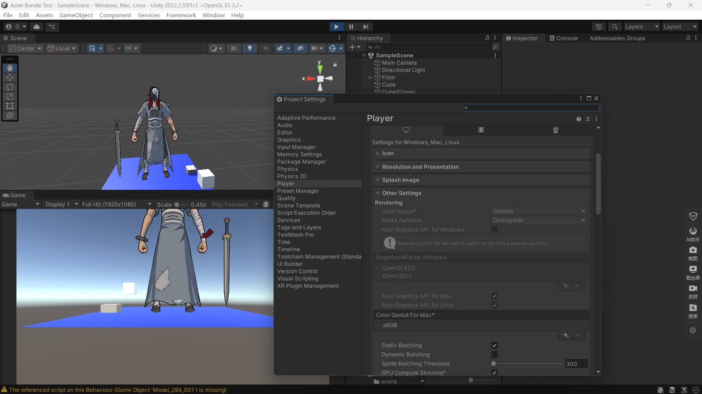

[TOC]


# 2025年日志汇总

## 2025-04-08

### 开发九野个人版踩坑记录

### 一、网络匹配参考

主要参考这个网址：https://developer.unity.cn/projects/67d299e1edbc2a2b119bb6de

框架：multiverse+netcode+matchmaking，协议websocket/kcp

目前已全部跑通，接下来在这基础上开发九野。

*** 微信端开发工具的APPID，注意，小程序和小游戏是不一样的

### 1. 解决中文字符问题

#### 1.1 查找并复制中文字体

windows： 进入文件C:\windows\Fonts

选择其中一个字体，比如“楷体 常规”，复制进入项目的Assests/Resources/Fonts目录下。


#### 1.2 生成TextMeshPro字符集

右键点击刚加入的字体文件，选择“Create->TextMeshPro->FontAssest”生成。


#### 1.3 使用中文字体

在需要使用中文字体的地方，将Font Asset设置为刚刚生成的字体。


## 2025-04-09

### 一、加入Git版本管理

一开始直接在大项目下git init，结果数据太大很难跑通，实际上只要加入

* Assests/
* ProjectSettings/

这两上文件夹的版本管理即可。目前我是这样做的（网上介绍，这样最简），后续看会不会有其他影响。

## 2025-04-10

### 一、调通1v1 matchmaking模式

查找一天bug，未果

## 2025-04-12

### 一、调通1v1 matchmaking的问题


***解决方法：使用websocket代替kcp***

分析：不知道是不是因为kcp在底层使用udp的原因，导致之前基于示例教程中使用1v1 matchmaking进行匹配总是出bug，现象是：能够匹配成功，但在客户端却不绘制玩家预制体。

今天又调试查找了一天，能定位到错误出现在StartClient()这里，服务器能正确建立，客户端也能正确获得服务器的ip及端口，但就是不能建立起连接。

然后没有办法，想着试试websocket吧，结果一遍就过了。看来确实是kcp协议的问题，查了下，kcp底层一般是udp，它本身是一个中间层协议，并不处理底层网络协议，用户要自己定义底层的发送方式，并且通过回调传递给KCP。可能就是这个原因导致的吧。

之前想用KCP的原因是它快，且跟微信小游戏适配更好，现在看来可能需要额外配置一些东西才能使KCP协议在这里工作。

好吧，总算搞定这个问题了，快三天了吧！！！

### 二、客户端权威 or 服务器权威

在考虑这个问题，Unity 3D没有现成的客户端权威代码，在学的示例也是服务器权威的。但感觉客户端权威更符合我的需求，但可能需要更多的改动，目前尚在权衡。

后边想了想，暂时不纠结这个问题，先把本地资源和场景布局做好，之后需要服务器同步的资源再丢给服务器，其他就在本地计算。

看了下九野的日志，可以明确确定是“帧同步”的写法。

## 2025-04-13

### 一、重构九野资源

找到了之前做的Test Bundle程序，重新加载了九野的3D模型，用Instantiate可以恢复大部分数据，但无法处理Texture2D类型，导致加载的3D人物模型丢失纹理。尝试了一些方法，无果。无法完全还原带纹理的3D模型。

看到了Unity 3D新出现的工具Addressables，打算用新工具尝试一下，看看能不能完全还原人物模型。

## 2025-04-17

### 一、折腾Addressables

折腾了这些天的Addressables，以为能直接用它来正确、完整地加载AssetBundle文件，完美还原所有模型和依赖关系，结果今晚才发现：不能！！！它还是要用AssetBundle自身的API来进行加载。好吧，白忙活这些天了。

以后要加快文档阅读速度，提高效率，抓住重点，避免浪费无意义的时间。


## 2025-04-18

### 一、重新思考AssetBundle正确加载模型的问题

做了以下尝试：

* 重试了异步写法（于本次目标而言无关紧要，只是为了长远做准备）；
* 尝试了预加载，先加载Material、Texture2D，再加载类型，失败；
* 学习B站Up主LC_ilmlp关于Shader、MonoBehaviour的读取；
* 重新分析Card_284_001.ab结构，分析各个MonoBehaviour间的关系；
* 确定Card_284_001.ab中包含Manifest清单，最终找到files/dat文件下的总Manifest文件；
* 初步分析Manifest中给出的依赖项。

## 2025-04-19

### 一、尝试加载card_284_001

经过昨天的工作，已经能够正确加载出依赖项。在此基础上，找到了所有card_284_001模型的依赖项，但尝试加载时发现，某些依赖项，资源包里并没有，目前在这里卡住了。

尝试直接加载card_284_001，以为里边标为card/card_284_001.dat的文件是一个AssetBundleManifest文件。然而尝试之后发现，并不是。


## 2025-04-20

### 一、继续尝试加载九野模型

记录一下Unity模型不可见的常见原因，摘抄自（https://blog.csdn.net/qq_33060405/article/details/146927885）:

```
模型不可见：
模型不可见问题概述
在 Unity 中，模型不可见 是一个常见的问题，通常发生在使用 AssetBundle 加载 3D 模型时。如果模型的 AssetBundle 未加载，或者模型依赖的材质或贴图未加载，模型将无法在场景中正确显示。这不仅影响游戏的视觉效果，还可能影响玩家的体验。

常见原因
1. AssetBundle 未加载：

如果包含模型的 AssetBundle 没有成功加载，模型自然无法显示。
依赖的材质或贴图未加载：

2. 模型通常依赖于材质和贴图。如果这些资源未加载，模型可能会显示为不可见或使用默认材质。
3. 资源路径错误：

加载 AssetBundle 或模型时，如果指定的路径不正确，Unity 将无法找到并加载相应的资源。
4. 模型的缩放或位置问题：

模型的缩放设置为零或位置在摄像机视野之外，也会导致模型不可见。
渲染层级问题：

5. 模型可能被其他对象遮挡，或者其渲染层级设置不正确，导致无法在场景中显示。
6. Shader 问题：

如果模型使用的材质的 Shader 不支持当前的渲染管线，可能会导致模型不可见。
```

思路：尝试忽略掉缺失的前置资源，加载完其他前置资源后，直接加载card_284_001。在这里遇到新的问题：

* 由于原资源文件是加密的，所以想写一个将.dat转化为.ab的内存转换，但使用LoadFromMemoryAsync方法没成功，查看转换开头，确实是"Unity Fs"字样，目前不知道问题出在哪里？

## 2025-04-21

### 一、恢复九野3D模型

终于搞定！！！

***原来原因出在shader渲染出错上！我导入的是手机游戏的资源，渲染应该用OpenGL；但在重现工程时，电脑windows系统默认使用的渲染API是Direct3D***

经过以下步骤可以完美展现Card 284 模型。

* Edit -> Project Settings -> Player -> Other Settings，在确保程序没有运行时，去掉“Auto Graphics API for Windows"选项
* 在Graphics APIs for Windows中，添加OpenGLES3，并将其置于首位；或者将Direct3D11删掉均可。




## 2025-04-22

### 一、反编译C#脚本文件

昨天试着加载初始界面和对战等场景，但仍有一堆元素无法显示（显示洋葱紫色），试了下也不是Shader渲染的原因。想到几种方法可以继续尝试：

* 缓存文件Cache中有其他Shader的缓存文件，是不是跟这个有关；
* 反编译C#脚本，如果可以，可以试试从底层一步步重构；
* dat->PAK文件夹下，有一堆PAK文件，经查是系统资源类的压缩文件，但使用压缩软件，或者AssetBundle等方式均无法打开，应当是需要特定脚本打开，因此尝试还原脚本反编译是必要的。

排除思路1：

```
‌ShaderCache文件‌在Unity中用于存储预编译的Shader数据。当你在Unity中导入Shader资源时，Unity会对Shader文件进行预编译，并将编译后的数据缓存到Library\ShaderCache目录下。这些缓存数据被称为Shader Compilation Info，它们是中间状态的数据，用于在运行时动态编译和处理Shader‌
1。
ShaderCache的作用和重要性
‌缓存预编译数据‌：ShaderCache存储了Shader的预编译数据，这些数据在运行时可以直接使用，减少了每次运行时的编译时间，提高了游戏或应用的加载速度和运行效率。
‌跨平台支持‌：ShaderLab工作流确保了Shader可以在不同的图形API（如DirectX、OpenGL和Vulkan）上正确编译和运行。通过预编译和缓存机制，Unity能够生成适用于目标平台的Shader资源，从而实现跨平台开发‌
1。
如何管理和优化ShaderCache
‌清理缓存‌：随着项目的更新和迭代，旧的Shader缓存可能会占用大量磁盘空间。可以通过Unity编辑器的菜单选项手动清理ShaderCache。在Windows系统上，可以在项目设置中找到玩家设置，然后选择其他设置，最后选择清理缓存选项。在Mac系统上，可以在构建设置中找到清理缓存的选项‌
1。
‌动态加载‌：在打包过程中，Unity可以对Shader进行Strip处理，特别是对于动态加载的Shader，需要小心处理以避免运行时错误。动态加载的Shader需要在运行时确保其正确加载和编译‌
```

搜索了下，PAK文件貌似不是UE4的打包文件，跟它的描述不符（当然，还不能完全排除）。可能是Quake生成的PAK文件，目前卡在这，想办法把PAK文件中的资源提取出来。


## 2025-04-23

### 一、尝试获取PAK文件中的资源

用其他方法尝试打开PAK文件：

* 感觉九野中的PAK文件是UE4生成的，在这个假定上，尝试了UnrealEnginePAKViewer，一通捣腾尝试之后，发现是要用源码编译生成UE4后，再去编译，得到PAKViewer的运行文件。由于用源码编译需要的究竟太大（网上说是100多个G），目前剩余空间不够，遂放弃。
* 使用命令行工具：UnrealPak.exe，尝试一番后，虽然没有报错，但也始终没有得到正确的输出文件。（目前还是无法确定PAK是否由UE4生成）

换个思路，先去反编译代码，看能不能反过来得到PAK文件的解构线索。于是了解了一下il2cpp是什么。

明天的思路：

1. 可以先试试在UE4中自己打包一个PAK文件，看看是否和九野文件相似，以此来确定PAK文件是否由UE4生成。
2. 反编译代码。

## 2025-04-24

### 一、在UE4中打包Android应用

沿着昨天的第一个思路，在UE4编辑器中，打包PAK文件，以对比九野文件。

先尝试了打包成Windows压缩PAK文件，发现格式有出入。

然后尝试打包成Android PAK文件，发现有三种压缩格式，另外还需要在UE4上配置Android开发环境，目前在捣腾这个地方。

## 2025-05-03

### 一、完成UE4中打包Android应用的任务

#### 1. 初步配置UE4的Android SDK和NDK环境

参考文档1：https://dev.epicgames.com/documentation/en-us/unreal-engine/setting-up-android-sdk-and-ndk-for-unreal?application_version=4.27

该文档详细介绍了UE 4.27打包Android应用的步骤。之所以先用4.27这个版本，是因为我能确定，九野如果使用了UE资源，那么肯定是在UE4中构建的，因为那时候UE5还没有面世。为了避免使用UE5造成相关资源的不兼容，所以先用UE4.27来完成任务。

按照该文档的说明，一步步进行下去，由于文档推荐使用默认地址，但我安装的相关资源（Android SDK、Android Studio、JDK等）都使用的非默认，所以在这块花了一些时间，调整了一些系统参数，最终成功运行“SetupAndroid.bat”，安装了NDK 21。

#### 2. 开通外网VPN

本以为可以成功了，但出现了下载gradle-6.1.1-all.zip错误，网上说可以直接下载好了放到指定目录，但该网址需要外网访问权限。无奈之下，在大搬家后，开了外网。

一开始想用之前一直用的hash云上网VPN，但重新搜了下，发现原服务网址已经关闭了。无奈之下，转试其他VPN，这里踩了一下坑：因为没弄清楚加速器和外网VPN的关系，给轻蜂加速器冲了38元，结果发现仍无法连接外网（但它的描述里有说外网加速，我就是被这描述给骗了）。

然后，搜了下ExpressVPN、ShadowSocks等以前见过的VPN软件，但看了下价格和描述，没有尝试下去。

发现“快连VPN”，还带免费体验一段时间，果断尝试了一下，真得可以上外网了，看了下价格，其实还算合理，但比我以前用的Hash云，稍微贵了些。

转头又搜索了下“Hash云”，点了下前几个链接深入了解后，才发现，“Hash云”已经改名叫“深蓝云”了，又看到了熟悉的界面，最终又重新使用了该服务，搞定VPN的问题。


#### 3. 版本兼容问题

搞定外网问题后，也顺利解决了“gradle”的下载问题，但使用UE4导出Android应用时，仍旧出现bug："armv7 java头无法识别"等字样，一开始我便推测可能是哪里的兼容出了问题，毕竟我使用的是较新版本的Android Studio meerkat 2024，默认SDK版本较高。但对于如何解决该问题，我没啥头绪。

幸好，今天下午搜到了一篇文章，解决了该问题：

文档2： https://blog.csdn.net/weixin_44090328/article/details/145865286

原来是要卸载掉原来的SDK，搭配所有适配的配置，当然，并不需要更改Android Studio自身的版本。

依照该文档的做法，并将Android/sdk下相关的Android 35（默认的Android SDK版本）残留文件清除。清除C:\Users\gejx2\\.android下的"debug.*"文件。再安装Java 8（原先使用最新的LTS版本Java 21，但仍失败报错，必须使用Java 8），将系统路径JAVA_HOME、PATH设置到Java 8的路径，并在Android Studio中配置gradle默认使用的JDK，设置UE 4.27中Android SDK路径。

以上全部设置好后，便可以打包成功了。


### 二、UE4中打包PAK文件

之前以为打包PAK文件与打包Android应用是一个意思，所以之前折腾的都是打包成Android，绕了远路。今晚，使用UnrealPak.exe工具，打包了一个PAK文件出来，与九野PAK文件对比了一下。你别说，长得还真得挺像的，除了开头没有"PAK"字样外，后边二者长得很像。

推测“PAK”字样也是类似的加密手段。

## 2025-05-04

### 一、继续折腾PAK文件的解包

尝试了UnrealPak解包、删除开头字符解包、zip/rar法解包、Quake 1/2/3 PAK解包，并下载了Quark浏览器、PakViewer、Van开发的某某Viewer后，均无果。

目前推测，九野的PAK包需要自身的解包格式。

### 二、准备反编译il2cpp

既然折腾PAK文件无果，无法进一步拿到里边的资源，只好换个道，尝试反编译il2cpp的代码，目前找到一篇较为详细的文章：https://www.cnblogs.com/szyx/p/16295864.html

在此基础上，看看能不能直接复现九野程序原本的逻辑。

## 2025-05-05

### 一、准备原始APK文件

因为反编译工具il2cppdumper需要用到libil2cpp.so这个文件，而我目前获取到的游戏资源文件中并没有这个，所以需要找到最原始的文件。在九野群中搜索一番后无果，所幸，在手机的QQ大文件下载中找到了很久之前下载的备份文件（第一次感觉QQ文件下载后可以保存这么久且没删除原始APK文件真是太棒了！）。

将.apk后缀改成.zip后，解压能得到所有的资源。此时我才认识到，原来所有资源可以直接从APK中获取啊，并且从APK中获取的一般来说才是比较完整的资源，而安装后会因为系统运行、处理和备份，将资源封装到不同目录，并不一定完整。当然，需要再连接游戏服务器获取后续资源和补丁则另说。总之，破解游戏，从原始APK入手会更快更完整。

### 二、反编译il2cpp

从九野APK文件中成功拿到了libil2cpp.so和global-metadata.dat，直接运行il2CppDumper可以反编译成功，看到相关函数、变量（九野的这两个文件没有做加密处理，直接运行即可）。

### 三、使用IDA工具

按着昨天的说明文档继续往下走，安装IDA 7.0工具，出现一个要密码的地方。在网上搜索了下，密码是：qY2jts9hEJGy。

使用IDA工具反编译，确实能够看到函数体内部的汇编代码了。不禁感叹，现在的反编译工具居然已经如此强大了！

### 四、下一步方向思考

虽然，目前的反汇编、反编译已经非常强大，但查了一下，想完美回复到Unity工程的原代码或者直接能用的程度还是不够。看IDA的介绍，它可能可以生成对等的C代码，但转成对应的C#代码可能不行，并且生成的C代码是否可以直接用也是一个问题。

我原本的想法是直接最大限度利用APK包里的资源，但代码反编译目前能够看到的是类方法、成员以及dll包，这些在手机端可以直接运行，但还原到Unity项目中还是挺难的。因为在编译过程中会优化、丢失一些信息。所以，等IDA反编译完所有资源，看下它反汇编生成的C代码如何；另一方面，着手利用手头的资源，自己动手搭建场景，编辑代码，重构九野的主要逻辑，再加入自己的新想法。

哦，对了，还要查看一下程序是如何加载PAK包里的资源的，看看反编译的代码里有没有相关的线索，好让我知道PAK包里有些什么资源，是否可用。

## 2025-05-06	

### 一、九野反编译&PAK解包初探

从反编译的代码来看，九野是自定义了一个PackageManager的结构，对.pak格式文件进行打包和解包的管理。目前在重点查看这部分代码，希望能从代码中找出主要部分，完成.pak文件的解包。

## 2025-05-07

### 一、重新整合九野可用资源

将APK包导入项目，但发现没有dat总文件（此时怀疑该文件是由data.bin文件另外生成的），为避免麻烦，将手机dat目录下的文件拷贝到APK包的Assests目录下，将二者做了一个合并。

这次测试后，不仅能够正确渲染card目录下的卡片3D模型，也能正确加载部分战斗场景（颜色、场景全部可见）。但在复现scene目录下的资源时，遇到“流式场景AssetBundle加载”的问题，无法通过LoadAllAssestsAsync()函数直接加载该目录下的文件，会报错。

经查，包含场景文件(.unity)的AssetBundle文件是无法用Load来直接复现的，需要通过SceneManager操作。

但进一步操作后，发现scene目录下类似"battle_scenes_001.dat"文件中实际上貌似没有.unity类的scene场景，后续再查并猜测：该文件可能只是场景文件中的一部分，并没有完整场景，但属于流式文件，所以仍旧无法加载，也无法正确还原该部分场景。目前卡在这里。

明天试试百度给出的以附加场景加载的方式，看看有没有用。

目前的计划是：先熟悉所有可用资源和现有结构，接下来，就是全力编写代码，重现九野了！！！

## 2025-05-10

### 一、浏览九野结构

偷会懒，重新复习了下九野的结构，在APK和手机导出资源的补充下，了解资源布局及场景建立。目前，几乎所有模型都能正确还原，场景在ui中的能看到正确模型，但棋盘布局只看到一种，继续搜索了下，说是Unity3D 5.3以前有不能加载流式资源的问题，之后修复了，在这里要继续尝试。

### 二、Unity加载DLL

这是下午看到的一个做法，DLL文件我是可以通过反编译得到的，如果能够在项目中直接将其加载，那么，我是不是能够大幅利用已有的代码？如果可以，这将大大减少我自己的工作量。

## 2025-05-11

### 一、关于Unity3D 加载流式资源的问题

看了下相关文档的介绍（英文版），我的理解大意是：放在StreamingAssets文件夹下的资源，在Unity 3D 5.3版本之前，直接用LoadFromFile（Async）会有问题，但之后的问题中没有。这和我需要解决的加载“流式场景资源”（streaming sence assests）问题不同，看来还是回到之前那个点了，加载流式场景用LoadScene等相关API，但九野scene文件夹下的相关AssetBundle文件，其中可能只是部分场景，没有完整的.unity文件，所以调用相关API时无法呈现任何场景。

### 二、Unity加载DLL文件

试了下这个方向的工作，确实可以加载DLL文件，但问题是：仍然无法在Unity工程中，相关的Object下，挂上对应脚本。查了下，说是Unity挂上脚本的地方需要是同名的C#脚本（一般），系统不会去扫描DLL文件中的相关方法，只认同名脚本。

因此，这个方向也相当于被堵上了。与其参照反编译的伪代码或者汇编代码来重再现脚本，还不如全部重写我需要的那部分脚本来得快呢。

### 三、初步呈现战斗场景和初级逻辑

由于以上两个原因，最大程度地利用已有的九野资源这一步，暂时告一段落。之后按照涉及，需要先把简单的战斗场景、简单的人物和卡牌1V1对战、最初级的战斗逻辑、网络同步问题解决。全程跑通最简单的逻辑。之后再完善场景、人物、卡片、逻辑等等。

## 2025-05-12

### 一、清除Library/PackageCache

解决Unity Bug: TypeLoadException: Could not resolve type with token

解决方案：去项目目录中，清库 Library\PackageCache

### 二、星野工程中测试加载九野资源

直接使用原先的LoadBundle方法可以直接成功。之后考虑可以将方法写成库函数以便使用，于是用命名空间LoadJiuyeAssetBundle封装结构体和方法，在这里遇到了一个调试很久的Bug：

因为方法中用到了异步，所以使用了StartCoroutine、yield return、async等异步机制，目前我的理解是：这些机制必须让类继承MonoBehaviour才能使用（否则StartCoroutine报错）。于是，类必须继承MonoBehaviour，这导致类不宜像普通类那样直接使用new来创建，需要在工程项目中实例化，而直接在代码中使用gameObject.AddComponent<>()方法，或者是Instantiate()方法，均无法将该类实例化。于是陷入两难：要么不继承MonoBehaviour，但这样无法用诸多现成的异步函数；要么继承MonoBehaviour，但无法在另一个类中调用该类的其他方法，因为必须实例化该类，这样的话，还不如直接调用，不用另一个类加载了。

于是，只好去掉将方法做成基类供其他类调用的想法，改为在需要用到该脚本的地方直接用，加上一个JiuyeFilePath参数供动态调用。

最后，加载资源时如何避免重复加载？是否需要计数或者锁？

## 2025-05-13

### 一、设置战斗场景

战斗场景在"dat/battle.dat"中，整体加载已经成功，但想把其中的Battlefield场景单独拿出来，所以涉及到LoadJiuyeAssetBundle的整改。对于这些加载其中一部分资源的要求，设置loadObjects成员，记录并实例化需要的资源。

这里需要注意的是：LoadAssetAsync(“assetbundlename”)中，名字并不是"Battlefield"，而是“assets/gameresource/uipref/ui/battle/battlefield.prefab”，即封装时的完整引用名。

类似的，又在战斗场景中加了Scene这个Object，也需要使用完整引用名才能实例化。

### 二、添加柳梦璃人物形象

在这里又引入了一个新需求：加载另一个asset bundle。为了所有任务都能通过同一脚本（LoadJiuyeAssetBundle）完成，所以需要一个结构体JiuyeDemand来刻化访问需求。

目前JiuyeDemand设计包含两部分：bundle名称、需要加载的prefab（为null时默认加载所有prefab并实例化）。

这里需要注意的是：

* 需要使用class而非struct修饰
* 为了能够在Inspector界面直接配置，需要在类上加上[System.Serializable]修饰

在不计重复加载的问题时，可以成功加载战斗场景及柳梦璃形象。

### 三、避免重复加载问题

如题，为了避免重复加载，主要做了以下方面的事：

1. 将所有LoadFromMemoryAsync方法改写成LoadFromFileAsync方法，也就是说：需要将.dat转为.ab，并在程序结束时删除.ab。
2. 加入AssetBundle的统计，在资源释放时，释放所有AssetBundle类的资源。
3. 引入异步，异步加载、读写文件。

目前出现bug，推测是异步的问题，程序卡住无法看到结果。明天试试异步推荐的标准写法（计数型和简易函数）。

## 2025-05-19

### 一、完成多个场景的加载

之前多次加载时出现一堆bug，于是去进一步了解了下Unity中Coroutine机制和异步的相关知识，这才了解到Coroutine并非异步，而仅是将任务分成不同的片段，放在不同帧中分步执行，实际上和主任务共用一个线程，而并非子线程。并在此基础上了解了Coroutine和yield return|break等等相关语法及执行顺序、原理等等。

在此基础上，重新改写代码，合理、规范化使用Coroutine加载AssetBundle任务，这时，主协程能够顺利通过，但在CreateABFile（即将.dat转化为.ab文件这一步）仍然遇到问题。

最后，查出来是使用了File.Open()和File.WriteAllBytes()这两个函数冲突了，去掉了FileOpen()后，CreateABFile成功。此时，可以同时完成battleScene和柳梦璃人物形象的加载。

### 二、避免重复加载同一AssetBundle文件

查找了一些方法，如Addressables管理去重等等，最后决定使用数据结构对已加载文件进行记录去重，目前使用HashSet，记录加载好的AssetBundle和Bundle文件名，并在对象销毁时删除。

### 三、加载之前加载不出来的Scene

之前加载流场景AssetBundle不成功，我一直以为是因为该文件是完整Scene的一部分，因而不能使用Instantiate实例化。实际上，是因为我犯了一个很愚蠢的错误：我在使用GetAllScenePaths（）这一函数时，其主体使用了最外层的assetBundle（对应加载的是.dat这一文件，包含全局manifest的最外层AssetBundle文件），实际上应该使用subAssetBundle（对应Scene文件的加载对象），如此，可以顺利加载所有Scene文件下的场景资源。

重新审视了下scene文件夹下的资源，所有场景都加载了一遍，虽然都能看到棋盘，但总感觉和我在手机上玩得时候有些不同，不知道是不是错觉，虽然有些场景看着很像，但还是感觉有些陌生。


### 四、加载新场景遇到的问题

如题，在已有场景中，加载scene文件夹下的新场景时，一开始时遇到一个问题：所有资源失去渲染，又呈现洋葱紫了？

一开始以为是没有设置主摄像头渲染的原因，于是捣腾了一会，尝试在新场景加载时用代码主动生成一个摄像头，深度设置为-10，以便优选加载摄像头，但始终无法修复该Bug。再加上调试信息后才最终确认：当用SceneManager加载流场景AssetBundle时，加载成功后（Single模式下）便立即生成新场景，后续的设置摄像头代码根本没有执行。

此时，灵光一闪，意识到可能是我在原场景下OnDestroy()函数中，当Empty这个GameObject卸载时，会一并将相关资源卸载；这样，新场景生成时，便会失去相关前置资源的渲染，会不会是这个原因？如此，将OnDestroy()中卸载资源的代码注释后，便成功加载了所有Scene场景。

### 五、如何有效管理场景

接四，虽然目前所有场景都能加载了，并且能在同一脚本下同时加载不同场景，但目前代码对场景的管理仍然是有些混乱的，集中表现在：如何分配旧场景和新场景的功能？新旧场景应当分别管理什么职能？在什么时候将新场景设置为Active？新场景是完全覆盖旧场景，还是同时出现？如何统一管理九野的AssetBundle资源加载？是否需要设立一个全局的九野资源管理器？

目前进行到这一步，需要好好规划一个，统筹设计。

## 2025-05-20

### 一、规划全局管理

目前找到的最方便的方法是：将当前场景下的挂载脚本的对象，设置为DontDestroyOnLoad，即在Start()方法中调用该方法即可。这样，可以在不同场景转换时，始终不销毁该对象，从而实现全局管理。

## 2025-05-21

### 一、初步测试全局规划

将原有的BattleField0中的Empty设为全局管理，在LoadJiuyeAssetBundle脚本中追加调整战斗场和人物位置的相关代码。读取物体位置，将人物、场景设置在正确的位置和旋转角度上，并成功展示初步效果。

目前的代码，是通过成员变量LoadSuccess来判断加载成功的asset bundle文件，当LoadSuccess等于要求加载的九野demands时，即文件全部加载成功时，再进行位置的初步调整。

为求速通，代码没有进行整体的框架设计，考虑后续有需要再进行整体的调整，目前先追求一个能够快速战斗、完善战斗逻辑的版本。


## 2025-05-26

为了与UOS(Matchmaking)+Netcode的框架互融，将相关代码写进之前的网络框架中。目前，为了整体框架更加合理，完成了将Samples下的相关文件资源转移到Assets下，并删除Samples文件夹。别说只是很小的一步，却花费了我几天时间，难绷。

### 一、在已有的网络框架下测试九野文件加载

这一步很成功，直接在Bootstrap这个场景中挂载一个之前场景（BattleField0）中的复制对象Empty（这个对象中挂载之前成功加载的混合九野资源脚本LoadJiuyeAssetBundle）。

### 二、查找当前网络框架下，客户端和服务器如何通讯的问题

由于不了解，查找了一些其他Unity网络通信架构，最后还是回归Rpc调用的方法，因为整体的框架就是使用Netcode的。

关于帧同步和状态同步，预计是使用帧同步，因为服务器和游戏类型的原因。但目前尚未进行详细设计，后续再进一步深入。

### 三、全局共享资源的问题

由于是1V1的对战设计，需要服务器向不同客户端发送信息（或者不同客户端能够识别服务器消息是否是发给自己的），因而要用到UserID的问题。我看原代码中有这一个_userid的变量，为了访问方便，将其设为静态类（JiuyeUtility.SharedData）的静态成员变量，以便全局访问，这时走进一个大坑中。

将静态类方法放在Scripts目录下后，无论如何，BootstrapManager.cs脚本都识别不到该类。在网上查看了很多方法，一一试了后皆无果，包括加命名空间、查看类名与文件名是否一致、设立与命名空间相符的路径等等。奇怪的是，将该脚本放到与BootstrapManager.cs脚本同一目录下后，就能识别到该类了。

但这种做法，貌似与“全局”共享这一要求不符，且BootstrapManager.cs脚本放在Samples目录下的结构设计不利于统一管理。于是，还是打算深度将Samples目录删除，相关资源全部放到Assets下。

### 四、解决目录迁移、全局共享

将资源迁移到Assets下后，还是报了一堆奇怪的错误，比如"Addressables"的相关引用无法正常使用等。我以为是Addressables包安装出问题了，来回重复安装数次，无果。又试了网上相关报错的一堆方法，仍然无果，包括删除Library重新编译，重启等等，折腾许久，还是没有方法。

无奈之下，只好先还原，在把文件还原到Samples中，才发现居然有个Bootstrap.asmdef文件，这方意识到，一切都是这个文件造成的。它定义了相关文件的预编译库目录，这样更新时不需要检索整个库，而只检索文件定义的库就行，节省时间和效率。也正因为这个文件的存在，导致不在同一目录下的全局变量无法被识别，以及放到主目录下会影响其他脚本的预编译，导致库识别出错。

最终，Bug解决，文件迁移成功。总体来看，不过是很小的一个问题；但由于习惯了从网上寻找解决方案，而没有审视专注于自己的文件构成，导致这一Bug拦路许久。吸取教训，本地自查的Debug方法往往很重要。

### 五、Base64的ID识别不正确

这一错误也困扰了我不少时间，由于没认真看报错位置，我一直以为是_userid出错。这是因为，我把_userid改成了全局资源的缘故，自然就以为报错是它带来的。导致报错：初始化失败，因为提供的ID不是正确的Base64格式。

今晚，打了一下Log信息检查时才发现，根本就不是Userid这一行代码报的错，而是MatchmakingSDK.Initialize()报的错。定位错误位置之后就很容易解决了，这个是因为UOS Launcher中，没有Link App造成的。重新Link一下，问题就解决了。

这一Debug过程也提醒了我，不要想当然的Debug，要反复确认出Bug的位置，否则只是缘木求鱼罢了。